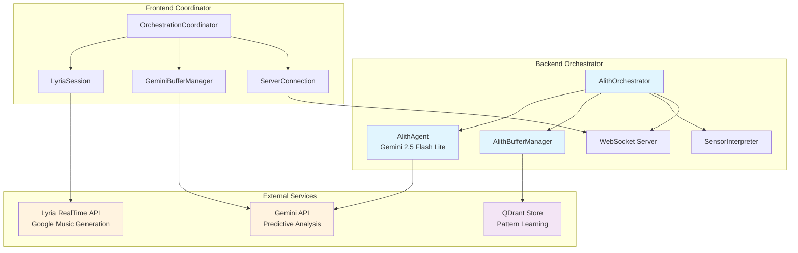
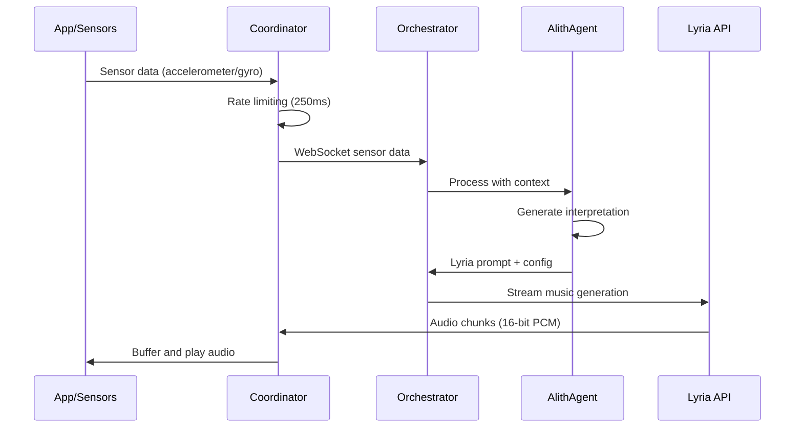
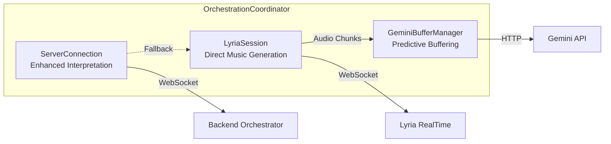

# Alith Orchestrator

The Alith Orchestrator is an intelligent music generation system that combines the [Alith AI framework](https://lazai.network/alith) with Google's Lyria RealTime API to provide zero-dropout audio streaming and adaptive music generation.

## Architecture Overview

The orchestrator implements a distributed architecture with multiple specialized components:

<Mermaid>

</Mermaid>

## Core Components

### AlithAgent

The core intelligence uses Alith's Agent class with Gemini 2.5 Flash Lite for real-time decision making:

```javascript
// Initialize Alith agent with optimized preamble
musicAgent = new Agent({
  model: "gemini-2.5-flash-lite",
  apiKey: process.env.GOOGLE_GENERATIVE_AI_API_KEY,
  baseUrl: "generativelanguage.googleapis.com/v1beta/openai",
  preamble: enhancedPreamble,
  memory: new WindowBufferMemory(8)
});
```

The agent processes sensor data and generates Lyria prompts using embedded knowledge:

```javascript
const interpretation = await musicAgent.run(JSON.stringify({
  sensorData: enrichedSensorData,
  sessionHistory: sessionData?.history || [],
  userProfile: sessionData?.profile || {},
  currentBaseline: this.currentBaseline
}));
```

### Enhanced Sensor Processing

The orchestrator implements intelligent sensor interpretation with rate limiting and smoothing:

<Mermaid>

</Mermaid>

### Rate Limiting and Optimization

The system implements sophisticated rate limiting to respect API quotas:

```javascript
// Optimized rate limiting for baseline-driven processing
this.geminiCallCooldown = 4500; // 4.5 seconds for 15 requests/minute quota
this.serverLatency = 250; // Stability-focused latency
this.minSendInterval = 200; // Smooth server processing
```

## Pattern Learning System

### QDrant Integration

User patterns are stored using QDrant vector database for continuous learning:

```javascript
userPatternStore = new QdrantStore({
  url: process.env.QDRANT_URL || 'http://localhost:6333',
  collectionName: 'user_patterns',
  apiKey: process.env.QDRANT_API_KEY
});
```

### Memory Management

The system uses Alith's WindowBufferMemory for context retention:

```javascript
// Reduced memory window for token efficiency
memory: new WindowBufferMemory(8)
```

## WebSocket Communication

### Server Implementation

The orchestrator provides WebSocket endpoints for real-time communication:

```javascript
this.wsServer.on('connection', (ws) => {
  ws.on('message', async (message) => {
    const data = JSON.parse(message);
    
    if (data.type === 'sensorUpdate') {
      await this.processSensorData(data.sensorData, ws);
    }
  });
});
```

### Client Coordination

The frontend coordinator manages multiple connection types:

<Mermaid>

</Mermaid>

## Performance Optimizations

### Token Efficiency

The system optimizes token usage through embedded knowledge:

```javascript
function preambleWithKnowledge() {
  const poemsContent = readFileSync(join(__dirname, 'knowledge', 'poems.txt'), 'utf8');
  const parametersContent = readFileSync(join(__dirname, 'knowledge', 'parameters.txt'), 'utf8');
  
  return `Enhanced preamble with ${poemsContent} and ${parametersContent}`;
}
```

### Processing Queue

Agent synchronization prevents parallel token consumption:

```javascript
let agentProcessingQueue = Promise.resolve();
let activeProcessingCount = 0;

// Queue processing to prevent parallel API calls
agentProcessingQueue = agentProcessingQueue.then(async () => {
  activeProcessingCount++;
  try {
    return await processRequest();
  } finally {
    activeProcessingCount--;
  }
});
```

## Error Handling and Resilience

### Fallback Systems

The orchestrator implements multiple fallback mechanisms:

```javascript
createIntelligentRaveFallback(enrichedSensorData, sessionData) {
  // Energy-based fallback when AI agent is unavailable
  const energy = Math.sqrt(
    Math.pow(enrichedSensorData.x, 2) + 
    Math.pow(enrichedSensorData.y, 2) + 
    Math.pow(enrichedSensorData.z, 2)
  ) / 3;
  
  return {
    singleCoherentPrompt: this.generateEnergyBasedPrompt(energy),
    lyriaConfig: this.generateEnergyBasedConfig(energy),
    requiresCrossfade: energy > 0.6
  };
}
```

### Connection Recovery

Automatic reconnection with exponential backoff:

```javascript
async reconnectToServer() {
  const delay = Math.min(1000 * Math.pow(2, this.reconnectAttempts), 30000);
  
  setTimeout(async () => {
    try {
      await this.connectToInterpretationServer();
    } catch (error) {
      this.reconnectAttempts++;
      if (this.reconnectAttempts < this.maxReconnectAttempts) {
        this.reconnectToServer();
      }
    }
  }, delay);
}
```

## Configuration

### Environment Variables

Required environment variables for the orchestrator:

```bash
# Alith/Gemini Configuration
GOOGLE_GENERATIVE_AI_API_KEY=your_gemini_api_key

# QDrant Configuration (optional)
QDRANT_URL=http://localhost:6333
QDRANT_API_KEY=your_qdrant_key

# Server Configuration
PORT=3001
```

### Deployment

The orchestrator includes PM2 configuration for production deployment:

```javascript
// ecosystem.config.js
module.exports = {
  apps: [{
    name: 'vibesflow-orchestrator',
    script: 'index.js',
    instances: 1,
    exec_mode: 'fork',
    env: {
      NODE_ENV: 'production'
    }
  }]
};
```

## Integration Points

### Frontend Integration

The orchestrator integrates with the React Native frontend through the OrchestrationCoordinator:

```javascript
// Initialize with wallet integration
await coordinator.initializeWithWallet(walletIntegration);

// Start vibestream session
await coordinator.startVibestreamSession(rtaId, audioChunkService);

// Process sensor updates
coordinator.handleSensorUpdate(sensorData);
```

### Platform Support

The system supports both mobile and web platforms through platform-specific orchestrators:

```javascript
this.orchestrators = {
  mobile: mobileOrchestrator,
  web: webOrchestrator
};

this.activeOrchestrator = this.orchestrators[this.platform];
```

## Monitoring and Logging

The orchestrator implements comprehensive logging for monitoring system performance:

```javascript
console.log('📊 Enhanced preamble statistics:', {
  totalLength: enhancedPreamble.length,
  estimatedTokens: Math.ceil(enhancedPreamble.length / 4),
  knowledgeEmbedded: 'parameters.txt + poems.txt',
  ragRequired: false
});
```

Performance metrics are tracked for optimization:

```javascript
const processingTime = Date.now() - startTime;
logPerformance('sensor_processing', processingTime);
```
