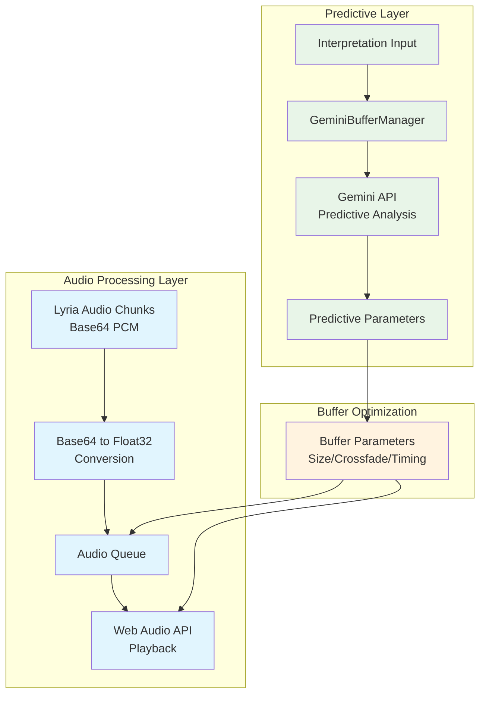
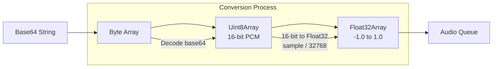
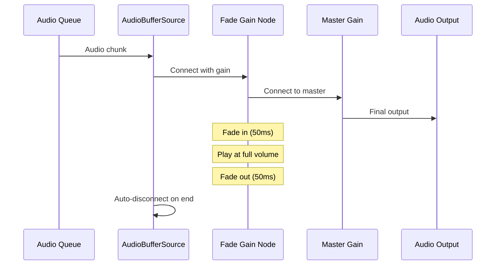

# Predictive Buffering System

The predictive buffering system uses Google's Gemini API to anticipate audio requirements and optimize playback performance before audio chunks arrive from Lyria RealTime.

## Architecture Overview

The buffering system operates on two levels: predictive analysis and real-time audio processing:

<Mermaid>

</Mermaid>

## Core Components

### BufferManager Class

The main BufferManager handles both predictive analysis and audio playback:

```javascript
export class BufferManager {
  constructor(geminiApiKey) {
    this.geminiApiKey = geminiApiKey;
    this.genAI = null;
    this.isInitialized = false;
    
    // Essential audio playback (Web Audio API)
    this.audioContext = null;
    this.audioQueue = [];
    this.isQueueProcessing = false;
    this.nextStartTime = 0;
    this.masterGain = null;
    
    // Predictive buffering state
    this.currentInterpretation = null;
    this.targetBufferSize = 4096;
    
    // Rate limiting for Vertex AI
    this.lastGeminiCall = 0;
    this.geminiCallCooldown = 3000;
  }
}
```

### Initialization

The system initializes with fallback support for basic buffering:

```javascript
async initialize() {
  try {
    if (!this.geminiApiKey) {
      console.warn('⚠️ No Gemini API key - using basic buffering');
      this.isInitialized = true;
      return true;
    }

    // Initialize Vertex AI client
    this.genAI = new GoogleGenAI({ apiKey: this.geminiApiKey });
    
    this.isInitialized = true;
    return true;
  } catch (error) {
    console.warn('⚠️ Buffer manager initialization failed, using basic buffering:', error.message);
    this.isInitialized = true; // Still allow basic buffering
    return true;
  }
}
```

## Predictive Processing

### Pre-Audio Analysis

The system processes interpretations before audio arrives to prepare optimal buffering:

```javascript
async processInterpretation(interpretation) {
  try {
    console.log('🧠 PREDICTIVE BUFFERING: Processing interpretation BEFORE audio arrives');
    
    this.currentInterpretation = interpretation;
    
    // PREDICTIVE: Prepare buffer parameters
    this.preparePredictiveBuffering(interpretation);
    
    // PREDICTIVE: Generate code for upcoming transition
    if (interpretation.requiresCrossfade) {
      await this.prepareCrossfadeBuffering(interpretation);
    } else {
      await this.prepareLayerBuffering(interpretation);
    }
    
  } catch (error) {
    console.error('❌ Predictive buffering failed:', error);
  }
}
```

### Buffer Parameter Optimization

The system calculates optimal buffer sizes based on musical characteristics:

```javascript
preparePredictiveBuffering(interpretation) {
  const bpm = interpretation.lyriaConfig?.bpm || 140;
  const density = interpretation.lyriaConfig?.density || 0.5;
  
  // Predict optimal buffer size
  let optimalBufferSize;
  if (bpm > 160 && density > 0.7) {
    optimalBufferSize = 8192; // Fast, dense music
  } else if (bpm < 100) {
    optimalBufferSize = 2048; // Slow music
  } else {
    optimalBufferSize = 4096; // Standard techno/house
  }
  
  this.targetBufferSize = optimalBufferSize;
  console.log('🧠 PREDICTIVE: Buffer optimized for', bpm, 'BPM →', optimalBufferSize, 'samples');
}
```

## Audio Processing Pipeline

### Base64 to Float32 Conversion

Lyria audio chunks arrive as base64-encoded 16-bit PCM and must be converted for Web Audio API:

<Mermaid>

</Mermaid>

```javascript
base64ToFloat32AudioData(base64String) {
  const byteCharacters = atob(base64String);
  const byteArray = [];

  for (let i = 0; i < byteCharacters.length; i++) {
    byteArray.push(byteCharacters.charCodeAt(i));
  }

  const audioChunks = new Uint8Array(byteArray);

  // Convert Uint8Array (16-bit PCM) to Float32Array for Web Audio API
  const length = audioChunks.length / 2; // 16-bit audio, so 2 bytes per sample
  const float32AudioData = new Float32Array(length);

  for (let i = 0; i < length; i++) {
    // Combine two bytes into one 16-bit signed integer (little-endian)
    let sample = audioChunks[i * 2] | (audioChunks[i * 2 + 1] << 8);
    // Convert from 16-bit PCM to Float32 (range -1 to 1)
    if (sample >= 32768) sample -= 65536;
    float32AudioData[i] = sample / 32768;
  }

  return float32AudioData;
}
```

### Seamless Audio Playback

The system implements seamless audio playback with crossfading:

```javascript
async playAudioData() {
  this.isQueueProcessing = true;

  if (!this.audioContext || this.audioContext.state === "closed") {
    this.audioContext = new (window.AudioContext || window.webkitAudioContext)({
      sampleRate: 48000,
      latencyHint: 'interactive'
    });
    this.nextStartTime = this.audioContext.currentTime;
    
    // Create master gain node
    this.masterGain = this.audioContext.createGain();
    this.masterGain.gain.setValueAtTime(0.8, this.audioContext.currentTime);
    this.masterGain.connect(this.audioContext.destination);
  }

  // Resume audio context if suspended
  if (this.audioContext.state === 'suspended') {
    await this.audioContext.resume();
  }

  while (this.audioQueue.length > 0) {
    const audioChunks = this.audioQueue.shift();
    await this.processAudioChunk(audioChunks);
  }
  
  this.isQueueProcessing = false;
}
```

### Stereo Channel Processing

Lyria provides interleaved stereo data that must be split for Web Audio API:

```javascript
// Create AudioBuffer (Lyria uses 48kHz stereo)
const audioBuffer = this.audioContext.createBuffer(2, audioChunks.length / 2, 48000);

// Split interleaved stereo data into separate channels
const leftChannel = audioBuffer.getChannelData(0);
const rightChannel = audioBuffer.getChannelData(1);

for (let i = 0; i < audioChunks.length / 2; i++) {
  leftChannel[i] = audioChunks[i * 2];
  rightChannel[i] = audioChunks[i * 2 + 1];
}
```

## Crossfading System

### Predictive Crossfade Preparation

The system prepares crossfade parameters based on musical characteristics:

```javascript
async prepareCrossfadeBuffering(interpretation) {
  try {
    const expectedBPM = interpretation.lyriaConfig?.bpm || 140;
    const expectedDensity = interpretation.lyriaConfig?.density || 0.5;
    
    // Adjust crossfade timing based on BPM
    this.crossfadeTime = expectedBPM > 150 ? 0.08 : expectedBPM > 120 ? 0.12 : 0.15;
    
    console.log('🌊 PREDICTIVE: Crossfade ready -', {
      crossfadeTime: this.crossfadeTime,
      expectedBPM,
      expectedDensity
    });
  } catch (error) {
    console.warn('⚠️ Crossfade preparation failed:', error.message);
  }
}
```

### Real-time Crossfade Implementation

Each audio chunk is played with automatic crossfading for seamless transitions:

<Mermaid>

</Mermaid>

```javascript
// Apply crossfading for seamless transitions
const crossfadeTime = 0.05; // 50ms crossfade
fadeGain.gain.setValueAtTime(0, startTime);
fadeGain.gain.linearRampToValueAtTime(1, startTime + crossfadeTime);
fadeGain.gain.setValueAtTime(1, startTime + audioBuffer.duration - crossfadeTime);
fadeGain.gain.linearRampToValueAtTime(0, startTime + audioBuffer.duration);

source.start(startTime);
source.stop(startTime + audioBuffer.duration);

// Update next start time for seamless playback
this.nextStartTime = startTime + audioBuffer.duration - crossfadeTime;
```

## Layer Addition System

### Predictive Layer Preparation

For additive layering (non-crossfade transitions), the system optimizes for longer overlaps:

```javascript
async prepareLayerBuffering(interpretation) {
  try {
    console.log('📫 PREDICTIVE: Setting up layer addition parameters...');
    
    // Optimize for additive layering
    this.overlapBuffer = 0.05; // Longer overlap for layers
    
    console.log('📫 PREDICTIVE: Layer buffering ready');
  } catch (error) {
    console.warn('⚠️ Layer preparation failed:', error.message);
  }
}
```

## Performance Monitoring

### Buffer Status Tracking

The system provides real-time buffer status for monitoring:

```javascript
getBufferStatus() {
  return {
    isInitialized: this.isInitialized,
    hasAudioContext: !!this.audioContext,
    queueLength: this.audioQueue.length,
    isPlaying: this.isQueueProcessing
  };
}
```

### Rate Limiting

Gemini API calls are rate-limited to prevent quota exhaustion:

```javascript
// Rate limiting for Vertex AI
this.lastGeminiCall = 0;
this.geminiCallCooldown = 3000;
this.lastInterpretationSignature = null;

// Check rate limiting before API calls
const now = Date.now();
if (now - this.lastGeminiCall < this.geminiCallCooldown) {
  console.log('⏰ Rate limiting: Skipping Gemini call');
  return;
}
```

## Integration with Lyria

### Audio Chunk Handling

The system processes Lyria audio chunks for immediate playback:

```javascript
async handleLyriaAudioChunk(base64AudioData) {
  if (!base64AudioData) return;

  try {
    console.log('🎵 BUFFERING: Processing Lyria audio chunk for immediate playback');
    
    // Convert base64 to Float32Array for Web Audio API
    const float32AudioData = this.base64ToFloat32AudioData(base64AudioData);
    
    // Add to audio queue for immediate playback
    this.audioQueue.push(float32AudioData);

    // Start playback if not already playing
    if (!this.isQueueProcessing) {
      await this.playAudioData();
    }
    
  } catch (error) {
    console.error('❌ Failed to handle Lyria audio chunk:', error);
  }
}
```

## Resource Management

### Cleanup System

Proper cleanup prevents memory leaks and audio artifacts:

```javascript
cleanup() {
  try {
    console.log('🧹 Cleaning up Buffer Manager...');
    
    // Stop audio playback
    this.audioQueue = [];
    this.isQueueProcessing = false;
    
    // Cleanup master gain
    if (this.masterGain) {
      try {
        this.masterGain.disconnect();
      } catch (error) {
        // Ignore disconnect errors
      }
      this.masterGain = null;
    }
    
    // Cleanup AudioContext
    if (this.audioContext && this.audioContext.state !== 'closed') {
      this.audioContext.close();
      this.audioContext = null;
    }
    
    // Reset state
    this.isInitialized = false;
    this.nextStartTime = 0;
    
  } catch (error) {
    console.error('❌ Cleanup failed:', error);
  }
}
```

## Factory Function

The system provides a factory function for easy instantiation:

```javascript
/**
 * Create and return a configured buffer manager instance
 */
export function createBufferManager(geminiApiKey) {
  return new BufferManager(geminiApiKey);
}

export default BufferManager;
```

## Configuration

### Environment Variables

```bash
# Gemini API Configuration
EXPO_PUBLIC_GEMINI_API_KEY=your_gemini_api_key
```

### Audio Specifications

The system is configured for Lyria's audio format:

- **Sample Rate**: 48kHz
- **Channels**: 2 (stereo)
- **Format**: 16-bit PCM
- **Encoding**: Base64 (from Lyria)
- **Processing**: Float32 (for Web Audio API)
