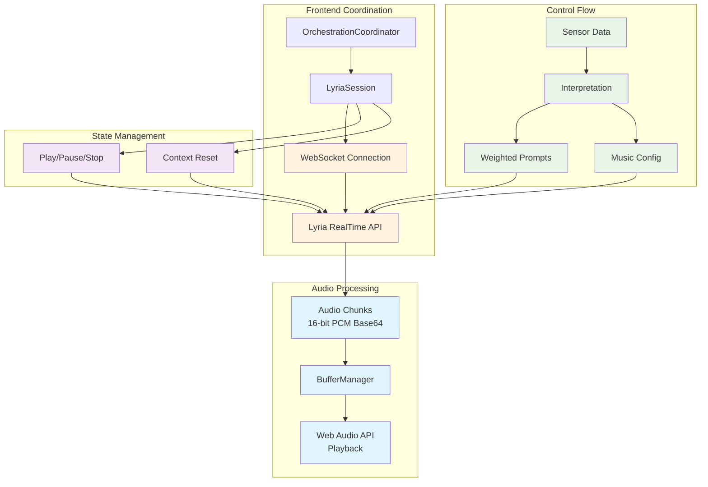
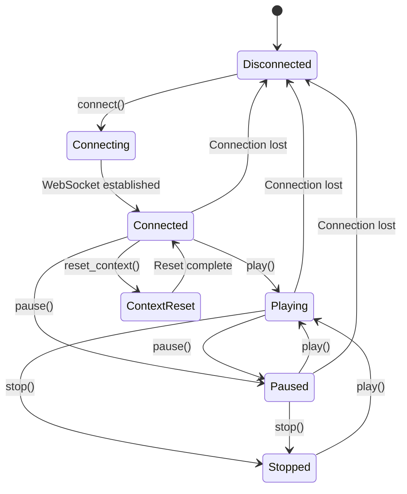
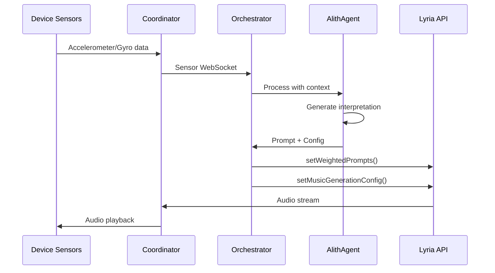

# Lyria RealTime Integration


## Architecture Overview

The Lyria integration operates through a persistent WebSocket connection with multiple coordination layers:



## Technical Specifications

### Audio Format

Lyria RealTime generates audio with specific characteristics:

- **Output Format**: Raw 16-bit PCM Audio
- **Sample Rate**: 48kHz
- **Channels**: 2 (stereo)
- **Encoding**: Base64 (for WebSocket transmission)
- **Streaming**: Real-time generation via WebSocket

### API Connection

The system establishes a persistent bidirectional WebSocket connection:

```javascript
// Initialize Lyria connection
const ai = new GoogleGenAI({
  apiKey: process.env.EXPO_PUBLIC_LYRIA_API_KEY,
  apiVersion: 'v1alpha',
});

const session = client.live.music.connect({
  model: 'models/lyria-realtime-exp',
  callbacks: {
    onMessage: (message) => {
      // Process audio chunks
      this.handleAudioChunk(message);
    },
    onError: (error) => {
      console.error('Lyria session error:', error);
      this.handleConnectionError(error);
    },
    onClose: () => {
      console.log('Lyria RealTime stream closed.');
      this.handleConnectionClose();
    }
  }
});
```

## Music Generation Control

### Weighted Prompts

The system uses weighted prompts for continuous music steering:

```javascript
await session.setWeightedPrompts({
  weightedPrompts: [
    { text: 'minimal techno', weight: 1.0 },
    { text: 'acid bass', weight: 0.7 },
    { text: 'hypnotic rhythm', weight: 0.5 }
  ],
});
```

### Configuration Parameters

Music generation is controlled through comprehensive configuration:

```javascript
await session.setMusicGenerationConfig({
  musicGenerationConfig: {
    bpm: 140,                    // 60-200 BPM range
    density: 0.75,               // 0.0-1.0 note density
    brightness: 0.6,             // 0.0-1.0 tonal quality
    guidance: 4.0,               // 0.0-6.0 prompt adherence
    temperature: 1.1,            // 0.0-3.0 creativity
    top_k: 40,                   // 1-1000 sampling
    scale: 'C_MAJOR_A_MINOR',    // Musical scale
    mute_bass: false,            // Bass control
    mute_drums: false,           // Drum control
    only_bass_and_drums: false   // Isolation mode
  }
});
```

## Playback Control

### Session Management

The system provides comprehensive playback control:



```javascript
// Start generation
await session.play();

// Pause generation
await session.pause();

// Stop generation
await session.stop();

// Reset context for dramatic transitions
await session.reset_context();
```

## Real-time Music Steering

### Dynamic Prompt Updates

The system supports real-time prompt modifications for smooth transitions:

```javascript
// Gradual transition example
await session.setWeightedPrompts({
  weightedPrompts: [
    { text: 'Harmonica', weight: 0.3 },
    { text: 'Afrobeat', weight: 0.7 }
  ],
});
```

### Parameter Transitions

Configuration changes can be applied without stopping the stream:

```javascript
// Update configuration in real-time
await session.setMusicGenerationConfig({
  musicGenerationConfig: { 
    bpm: 120, 
    density: 0.75,
    brightness: 0.8
  },
});

// Reset context for BPM/scale changes
if (bpmChanged || scaleChanged) {
  await session.reset_context();
}
```

## Connection Management

### Initialization and Retry Logic

The system implements robust connection management:

```javascript
async initializeLyriaConnection() {
  try {
    console.log('🎵 Connecting to Lyria RealTime...');
    
    if (!this.lyriaApiKey) {
      throw new Error('Lyria API key not configured');
    }

    const genAI = new GoogleGenAI({ 
      apiKey: this.lyriaApiKey,
      apiVersion: 'v1alpha'
    });

    this.lyriaSession = genAI.live.music.connect({
      model: 'models/lyria-realtime-exp',
      callbacks: {
        onMessage: this.handleLyriaMessage.bind(this),
        onError: this.handleLyriaError.bind(this),
        onClose: this.handleLyriaClose.bind(this)
      }
    });

    this.isLyriaConnected = true;
    this.connectionRetries = 0;
    
    console.log('✅ Lyria RealTime connected successfully');
    
  } catch (error) {
    console.error('❌ Lyria connection failed:', error);
    await this.handleConnectionFailure(error);
  }
}
```

### Automatic Reconnection

```javascript
async handleConnectionFailure(error) {
  this.isLyriaConnected = false;
  
  if (this.autoReconnect && this.connectionRetries < this.maxRetries) {
    this.connectionRetries++;
    const delay = Math.min(1000 * Math.pow(2, this.connectionRetries), 10000);
    
    console.log(`🔄 Retrying Lyria connection in ${delay}ms (attempt ${this.connectionRetries}/${this.maxRetries})`);
    
    setTimeout(() => {
      this.initializeLyriaConnection();
    }, delay);
  } else {
    console.error('❌ Lyria connection failed permanently');
    this.emit('connectionFailed', error);
  }
}
```

## Audio Chunk Processing

### Message Handling

Lyria sends audio data through WebSocket messages:

```javascript
handleLyriaMessage(message) {
  try {
    if (message.type === 'audio') {
      // Extract base64 audio data
      const audioData = message.data;
      
      // Process through buffer manager
      if (this.geminiBufferManager) {
        this.geminiBufferManager.handleLyriaAudioChunk(audioData);
      }
      
      // Emit for other processors
      this.emit('audioChunk', {
        data: audioData,
        timestamp: Date.now(),
        format: '16-bit PCM',
        sampleRate: 48000,
        channels: 2
      });
      
    } else if (message.type === 'status') {
      this.handleStatusUpdate(message);
    }
    
  } catch (error) {
    console.error('❌ Failed to process Lyria message:', error);
  }
}
```

## Integration with Orchestrator

### Sensor-Driven Generation

The system integrates sensor data with Lyria generation:



### Crossfade Detection

The system determines when crossfades are needed:

```javascript
// From orchestrator interpretation
if (interpretation.requiresCrossfade) {
  // Prepare for smooth transition
  await this.prepareCrossfadeTransition();
  
  // Update Lyria with new prompts
  await this.lyriaSession.setWeightedPrompts({
    weightedPrompts: interpretation.weightedPrompts
  });
  
  // Reset context for dramatic changes
  await this.lyriaSession.reset_context();
} else {
  // Gradual layer addition
  await this.lyriaSession.setWeightedPrompts({
    weightedPrompts: interpretation.weightedPrompts
  });
}
```

## Safety and Limitations

### Content Filtering

Lyria implements safety filters for prompts:

- **Filtered Prompts**: Prompts triggering safety filters are ignored
- **Explanation Field**: Filtered prompts include explanation in output
- **Fallback Behavior**: System continues with previous valid prompts

### Watermarking

All generated audio includes watermarking:

- **Identification**: Output audio is watermarked for identification
- **Responsible AI**: Follows Google's Responsible AI principles
- **Transparency**: Watermarks enable content attribution

### Model Limitations

- **Instrumental Only**: Lyria generates instrumental music exclusively
- **Real-time Generation**: Optimized for streaming, not offline processing
- **Experimental Status**: Lyria RealTime is currently experimental

## Configuration

### Environment Variables

```bash
# Lyria API Configuration
EXPO_PUBLIC_LYRIA_API_KEY=your_lyria_api_key

# Optional: API Version
LYRIA_API_VERSION=v1alpha
```

### Default Parameters

The system uses optimized defaults:

```javascript
const DEFAULT_CONFIG = {
  bpm: 140,
  density: 0.5,
  brightness: 0.6,
  guidance: 4.0,
  temperature: 1.1,
  top_k: 40,
  scale: 'SCALE_UNSPECIFIED',
  mute_bass: false,
  mute_drums: false,
  only_bass_and_drums: false
};
```

## Best Practices

### Effective Prompting

1. **Be Descriptive**: Use adjectives for mood, genre, and instrumentation
2. **Gradual Steering**: Modify elements incrementally for smooth transitions  
3. **Weight Experimentation**: Use prompt weights to influence generation strength
4. **Context Management**: Reset context only for dramatic changes (BPM/scale)

### Performance Optimization

1. **Buffer Management**: Implement robust audio buffering for smooth playback
2. **Rate Limiting**: Respect API quotas with appropriate request spacing
3. **Error Handling**: Implement fallback systems for connection failures
4. **Memory Management**: Clean up audio resources properly
