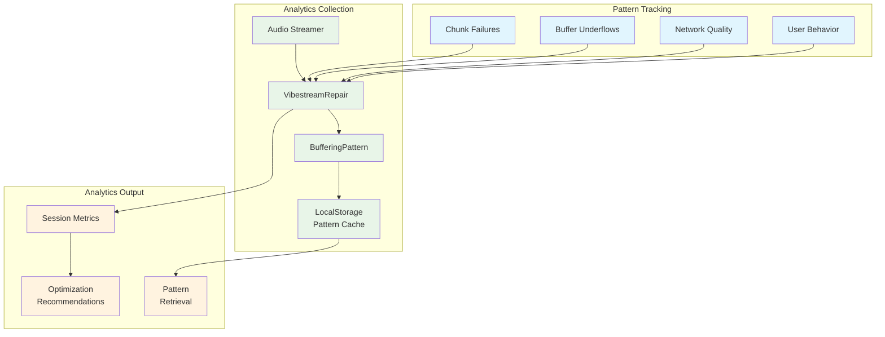
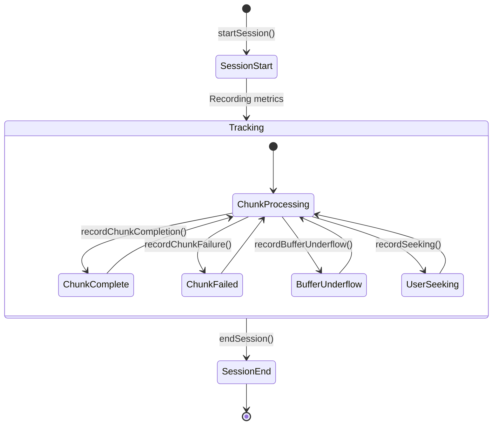
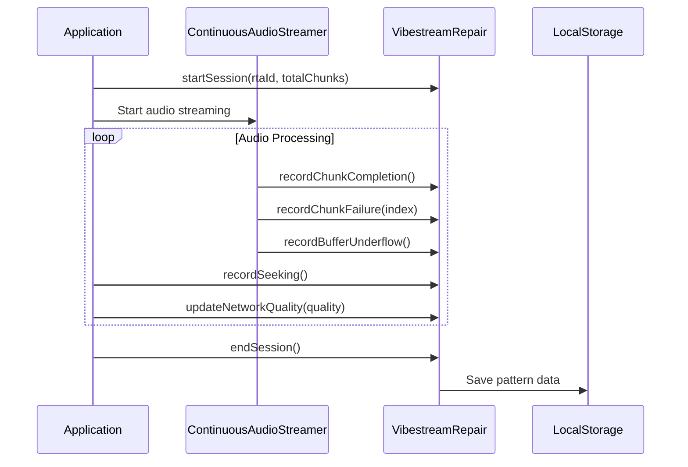

# VibeRepair Analytics

The VibeRepair system provides buffering analytics and pattern tracking for the ContinuousAudioStreamer, focusing on essential pattern recognition to optimize audio streaming performance and user experience.

## Architecture Overview

The VibeRepair system operates as a lightweight analytics layer that tracks streaming patterns and provides insights for optimization:

<Mermaid>

</Mermaid>

## Core Components

### VibestreamRepair Class

The main analytics class tracks buffering patterns with enhanced metrics:

```typescript
export class VibestreamRepair {
  private currentSession: Partial<BufferingPattern> = {};
  private patterns: BufferingPattern[] = [];

  constructor() {
    this.loadPatternsFromStorage();
  }
}
```

### BufferingPattern Interface

The system tracks comprehensive buffering metrics:

```typescript
interface BufferingPattern {
  rtaId: string;
  chunkFailures: number[];
  sessionDuration: number;
  userBehavior: 'seeking' | 'continuous' | 'interrupted';
  timestamp: number;
  totalChunks: number;
  completedChunks: number;
  bufferUnderflows: number;
  networkQuality: 'excellent' | 'good' | 'poor';
}
```

## Session Management

### Session Initialization

Each streaming session is tracked with comprehensive metadata:

```typescript
startSession(rtaId: string, totalChunks: number = 0) {
  this.currentSession = {
    rtaId,
    chunkFailures: [],
    timestamp: Date.now(),
    userBehavior: 'continuous',
    totalChunks,
    completedChunks: 0,
    bufferUnderflows: 0,
    networkQuality: 'excellent'
  };
  console.log(`📊 Started analytics session for ${rtaId} (${totalChunks} chunks)`);
}
```

### Session Lifecycle

The system tracks the complete session lifecycle:

<Mermaid>

</Mermaid>

## Metric Collection

### Chunk Failure Tracking

The system records specific chunk indices that fail during streaming:

```typescript
recordChunkFailure(chunkIndex: number) {
  if (!this.currentSession.chunkFailures) this.currentSession.chunkFailures = [];
  this.currentSession.chunkFailures.push(chunkIndex);
}
```

### User Behavior Analysis

Different user interaction patterns are tracked:

```typescript
recordSeeking() {
  if (this.currentSession) {
    this.currentSession.userBehavior = 'seeking';
  }
}
```

### Performance Metrics

The system tracks completion rates and buffer health:

```typescript
recordChunkCompletion() {
  if (this.currentSession.completedChunks !== undefined) {
    this.currentSession.completedChunks++;
  }
}

recordBufferUnderflow() {
  if (this.currentSession.bufferUnderflows !== undefined) {
    this.currentSession.bufferUnderflows++;
  }
}
```

### Network Quality Assessment

Network conditions are continuously monitored:

```typescript
updateNetworkQuality(quality: 'excellent' | 'good' | 'poor') {
  if (this.currentSession) {
    this.currentSession.networkQuality = quality;
  }
}
```

## Pattern Storage

### Local Storage Implementation

The system uses platform-specific storage for pattern persistence:

```typescript
private loadPatternsFromStorage() {
  try {
    if (Platform.OS === 'web') {
      const stored = localStorage.getItem('vibesflow_buffering_patterns');
      if (stored) {
        this.patterns = JSON.parse(stored);
      }
    }
  } catch (error) {
    console.warn('⚠️ Failed to load buffering patterns:', error);
  }
}
```

### Pattern Persistence

Patterns are saved with memory management to prevent storage bloat:

```typescript
private savePatternsToStorage() {
  try {
    if (Platform.OS === 'web') {
      // Keep only last 20 patterns to prevent memory bloat
      const patternsToStore = this.patterns.slice(-20);
      localStorage.setItem('vibesflow_buffering_patterns', JSON.stringify(patternsToStore));
    }
  } catch (error) {
    console.warn('⚠️ Failed to save buffering patterns:', error);
  }
}
```

## Session Finalization

### Pattern Generation

When a session ends, comprehensive patterns are generated:

```typescript
endSession() {
  if (!this.currentSession.rtaId) return;

  const pattern: BufferingPattern = {
    rtaId: this.currentSession.rtaId,
    chunkFailures: this.currentSession.chunkFailures || [],
    sessionDuration: Date.now() - (this.currentSession.timestamp || Date.now()),
    userBehavior: this.currentSession.userBehavior || 'continuous',
    timestamp: this.currentSession.timestamp || Date.now(),
    totalChunks: this.currentSession.totalChunks || 0,
    completedChunks: this.currentSession.completedChunks || 0,
    bufferUnderflows: this.currentSession.bufferUnderflows || 0,
    networkQuality: this.currentSession.networkQuality || 'excellent'
  };

  this.patterns.push(pattern);
  this.savePatternsToStorage();
  
  // Reset session
  this.currentSession = {};
}
```

## Integration with Audio Streaming

### ContinuousAudioStreamer Integration

The VibeRepair system integrates with the audio streaming pipeline:

<Mermaid>

</Mermaid>

## Performance Optimization

### Memory Management

The system implements efficient memory management:

- **Pattern Limit**: Only stores the last 20 patterns
- **Session Reset**: Clears session data after each completion
- **Error Handling**: Graceful fallback for storage failures

### Platform Compatibility

The system supports multiple platforms through React Native's Platform API:

```typescript
import { Platform } from 'react-native';

// Platform-specific storage implementation
if (Platform.OS === 'web') {
  // Use localStorage for web
} else {
  // Use AsyncStorage for mobile (if implemented)
}
```

## Analytics Insights

### Pattern Analysis

The stored patterns can be analyzed to identify:

1. **Failure Hotspots**: Specific chunk indices that consistently fail
2. **Network Correlations**: Relationship between network quality and performance
3. **User Behavior Impact**: How seeking affects buffering performance
4. **Session Duration Patterns**: Optimal session lengths for different scenarios

### Optimization Recommendations

Based on collected patterns, the system can inform:

- **Buffer Size Adjustments**: Optimal buffer sizes for different network conditions
- **Prefetch Strategies**: Which chunks to prioritize based on failure patterns
- **User Experience**: When to show loading indicators or quality warnings

## Error Handling

### Graceful Degradation

The system handles errors without affecting audio playback:

```typescript
try {
  // Analytics operations
} catch (error) {
  console.warn('⚠️ Analytics operation failed:', error);
  // Continue without analytics
}
```

### Storage Fallbacks

If storage operations fail, the system continues operation:

```typescript
private savePatternsToStorage() {
  try {
    // Storage operation
  } catch (error) {
    console.warn('⚠️ Failed to save buffering patterns:', error);
    // Analytics continues in memory only
  }
}
```

## Configuration

### Default Settings

The system operates with sensible defaults:

- **Maximum Stored Patterns**: 20
- **Default Network Quality**: 'excellent'
- **Default User Behavior**: 'continuous'

### Customization

The system can be extended for additional metrics:

```typescript
// Example extension for custom metrics
interface ExtendedBufferingPattern extends BufferingPattern {
  deviceType: string;
  connectionType: string;
  audioQuality: number;
}
```

## Future Enhancements

The VibeRepair system is designed for extensibility:

1. **Machine Learning**: Pattern recognition for predictive optimization
2. **Real-time Adaptation**: Dynamic buffer adjustments based on patterns
3. **Cross-session Learning**: Learning from historical patterns across users
4. **Advanced Analytics**: More sophisticated failure prediction algorithms
