# Contract Interaction Flows

This page provides comprehensive diagrams showing how the VibesFlow contracts interact with each other and with users.

## System Architecture

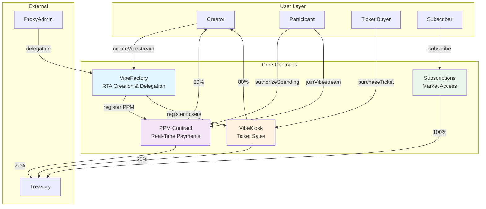

## RTA Creation Flow

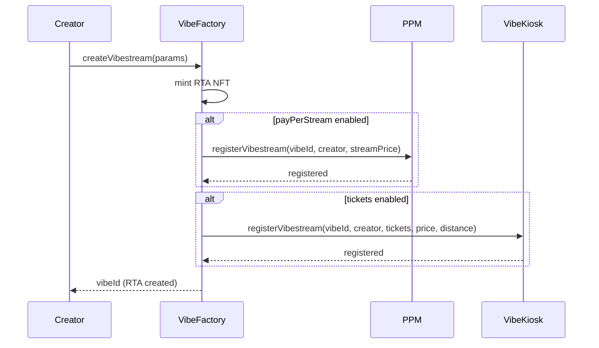

## PPM Payment Flow

```mermaid
sequenceDiagram
    participant Participant
    participant PPM
    participant Creator
    participant Treasury
    
    Participant->>PPM: authorizeSpending(vibeId, amount) + tMETIS
    PPM->>PPM: create/update allowance
    PPM-->>Participant: allowance authorized
    
    Participant->>PPM: joinVibestream(vibeId)
    PPM->>PPM: set active, start timer
    PPM-->>Participant: joined stream
    
    loop Every 60+ seconds
        PPM->>PPM: processParticipantPayment()
        PPM->>PPM: calculate minutes elapsed
        PPM->>PPM: deduct payment
        PPM->>Creator: transfer 80% of payment
        PPM->>Treasury: transfer 20% of payment
    end
    
    Participant->>PPM: leaveVibestream(vibeId)
    PPM->>PPM: process final payment
    PPM->>PPM: set inactive
    PPM-->>Participant: left stream
```

## Ticket Purchase Flow

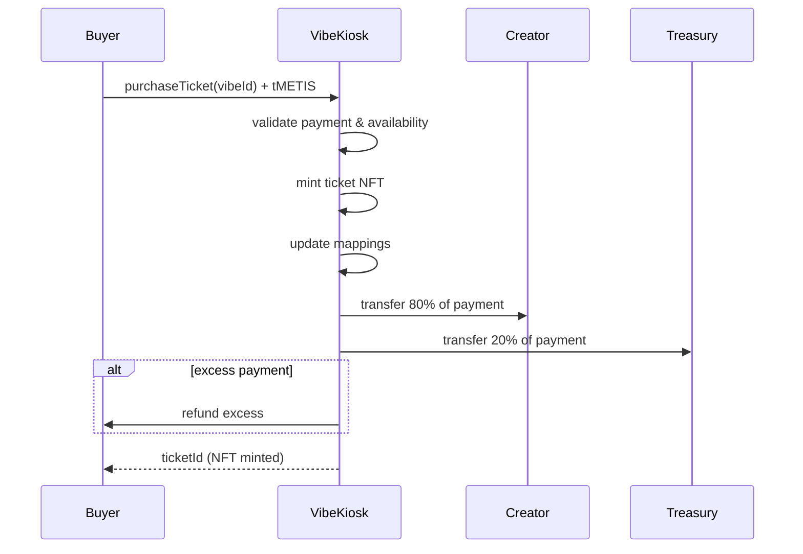

## Subscription Flow

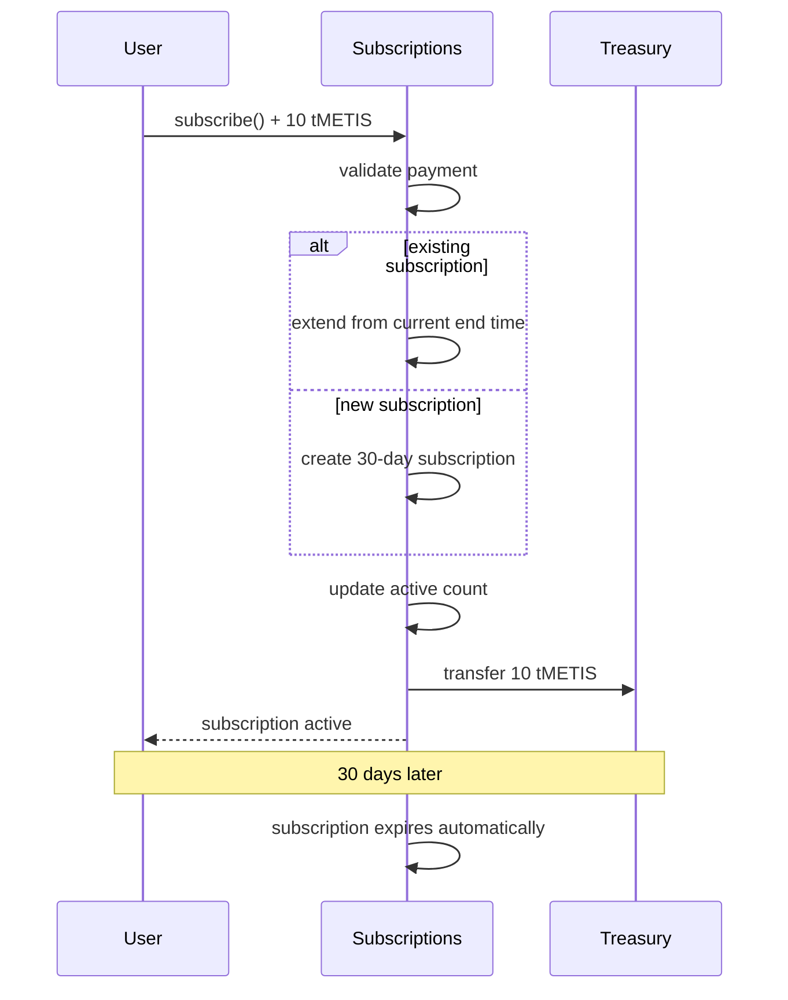

## Delegation Flow

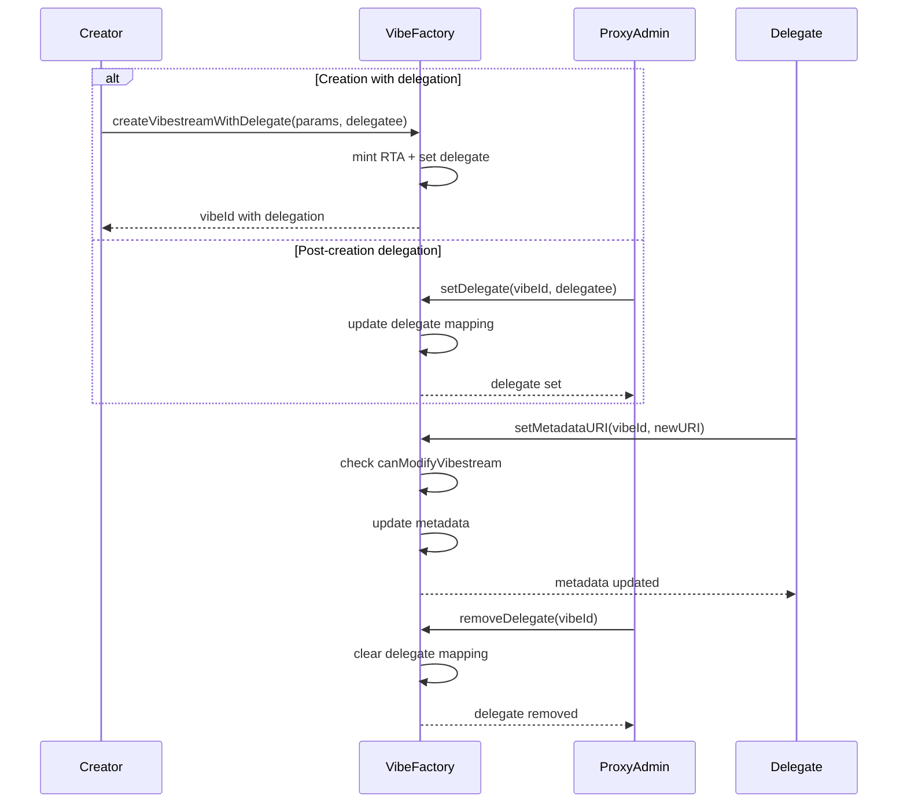

## Multi-Modal Monetization

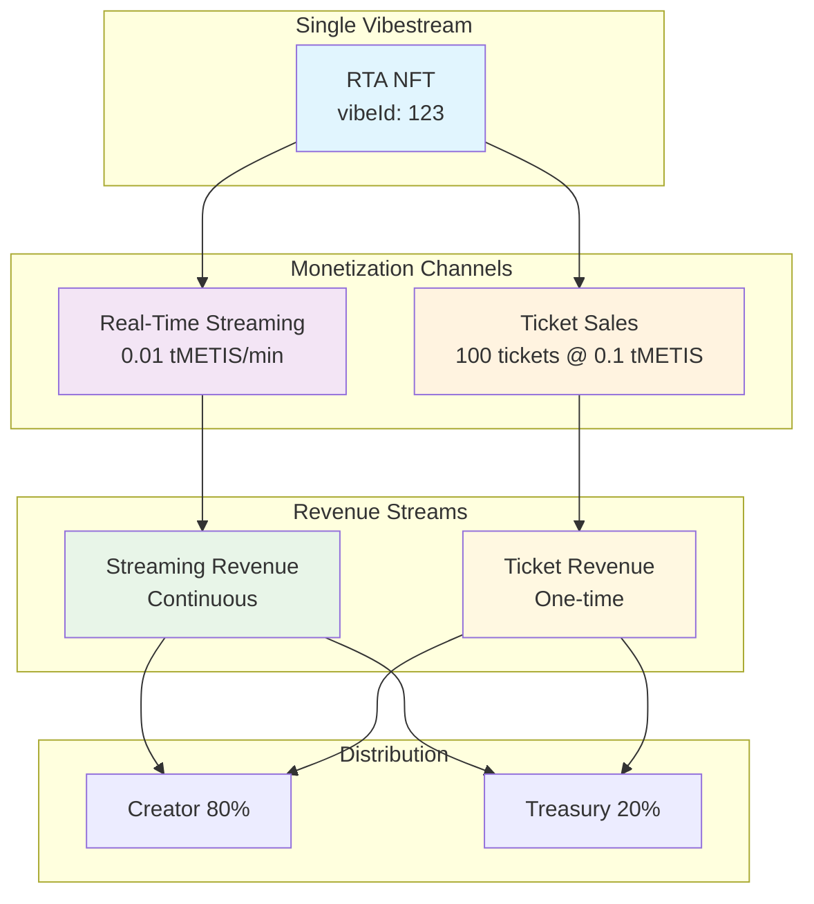

## Emergency Flows

### PPM Emergency Stop

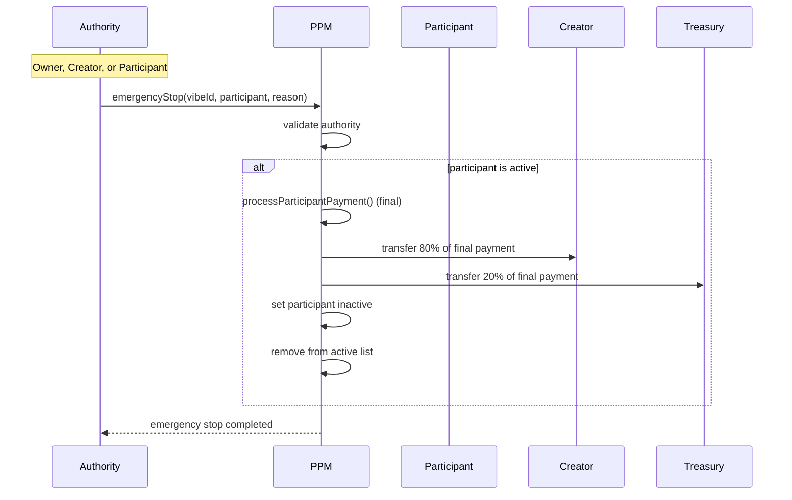

### Contract Pause Flow

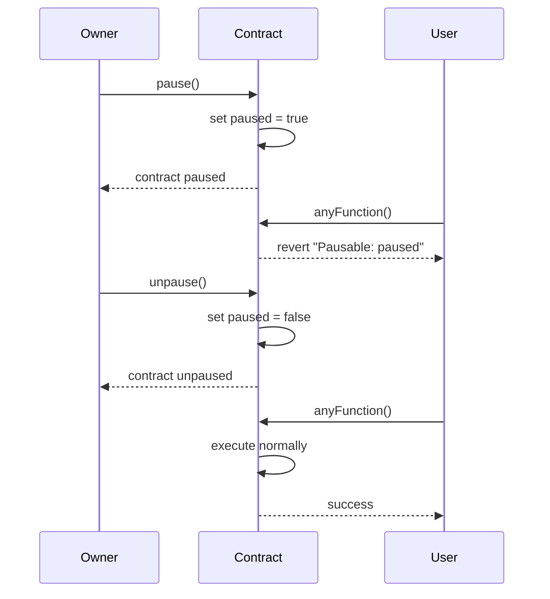

## Cross-Contract Integration

### VibeFactory Integration Points

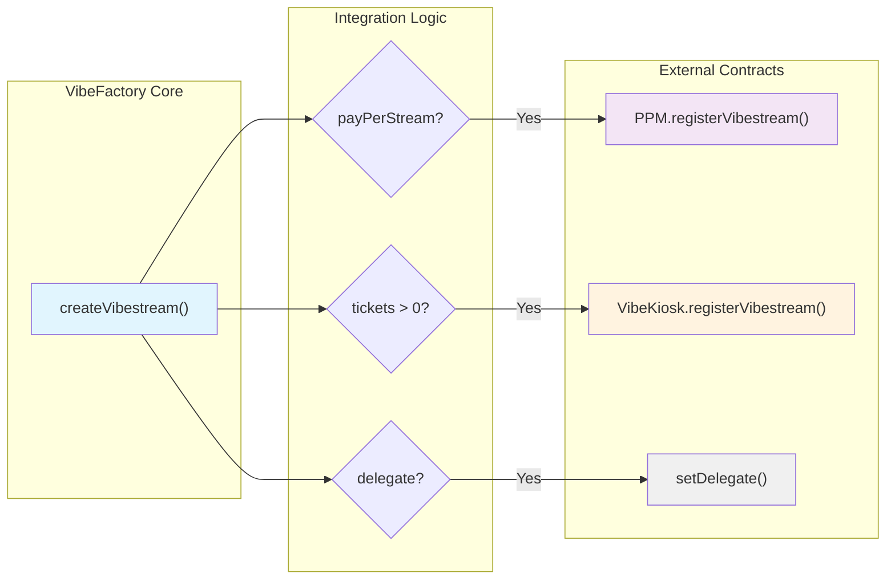

## State Transitions

### Participant State in PPM

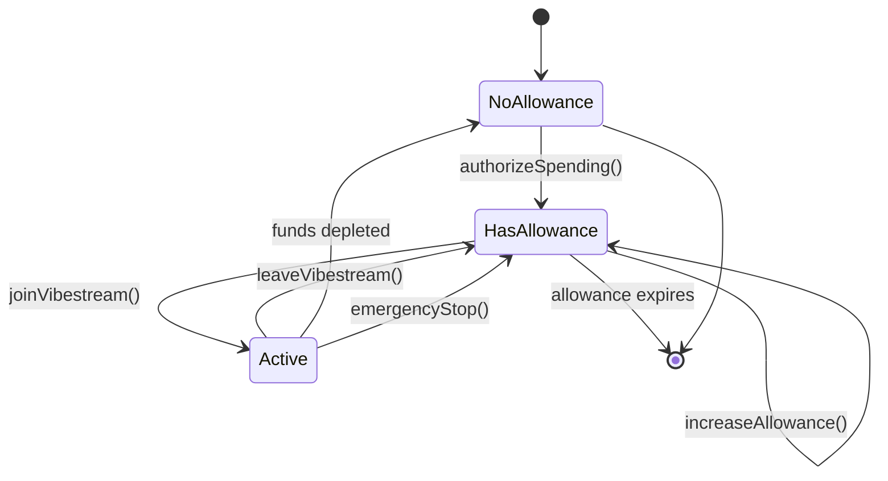

### RTA Lifecycle

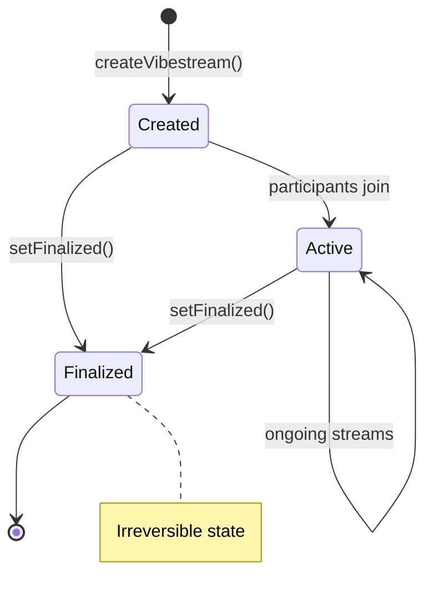

## Gas Optimization Patterns

### Batch Operations

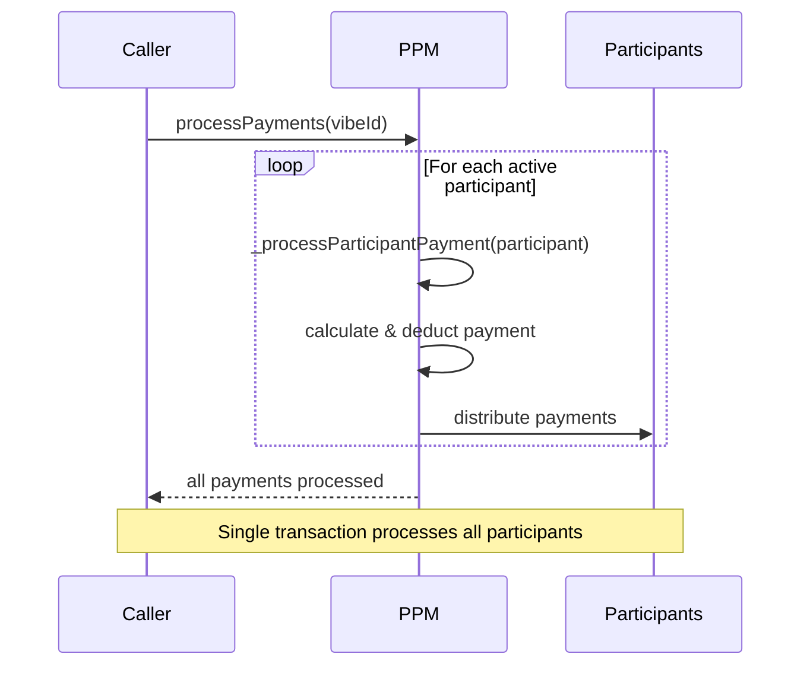

## Error Handling Flows

### Payment Failure Recovery

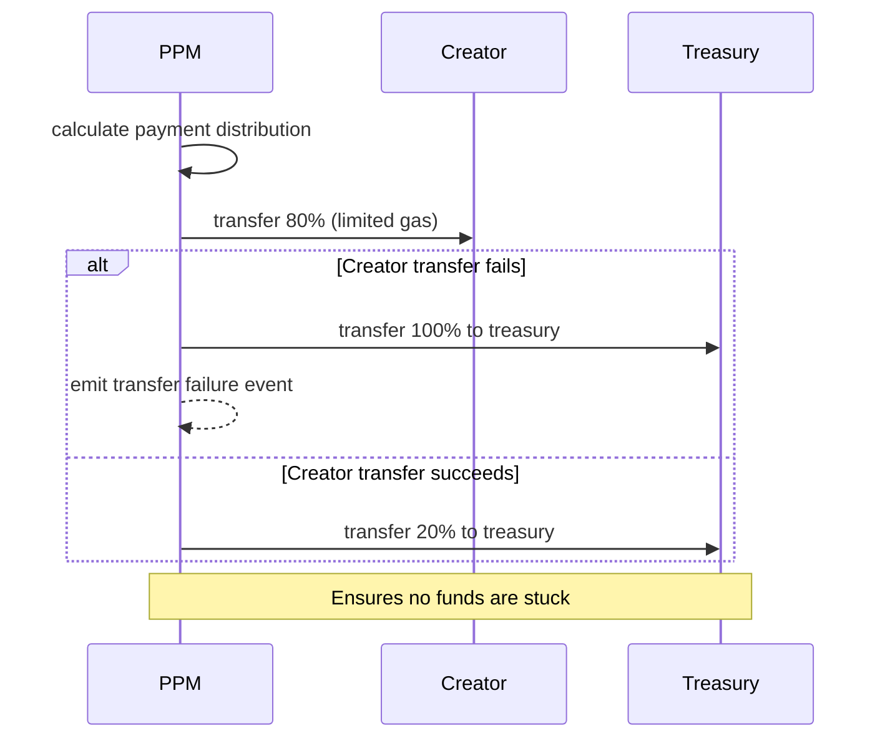

## Integration Summary

The VibesFlow contract system provides:

1. **Modular Architecture**: Each contract handles specific functionality
2. **Seamless Integration**: Automatic cross-contract registration and communication
3. **Dual Monetization**: RTAs can generate revenue through both streaming and tickets
4. **Flexible Delegation**: Comprehensive permission system for management
5. **Robust Security**: Multiple layers of access control and emergency mechanisms
6. **Gas Efficiency**: Optimized patterns for cost-effective operations

## Next Steps

<CardGroup cols={2}>
  <Card title="Deployed Contracts" icon="server" href="/contracts/deployment">
    View live contract addresses
  </Card>
  <Card title="RTA Protocol" icon="link" href="/contracts/rta-protocol">
    Understand the core protocol
  </Card>
</CardGroup>
