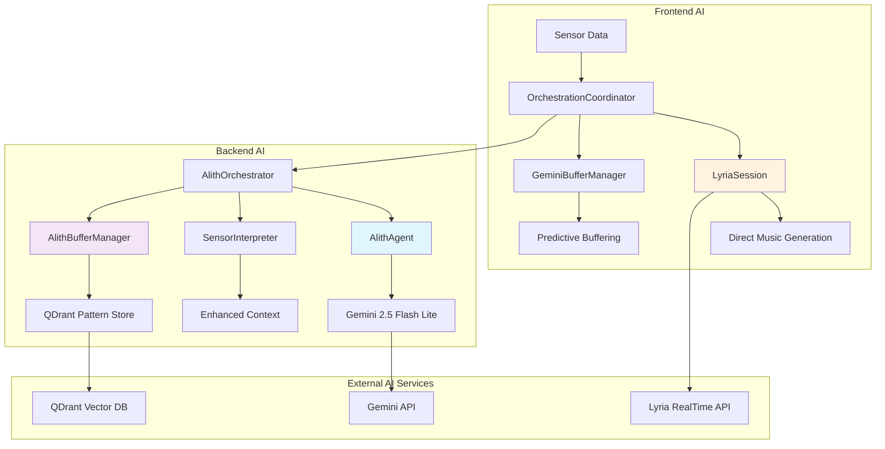

# AI Systems

VibesFlow integrates multiple AI systems for real-time music generation, sensor interpretation, and intelligent processing optimization. The AI infrastructure provides the core intelligence behind motion-to-music conversion.

## AI Architecture Overview

<Mermaid>

</Mermaid>

## Core AI Components

### Alith Agent Integration

The backend uses Alith framework with Gemini 2.5 Flash Lite for intelligent sensor interpretation:

```javascript
// Agent initialization from ai/alith-orchestrator.mdx
musicAgent = new Agent({
  model: "gemini-2.5-flash-lite",
  apiKey: process.env.GOOGLE_GENERATIVE_AI_API_KEY,
  baseUrl: "generativelanguage.googleapis.com/v1beta/openai",
  preamble: enhancedPreamble,
  memory: new WindowBufferMemory(8)
});

// Enhanced preamble with embedded knowledge
function preambleWithKnowledge() {
  const poemsContent = readFileSync(join(__dirname, 'knowledge', 'poems.txt'), 'utf8');
  const parametersContent = readFileSync(join(__dirname, 'knowledge', 'parameters.txt'), 'utf8');
  
  return `Enhanced preamble with ${poemsContent} and ${parametersContent}`;
}
```

### Sensor Interpretation Pipeline

```javascript
// Sensor data processing with context enrichment
const interpretation = await musicAgent.run(JSON.stringify({
  sensorData: enrichedSensorData,
  sessionHistory: sessionData?.history || [],
  userProfile: sessionData?.profile || {},
  currentBaseline: this.currentBaseline
}));

// Context enrichment
const enrichedSensorData = {
  ...sensorData,
  sessionDuration: Date.now() - this.sessionStartTime,
  totalSensorUpdates: this.sensorUpdateCount,
  averageMotionLevel: this.calculateAverageMotion(),
  motionTrend: this.calculateMotionTrend(),
  energyLevel: this.calculateEnergyLevel(sensorData)
};
```

### Pattern Learning System

```javascript
// QDrant integration for user pattern storage
userPatternStore = new QdrantStore({
  url: process.env.QDRANT_URL || 'http://localhost:6333',
  collectionName: 'user_patterns',
  apiKey: process.env.QDRANT_API_KEY
});

// Memory management with token efficiency
memory: new WindowBufferMemory(8) // Reduced window for token efficiency
```

## Lyria Integration

### Direct Music Generation

Frontend Lyria integration for real-time music generation:

```javascript
// Lyria session management in orchestration/coordinator.js
class LyriaSession {
  async startSession() {
    try {
      console.log('🎵 Starting Lyria RealTime session...');
      
      // Initialize Lyria WebSocket connection
      this.lyriaWs = new WebSocket(this.getLyriaWebSocketUrl());
      
      this.lyriaWs.onopen = () => {
        console.log('✅ Lyria session connected');
        this.isConnected = true;
      };
      
      this.lyriaWs.onmessage = (event) => {
        this.handleLyriaAudioChunk(event.data);
      };
      
      return true;
    } catch (error) {
      console.error('❌ Failed to start Lyria session:', error);
      return false;
    }
  }
  
  async generateMusic(prompt, config) {
    if (this.lyriaWs?.readyState === WebSocket.OPEN) {
      this.lyriaWs.send(JSON.stringify({
        type: 'generateMusic',
        prompt: prompt,
        config: config,
        timestamp: Date.now()
      }));
    }
  }
}
```

### Buffering Management

```javascript
// Gemini-powered predictive buffering
class GeminiBufferManager {
  async predictNextChunk(currentSensorData, musicHistory) {
    try {
      const prediction = await this.geminiClient.generateContent({
        prompt: `Based on sensor data: ${JSON.stringify(currentSensorData)} and music history, predict next musical direction.`,
        model: 'gemini-pro'
      });
      
      return this.parseBufferPrediction(prediction);
    } catch (error) {
      console.warn('Buffer prediction failed:', error);
      return this.createFallbackBuffer();
    }
  }
}
```

## Performance Optimizations

### Rate Limiting

Sophisticated rate limiting respects API quotas:

```javascript
// Optimized rate limiting for Gemini API
this.geminiCallCooldown = 4500; // 4.5 seconds for 15 requests/minute quota
this.serverLatency = 250;       // Stability-focused latency
this.minSendInterval = 200;     // Smooth server processing

// Agent synchronization prevents parallel token consumption
let agentProcessingQueue = Promise.resolve();
let activeProcessingCount = 0;

agentProcessingQueue = agentProcessingQueue.then(async () => {
  activeProcessingCount++;
  try {
    return await processRequest();
  } finally {
    activeProcessingCount--;
  }
});
```

### Token Efficiency

```javascript
// Token optimization through embedded knowledge
console.log('📊 Enhanced preamble statistics:', {
  totalLength: enhancedPreamble.length,
  estimatedTokens: Math.ceil(enhancedPreamble.length / 4),
  knowledgeEmbedded: 'parameters.txt + poems.txt',
  ragRequired: false
});
```

## Fallback Systems

### Energy-Based Fallbacks

When AI interpretation fails, energy-based fallbacks provide continuity:

```javascript
// Intelligent fallback system
createIntelligentRaveFallback(enrichedSensorData, sessionData) {
  // Energy-based fallback when AI agent is unavailable
  const energy = Math.sqrt(
    Math.pow(enrichedSensorData.x, 2) + 
    Math.pow(enrichedSensorData.y, 2) + 
    Math.pow(enrichedSensorData.z, 2)
  ) / 3;
  
  return {
    singleCoherentPrompt: this.generateEnergyBasedPrompt(energy),
    lyriaConfig: this.generateEnergyBasedConfig(energy),
    requiresCrossfade: energy > 0.6
  };
}
```

### Connection Recovery

```javascript
// Exponential backoff for connection recovery
async reconnectToServer() {
  const delay = Math.min(1000 * Math.pow(2, this.reconnectAttempts), 30000);
  
  setTimeout(async () => {
    try {
      await this.connectToInterpretationServer();
    } catch (error) {
      this.reconnectAttempts++;
      if (this.reconnectAttempts < this.maxReconnectAttempts) {
        this.reconnectToServer();
      }
    }
  }, delay);
}
```

## Platform-Specific Orchestrators

### Multi-Platform Support

```javascript
// Platform-specific orchestrator management
this.orchestrators = {
  mobile: mobileOrchestrator,
  web: webOrchestrator
};

this.activeOrchestrator = this.orchestrators[this.platform];

// Platform detection
this.platform = Platform.OS === 'web' ? 'web' : 'mobile';
```

### Orchestrator Selection

```javascript
// Dynamic orchestrator selection based on capabilities
const selectOrchestrator = () => {
  if (Platform.OS === 'web' && window.AudioContext) {
    return webOrchestrator; // Full Web Audio API support
  } else if (Platform.OS !== 'web') {
    return mobileOrchestrator; // Mobile-optimized processing
  } else {
    return fallbackOrchestrator; // Basic functionality
  }
};
```

## Monitoring and Analytics

### Performance Tracking

```javascript
// Performance metrics tracking
const processingTime = Date.now() - startTime;
logPerformance('sensor_processing', processingTime);

// System health monitoring
const systemHealth = {
  aiConnected: this.isConnectedToServer,
  lyriaActive: this.lyriaSession?.isConnected,
  bufferHealth: this.bufferManager.getHealth(),
  processingLatency: this.getAverageLatency()
};
```

### Logging Strategy

```javascript
// Comprehensive AI system logging
console.log('📊 AI System Status:', {
  alithAgent: musicAgent ? 'active' : 'inactive',
  lyriaSession: this.lyriaSession?.isConnected ? 'connected' : 'disconnected',
  qDrantStore: this.userPatternStore ? 'available' : 'unavailable',
  memoryWindow: this.memory?.getWindowSize() || 0,
  processingQueue: activeProcessingCount
});
```

## Next Steps

<CardGroup cols={2}>
  <Card title="Streaming Infrastructure" icon="broadcast-tower" href="/essentials/streaming-infrastructure">
    Learn about SRS streaming system
  </Card>
  <Card title="Decentralized Storage" icon="database" href="/essentials/decentralized-storage">
    Understand storage infrastructure
  </Card>
</CardGroup>
