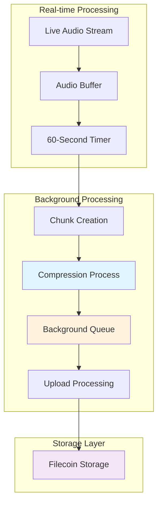

## Chunking Architecture



## Audio Collection System

### Chunk Service Initialization

```javascript
// AudioChunkService initialization in chunks.tsx
class AudioChunkService {
  private isCollecting: boolean = false;
  private currentRtaId: string | null = null;
  private currentCreator: string | null = null;
  private chunkDuration: number = 60000; // 60 seconds
  private chunkSequence: number = 0;
  
  // Enhanced audio accumulation with background processing
  private audioBuffer: ArrayBuffer[] = [];
  private bufferStartTime: number = 0;
  private chunkTimer: NodeJS.Timeout | null = null;
  
  // Background processing queue
  private backgroundQueue: Array<{
    chunkId: string, 
    buffer: ArrayBuffer, 
    metadata: ChunkMetadata, 
    isFinal: boolean,
    priority: 'low' | 'normal' | 'high'
  }> = [];
}
```

### Data Collection

```javascript
// Audio data collection with activity tracking
addAudioData(audioData: ArrayBuffer | string): void {
  if (!this.isCollecting || !this.currentRtaId) return;

  // Enhanced music activity tracking
  const now = Date.now();
  this.lastMusicActivity = now;
  this.musicActivityHistory.push(now);
  
  // Peak detection for rhythm-based processing optimization
  if (typeof audioData === 'string') {
    const estimatedEnergy = audioData.length;
    if (estimatedEnergy > this.musicPeakDetection.averagePeakInterval * 1.5) {
      this.musicPeakDetection.recentPeaks.push(now);
      this.musicPeakDetection.lastPeakTime = now;
      
      // Keep only recent peaks (last 30 seconds)
      this.musicPeakDetection.recentPeaks = this.musicPeakDetection.recentPeaks.filter(
        peak => now - peak < 30000
      );
    }
  }

  try {
    let buffer: ArrayBuffer;
    
    if (typeof audioData === 'string') {
      // Optimized base64 conversion with chunked processing
      buffer = this.fastBase64ToBuffer(audioData);
    } else {
      buffer = audioData;
    }

    // Add to accumulation buffer with minimal processing
    this.audioBuffer.push(buffer);
    
  } catch (error) {
    console.error('❌ Error adding audio data:', error);
  }
}
```

## Intelligent Activity Detection

### Pattern Recognition

```javascript
// Enhanced activity detection for processing optimization
private updateMusicActivityDetection(now: number, timeSinceLastActivity: number) {
  // Adaptive threshold based on recent patterns
  let adaptiveThreshold = this.activityDetectionWindow;
  
  if (this.musicActivityHistory.length > 5) {
    const recentIntervals: number[] = [];
    for (let i = 1; i < this.musicActivityHistory.length; i++) {
      recentIntervals.push(this.musicActivityHistory[i] - this.musicActivityHistory[i - 1]);
    }
    
    if (recentIntervals.length > 0) {
      const avgInterval = recentIntervals.reduce((a, b) => a + b, 0) / recentIntervals.length;
      // Adapt threshold based on music rhythm patterns
      adaptiveThreshold = Math.min(Math.max(avgInterval * 0.6, this.activityDetectionWindow), this.activityDetectionWindow * 2);
    }
  }
  
  this.isLiveMusicActive = timeSinceLastActivity < adaptiveThreshold;
}
```

### Compression Level Adaptation

```javascript
// Adaptive compression levels based on activity
private adjustCompressionLevel(timeSinceLastActivity: number) {
  let newLevel: 'light' | 'medium' | 'heavy';
  
  if (this.isLiveMusicActive) {
    newLevel = 'light'; // Minimal processing during live music
  } else if (timeSinceLastActivity < this.quietPeriodThreshold) {
    // Smart medium processing - consider background queue size and system load
    const queuePressure = this.backgroundQueue.length > 3;
    const lowSystemLoad = this.processingLoadMonitor.avgProcessingTime < 100;
    
    newLevel = (queuePressure && lowSystemLoad) ? 'medium' : 'light';
  } else if (timeSinceLastActivity < this.idlePeriodThreshold) {
    newLevel = 'medium'; // Moderate processing during quiet periods
  } else {
    // Intelligent heavy processing - only during confirmed idle periods
    const confirmedIdle = this.backgroundQueue.length > 2 && 
                         !this.processingLoadMonitor.isHeavyProcessing;
    newLevel = confirmedIdle ? 'heavy' : 'medium';
  }
  
  this.compressionLevel = newLevel;
}
```

## Chunk Timer System

### Optimized Timer Implementation

```javascript
// 60-second chunk timer with background processing
private startOptimizedChunkTimer(): void {
  this.chunkTimer = setInterval(async () => {
    if (this.isCollecting && this.audioBuffer.length > 0) {
      // Create chunk in background to avoid interrupting live music
      const chunkData = {
        chunkId: this.generateChunkId(false),
        buffer: this.combineAudioBuffers(),
        metadata: this.createCurrentMetadata(),
        isFinal: false,
        priority: this.isLiveMusicActive ? 'low' : 'normal' as 'low' | 'normal'
      };
      
      // Add to background queue instead of processing immediately
      this.backgroundQueue.push(chunkData);
      
      // Clear buffer immediately to free memory and reset timing
      this.audioBuffer = [];
      this.bufferStartTime = Date.now();
      this.chunkSequence++;
      
      // Process queue in background with minimal impact
      if (!this.isBackgroundProcessing) {
        setTimeout(() => this.processBackgroundQueue(), 100);
      }
    }
  }, this.chunkDuration);
}
```

### Chunk Metadata Creation

```javascript
// Comprehensive chunk metadata
private createCurrentMetadata(): ChunkMetadata {
  return {
    rtaId: this.currentRtaId!,
    chunkId: this.generateChunkId(false),
    timestamp: Date.now(),
    creator: this.currentCreator!,
    startTime: this.startTime.toString(),
    chunkTimestamp: this.bufferStartTime,
    sampleRate: 48000,
    channels: 2,
    bitDepth: 16,
    participantCount: this.currentParticipantCount,
    audioFormat: 'webm-opus',
  };
}
```

## Audio Compression

### Web Audio API Compression

```javascript
// Advanced audio compression using Web Audio API
private async compressAudioData(rawPcmBuffer: ArrayBuffer): Promise<ArrayBuffer> {
  if (typeof window === 'undefined' || !window.AudioContext) {
    return rawPcmBuffer;
  }

  try {
    const audioContext = new (window.AudioContext || (window as any).webkitAudioContext)();
    const sampleRate = 48000;
    const channels = 2;
    
    // Convert raw PCM buffer to AudioBuffer
    const samples = rawPcmBuffer.byteLength / (2 * channels); // 16-bit = 2 bytes per sample
    const audioBuffer = audioContext.createBuffer(channels, samples, sampleRate);
    
    // Convert interleaved 16-bit PCM to float32 planar
    const dataView = new DataView(rawPcmBuffer);
    for (let channel = 0; channel < channels; channel++) {
      const channelData = audioBuffer.getChannelData(channel);
      for (let i = 0; i < samples; i++) {
        // Read 16-bit little-endian PCM
        const sample16 = dataView.getInt16((i * channels + channel) * 2, true);
        // Convert to float32 (-1.0 to 1.0)
        channelData[i] = sample16 / 32768;
      }
    }

    // Use MediaRecorder for compression
    const stream = audioContext.createMediaStreamDestination();
    const source = audioContext.createBufferSource();
    source.buffer = audioBuffer;
    source.connect(stream);

    const mediaRecorder = new MediaRecorder(stream.stream, {
      mimeType: 'audio/webm;codecs=opus', // Opus codec in WebM container
      audioBitsPerSecond: 128000 // 128kbps for good quality
    });

    const compressedChunks: Blob[] = [];
    
    return new Promise((resolve, reject) => {
      mediaRecorder.ondataavailable = (event) => {
        if (event.data.size > 0) {
          compressedChunks.push(event.data);
        }
      };

      mediaRecorder.onstop = async () => {
        const compressedBlob = new Blob(compressedChunks, { type: 'audio/webm' });
        const compressedBuffer = await compressedBlob.arrayBuffer();
        
        // Log compression statistics
        const originalSizeMB = rawPcmBuffer.byteLength / 1024 / 1024;
        const compressedSizeMB = compressedBuffer.byteLength / 1024 / 1024;
        const compressionRatio = ((1 - compressedSizeMB / originalSizeMB) * 100).toFixed(1);
        
        if (originalSizeMB > 1) { // Only log for larger files
          console.log(`🗜️ Audio compressed: ${originalSizeMB.toFixed(1)}MB → ${compressedSizeMB.toFixed(1)}MB (${compressionRatio}% reduction)`);
        }
        
        resolve(compressedBuffer);
      };

      mediaRecorder.onerror = (error) => {
        console.error('MediaRecorder error:', error);
        reject(error);
      };

      // Start recording and play the audio
      mediaRecorder.start();
      source.start();
      
      // Stop recording after audio finishes
      source.onended = () => {
        setTimeout(() => mediaRecorder.stop(), 100);
      };
    });
  } catch (error) {
    console.error('Audio compression failed:', error);
    return rawPcmBuffer; // Fallback to raw audio
  }
}
```

## Background Processing Queue

### Queue Management

```javascript
// Enhanced background processing with load balancing
private async processBackgroundQueue(): Promise<void> {
  if (this.isBackgroundProcessing || this.backgroundQueue.length === 0) return;
  
  this.isBackgroundProcessing = true;
  const startTime = Date.now();
  
  console.groupCollapsed(`🔄 BACKGROUND PROCESSING: ${this.backgroundQueue.length} chunks`);

  let processedCount = 0;
  
  while (this.backgroundQueue.length > 0) {
    const { chunkId, buffer, metadata, isFinal } = this.backgroundQueue.shift()!;
    
    try {
      // Compress audio data
      const compressedBuffer = await this.compressAudioData(buffer);
      
      // Upload to backend
      await this.uploadChunkToBackend(chunkId, compressedBuffer, metadata, isFinal, 'background');
      
      processedCount++;
      
      // Small delay to prevent overwhelming
      await new Promise(resolve => setTimeout(resolve, 50));
      
    } catch (error) {
      console.error(`Background processing failed for ${chunkId}:`, (error as Error).message);
    }
  }

  this.isBackgroundProcessing = false;
  const totalTime = Date.now() - startTime;
  
  console.groupEnd();
}
```

### Priority-Based Processing

```javascript
// Dynamic priority adjustment based on system state
private optimizeBackgroundQueue() {
  if (this.backgroundQueue.length === 0) return;
  
  // Dynamic priority adjustment based on current state
  this.backgroundQueue.forEach(item => {
    // Upgrade priority for old items during idle periods
    if (!this.isLiveMusicActive && this.backgroundQueue.length > 5) {
      if (item.priority === 'low') item.priority = 'normal';
      else if (item.priority === 'normal') item.priority = 'high';
    }
    
    // Downgrade priority during active music periods
    if (this.isLiveMusicActive && this.backgroundQueue.length > 8) {
      if (item.priority === 'high') item.priority = 'normal';
      else if (item.priority === 'normal') item.priority = 'low';
    }
  });
  
  // Automatic queue processing during optimal conditions
  const shouldAutoProcess = !this.isBackgroundProcessing && 
                           this.backgroundQueue.length > 3 && 
                           !this.isLiveMusicActive &&
                           !this.processingLoadMonitor.isHeavyProcessing;
  
  if (shouldAutoProcess) {
    setTimeout(() => this.processBackgroundQueue(), 100);
  }
}
```

## Data Conversion Utilities

### Base64 Processing

```javascript
// Fast base64 to ArrayBuffer conversion with chunked processing
private fastBase64ToBuffer(base64: string): ArrayBuffer {
  try {
    if (Platform.OS === 'web' && typeof atob !== 'undefined') {
      const binaryString = atob(base64);
      const buffer = new ArrayBuffer(binaryString.length);
      const uint8Array = new Uint8Array(buffer);
      
      // Chunked processing for large buffers to avoid blocking
      const chunkSize = 32768; // 32KB chunks
      if (binaryString.length > chunkSize) {
        let offset = 0;
        while (offset < binaryString.length) {
          const end = Math.min(offset + chunkSize, binaryString.length);
          for (let i = offset; i < end; i++) {
            uint8Array[i] = binaryString.charCodeAt(i);
          }
          offset = end;
          
          // Yield control during non-live music to prevent blocking UI
          if (!this.isLiveMusicActive && offset < binaryString.length) {
            break;
          }
        }
      } else {
        // Fast processing for small buffers
        for (let i = 0; i < binaryString.length; i++) {
          uint8Array[i] = binaryString.charCodeAt(i);
        }
      }
      
      return buffer;
    } else {
      // Fallback for React Native
      return this.base64ToBinaryFallback(base64);
    }
  } catch (error) {
    console.error('Base64 decode error:', error);
    return new ArrayBuffer(0);
  }
}
```

### Buffer Combination

```javascript
// Efficient buffer combination
private combineAudioBuffers(): ArrayBuffer {
  if (this.audioBuffer.length === 0) return new ArrayBuffer(0);
  
  const totalLength = this.audioBuffer.reduce((sum, buffer) => sum + buffer.byteLength, 0);
  const combinedBuffer = new ArrayBuffer(totalLength);
  const combinedArray = new Uint8Array(combinedBuffer);
  
  let offset = 0;
  for (const buffer of this.audioBuffer) {
    const array = new Uint8Array(buffer);
    combinedArray.set(array, offset);
    offset += array.length;
  }

  return combinedBuffer;
}
```

## Performance Monitoring

### Processing Metrics

```javascript
// Processing performance tracking
private updateEnhancedProcessingMetrics() {
  // Keep rolling window of last 15 processing times
  if (this.processingLoadMonitor.processingTimes.length > 15) {
    this.processingLoadMonitor.processingTimes = this.processingLoadMonitor.processingTimes.slice(-15);
  }
  
  if (this.processingLoadMonitor.processingTimes.length > 0) {
    // Calculate average processing time
    this.processingLoadMonitor.avgProcessingTime = 
      this.processingLoadMonitor.processingTimes.reduce((a, b) => a + b, 0) / 
      this.processingLoadMonitor.processingTimes.length;
    
    // Track peak processing time
    this.processingLoadMonitor.peakProcessingTime = 
      Math.max(...this.processingLoadMonitor.processingTimes);
    
    // Detect heavy processing periods (average > 200ms or peak > 500ms)
    this.processingLoadMonitor.isHeavyProcessing = 
      this.processingLoadMonitor.avgProcessingTime > 200 || 
      this.processingLoadMonitor.peakProcessingTime > 500;
  }
}
```

### Load Monitoring

```javascript
// System load monitoring with intelligent detection
private startEnhancedLoadBalanceMonitoring() {
  setInterval(() => {
    const now = Date.now();
    const timeSinceLastActivity = now - this.lastMusicActivity;
    
    // Enhanced music activity detection
    this.updateMusicActivityDetection(now, timeSinceLastActivity);
    
    // Adaptive compression level adjustment
    this.adjustCompressionLevel(timeSinceLastActivity);
    
    // Processing load analysis
    this.updateEnhancedProcessingMetrics();
    
    // Background queue management
    this.optimizeBackgroundQueue();
    
  }, 250); // Higher frequency monitoring (4x per second)
}
```

## Cleanup and Finalization

### Session Termination

```javascript
// Clean session termination with final chunk processing
async stopCollecting(): Promise<void> {
  if (!this.isCollecting) return;

  console.log(`🛑 Stopping audio collection for RTA: ${this.currentRtaId}`);
  
  // Stop collecting new audio
  this.isCollecting = false;
  
  // Stop chunk timer
  if (this.chunkTimer) {
    clearInterval(this.chunkTimer);
    this.chunkTimer = null;
  }

  // Always process final chunk in background
  if (this.audioBuffer.length > 0) {
    this.backgroundQueue.push({
      chunkId: this.generateChunkId(true),
      buffer: this.combineAudioBuffers(),
      metadata: this.createCurrentMetadata(),
      isFinal: true, // Mark as final when stopping
      priority: 'high' // High priority for final chunks
    });
    
    // Clear buffer immediately to free memory
    this.audioBuffer = [];
    console.log(`🏁 Final chunk queued for processing`);
  }

  // Process background queue with minimal interference
  setTimeout(() => this.processBackgroundQueue(), 1000);
}
```

### State Cleanup

```javascript
// Complete state cleanup after processing
private cleanupState(): void {
  this.currentRtaId = null;
  this.currentCreator = null;
  this.audioBuffer = [];
  this.chunkSequence = 0;
  this.processedChunkIds.clear();
  this.backgroundQueue = [];
  this.isProcessing = false;
  this.isBackgroundProcessing = false;
  this.currentParticipantCount = 1; // Reset to default
}
```

## Integration Points

### VibePlayer Integration

```javascript
// Integration with VibePlayer for creator mode
if (rtaID && config?.creator) {
  console.log('🎵 CREATOR: Starting audio chunk service...');
  audioChunkService.reloadBackendUrl();
  audioChunkService.startCollecting(rtaID, config.creator);
  audioChunkService.updateParticipantCount(participants.count);
}

// Feed audio data from orchestration
orchestrationIntegration.onSensorData((data) => {
  if (typeof data.audioData === 'string' || data.audioData instanceof ArrayBuffer) {
    audioChunkService.addAudioData(data.audioData);
  }
});
```

### Backend Communication

```javascript
// Status reporting to backend
getStatus(): {
  isCollecting: boolean;
  rtaId: string | null;
  uptime: number;
  currentChunk: number;
  bufferSize: number;
  participantCount: number;
} {
  return {
    isCollecting: this.isCollecting,
    rtaId: this.currentRtaId,
    uptime: this.isCollecting ? Date.now() - this.startTime : 0,
    currentChunk: this.chunkSequence,
    bufferSize: this.audioBuffer.length,
    participantCount: this.currentParticipantCount,
  };
}
```

## Next Steps

<CardGroup cols={2}>
  <Card title="Storage Upload" icon="upload" href="/essentials/storage-upload">
    Learn about Filecoin storage process
  </Card>
  <Card title="FilCDN Integration" icon="network-wired" href="/essentials/filcdn-integration">
    Understand content delivery system
  </Card>
</CardGroup>
