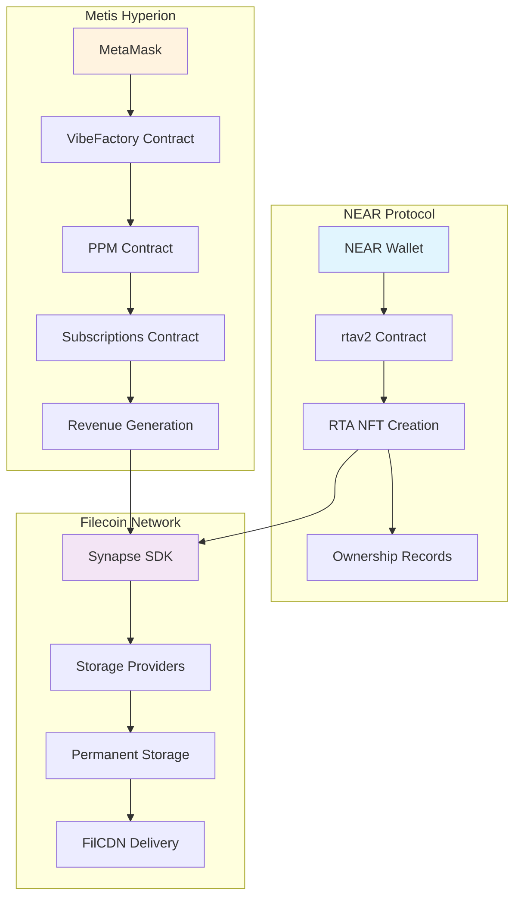
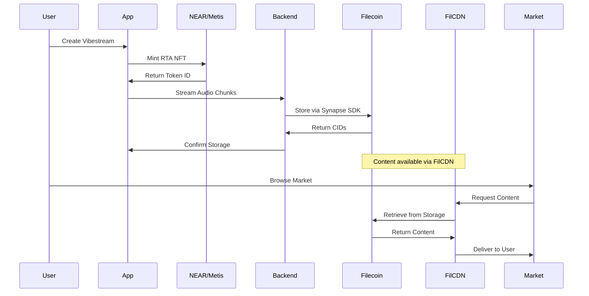

# Decentralization

VibesFlow implements a decentralized architecture using multiple blockchain networks and distributed storage systems to ensure permanence, ownership, and monetization of vibestreams.

## Multi-Network Architecture

### Network Roles

VibesFlow operates across two distinct blockchain networks with specialized functions:

<Mermaid>

</Mermaid>

### NEAR Protocol Integration

**Contract:** `rtav2` (Real-Time Assets v2)  
**Purpose:** RTA NFT creation and ownership management

```javascript
// NEAR RTA creation in context/connector.tsx
const createRTANFT = async (rtaId, config) => {
  if (networkInfo?.type === 'near-testnet' || networkInfo?.type === 'near-mainnet') {
    try {
      const result = await nearWallet.signAndSendTransaction({
        receiverId: 'rtav2.testnet',
        actions: [{
          type: 'FunctionCall',
          params: {
            methodName: 'create_rta',
            args: {
              rta_id: rtaId,
              metadata: JSON.stringify(config)
            },
            gas: '300000000000000',
            deposit: '10000000000000000000000' // 0.01 NEAR
          }
        }]
      });
      
      return `rta_${rtaId}`;
    } catch (error) {
      throw new Error(`NEAR RTA creation failed: ${error.message}`);
    }
  }
};
```

### Metis Hyperion Integration

**Contracts:** `VibeFactory`, `PPM`, `Subscriptions`  
**Purpose:** Monetization and payment processing

```javascript
// Metis vibestream creation with PPM integration
const createVibestreamWithDelegate = async (config) => {
  if (networkInfo?.type === 'metis-hyperion') {
    try {
      const vibeFactoryContract = new ethers.Contract(
        VIBE_FACTORY_ADDRESS,
        VIBE_FACTORY_ABI,
        signer
      );
      
      const tx = await vibeFactoryContract.createVibestream(
        config.mode,
        config.store_to_filecoin,
        config.distance || 0,
        JSON.stringify(config),
        config.ticket_amount || 0,
        ethers.parseEther(config.ticket_price || '0'),
        config.pay_per_stream || false,
        ethers.parseEther(config.stream_price || '0')
      );
      
      const receipt = await tx.wait();
      const vibeId = receipt.logs[0].topics[1];
      
      return `metis_vibe_${vibeId}`;
    } catch (error) {
      throw new Error(`Metis vibestream creation failed: ${error.message}`);
    }
  }
};
```

## Network Detection and Switching

### Automatic Network Detection

```javascript
// Network detection in context/connector.tsx
const getNetworkInfo = () => {
  if (!account) return null;
  
  // NEAR network detection
  if (account.accountId && (account.accountId.includes('.testnet') || account.accountId.includes('.near'))) {
    return {
      type: account.accountId.includes('.testnet') ? 'near-testnet' : 'near-mainnet',
      name: account.accountId.includes('.testnet') ? 'NEAR Testnet' : 'NEAR Mainnet',
      currency: 'NEAR'
    };
  }
  
  // Metis network detection
  if (account.address && typeof account.address === 'string') {
    return {
      type: 'metis-hyperion',
      name: 'Metis Hyperion',
      currency: 'tMETIS'
    };
  }
  
  return null;
};
```

### Currency Display

```javascript
// Network-aware currency display in VibestreamModal.tsx
const getCurrency = () => {
  const networkInfo = getNetworkInfo();
  return networkInfo?.type === 'metis-hyperion' ? 'tMETIS' : 'NEAR';
};
```

## Decentralized Storage

### Synapse SDK Integration

VibesFlow uses the Synapse SDK for permanent Filecoin storage:

```javascript
// Storage service initialization in backend/rawchunks/synapseSDK.js
async function createSynapseInstance() {
  const synapse = await Synapse.create({
    privateKey: FILECOIN_PRIVATE_KEY,
    rpcURL: FILECOIN_RPC_URL,
    withCDN: true // Enable CDN for VibesFlow
  });
  
  console.log(`✅ Synapse instance created for wallet: ${FILECOIN_ADDRESS}`);
  
  // Setup payments if not already done
  if (!paymentsInitialized) {
    await setupPayments(synapse);
    paymentsInitialized = true;
  }
  
  return synapse;
}
```

### Payment Setup

Automated USDFC payment setup for Filecoin storage:

```javascript
// Payment setup in synapseSDK.js
async function setupPayments(synapse) {
  try {
    const { TOKENS, CONTRACT_ADDRESSES } = await initializeSynapseSDK();
    
    // Check current balances
    const filBalance = await synapse.payments.walletBalance();
    const usdfcBalance = await synapse.payments.walletBalance(TOKENS.USDFC);
    const contractBalance = await synapse.payments.balance(TOKENS.USDFC);
    
    // Minimum required amounts
    const minDeposit = ethers.parseEther('50'); // 50 USDFC minimum
    const rateAllowance = ethers.parseEther('10'); // 10 USDFC per epoch
    const lockupAllowance = ethers.parseEther('1000'); // 1000 USDFC lockup
    
    // Deposit USDFC if contract balance is low
    if (contractBalance < minDeposit) {
      const depositAmount = minDeposit - contractBalance;
      const depositTx = await synapse.payments.deposit(depositAmount, TOKENS.USDFC);
      await depositTx.wait();
    }
    
    // Approve Pandora service
    const pandoraAddress = CONTRACT_ADDRESSES.PANDORA_SERVICE[synapse.getNetwork()];
    const approveTx = await synapse.payments.approveService(
      pandoraAddress,
      rateAllowance,
      lockupAllowance,
      TOKENS.USDFC
    );
    await approveTx.wait();
    
  } catch (error) {
    console.error('❌ Payment setup failed:', error);
    throw error;
  }
}
```

### Storage Service Management

Per-RTA storage service creation with proof set management:

```javascript
// Storage service creation per RTA
async function getStorageServiceForRTA(rtaId, synapse, creator = null) {
  try {
    // Check session cache first
    if (sessionStorageServices.has(rtaId)) {
      return sessionStorageServices.get(rtaId);
    }
    
    // Create storage service with CDN enabled
    const storageService = await synapse.createStorage({
      withCDN: true,
      callbacks: {
        onProviderSelected: (provider) => {
          console.log(`✅ Provider selected for ${rtaId}:`, {
            address: provider.owner,
            pdpUrl: provider.pdpUrl
          });
        },
        onProofSetResolved: (info) => {
          const status = info.isExisting ? 'existing' : 'new';
          console.log(`📋 Proof set ${status} for ${rtaId}: ID ${info.proofSetId}`);
        }
      }
    });
    
    // Cache the service for this session
    sessionStorageServices.set(rtaId, storageService);
    
    return storageService;
    
  } catch (error) {
    console.error(`❌ Failed to create storage service for RTA ${rtaId}:`, error);
    throw error;
  }
}
```

## FilCDN Integration

### Direct CDN URLs

FilCDN provides direct access to Filecoin-stored content:

```javascript
// FilCDN URL construction in context/filcdn.tsx
const constructFilCDNUrl = (cid, providerAddress) => {
  const address = providerAddress || process.env.EXPO_PUBLIC_FILCDN_PROVIDER_ADDRESS;
  return `https://${address}.calibration.filcdn.io/${cid}`;
};

// Chunk URL generation with FilCDN support
const transformedData = data.map((vibestream) => ({
  ...vibestream,
  chunks_detail: vibestream.chunks_detail?.map((chunk) => {
    if (!chunk.cid) return chunk;
    
    try {
      const filcdnUrl = constructFilCDNUrl(chunk.cid);
      
      return {
        ...chunk,
        url: `${backendUrl}/api/proxy/${chunk.cid}`, // Backend proxy fallback
        filcdn_url: filcdnUrl, // Direct FilCDN URL
      };
    } catch (error) {
      console.warn(`⚠️ Failed to construct FilCDN URL for chunk ${chunk.chunk_id}:`, error);
      return {
        ...chunk,
        url: `${backendUrl}/api/proxy/${chunk.cid}`,
      };
    }
  }) || []
}));
```

### Download Strategy

Prioritized download strategy with fallbacks:

```javascript
// Download with FilCDN priority in filcdn.tsx
const downloadChunk = async (cid, useDirectCDN = true) => {
  try {
    let response;
    
    if (useDirectCDN) {
      try {
        // Attempt direct FilCDN download
        const filcdnUrl = constructFilCDNUrl(cid);
        response = await fetch(filcdnUrl, {
          method: 'GET',
          headers: {
            'Accept': 'audio/*',
            'Cache-Control': 'public, max-age=31536000' // Cache for 1 year
          }
        });
        
        if (response.ok) {
          console.log(`✅ FilCDN download successful for ${cid}`);
        } else if (response.status === 402) {
          console.warn('📋 FilCDN requires payment - using backend proxy fallback');
          throw new Error('FilCDN payment required');
        }
      } catch (filcdnError) {
        // Fall back to backend proxy
        const backendUrl = process.env.EXPO_PUBLIC_RAWCHUNKS_URL || 'https://api.vibesflow.ai';
        response = await fetch(`${backendUrl}/api/proxy/${cid}`);
      }
    }
    
    const arrayBuffer = await response.arrayBuffer();
    return arrayBuffer;
    
  } catch (err) {
    console.error(`❌ Failed to download chunk ${cid}:`, err.message);
    throw new Error(err.message);
  }
};
```

## Data Flow Architecture

### Complete Decentralization Pipeline

<Mermaid>

</Mermaid>

### Persistence Layer

DynamoDB provides session persistence and metadata compilation:

```javascript
// RTA metadata persistence in backend/rawchunks/persistence.js
const saveRTAMetadata = async (metadata) => {
  const params = {
    TableName: 'VibestreamsMetadata',
    Item: {
      rta_id: metadata.rta_id,
      upload_timestamp: metadata.upload_timestamp,
      creator: metadata.creator,
      is_complete: metadata.is_complete,
      proof_set_id: metadata.proof_set_id,
      storage_provider: metadata.storage_provider,
      chunks: metadata.chunks || [],
      chunks_detail: metadata.chunks_detail || [],
      total_duration: metadata.total_duration || 0,
      total_size_mb: metadata.total_size_mb || 0
    }
  };
  
  await dynamoDb.put(params).promise();
};
```

## Fallback Mechanisms

### Storage Fallbacks

Pinata IPFS serves as fallback when Synapse fails:

```javascript
// Pinata fallback in synapseSDK.js
async function uploadToPinataFallback(chunkData, chunkId, metadata) {
  try {
    console.log(`📌 FALLBACK: Uploading chunk ${chunkId} to Pinata...`);
    
    const formData = new FormData();
    formData.append('file', Buffer.from(chunkData), {
      filename: `${chunkId}.webm`,
      contentType: 'audio/webm'
    });
    
    const response = await fetch('https://api.pinata.cloud/pinning/pinFileToIPFS', {
      method: 'POST',
      headers: {
        'Authorization': `Bearer ${PINATA_JWT}`,
        ...formData.getHeaders()
      },
      body: formData
    });
    
    const result = await response.json();
    
    return {
      success: true,
      cid: result.IpfsHash,
      size: chunkData.length,
      provider: 'pinata-fallback'
    };
    
  } catch (error) {
    console.error(`❌ Pinata fallback failed for chunk ${chunkId}:`, error);
    throw error;
  }
}
```

### Network Fallbacks

Mock data generation when blockchain operations fail:

```javascript
// Blockchain fallback in VibestreamModal.tsx
} catch (error) {
  console.warn(`⚠️ ${networkInfo.type} vibestream creation failed:`, error);
  console.log('🔄 Using fallback mode - vibestream will continue with mock data');
  
  // Generate fallback data for testing
  const networkPrefix = networkInfo.type === 'metis-hyperion' ? 'metis_vibe' : 'rta';
  fullTokenId = `${networkPrefix}_${rawRtaId}`;
  creationSucceeded = false;

  // Add fallback indicator to config
  rtaConfig.fallback_mode = true;
  rtaConfig.fallback_reason = error.message.includes('timeout') ? 
    `${networkInfo.type}_timeout` : `${networkInfo.type}_error`;
}
```

## Security Considerations

### Multi-Network Isolation

Each network maintains isolated state and functionality:

```javascript
// Network-specific validation
const validateNetworkOperation = (operation, networkType) => {
  switch (operation) {
    case 'rta_creation':
      return ['near-testnet', 'near-mainnet', 'metis-hyperion'].includes(networkType);
    case 'ppm_payment':
      return networkType === 'metis-hyperion';
    case 'subscription':
      return networkType === 'metis-hyperion';
    default:
      return false;
  }
};
```

### Storage Verification

Filecoin storage includes proof verification:

```javascript
// Storage verification through callbacks
const uploadResult = await storageService.upload(chunkData, {
  onRootConfirmed: (rootIds) => {
    console.log(`🎯 Root confirmed: IDs ${rootIds.join(', ')}`);
    finalRootId = rootIds[0]; // Store confirmed root ID
    rootConfirmed = true;
  }
});
```

## Next Steps

<CardGroup cols={2}>
  <Card title="Services Overview" icon="cogs" href="/essentials/splash-screen">
    Explore VibesFlow app services
  </Card>
  <Card title="Chunking Process" icon="cube" href="/essentials/chunking-process">
    Learn about audio processing
  </Card>
</CardGroup>
