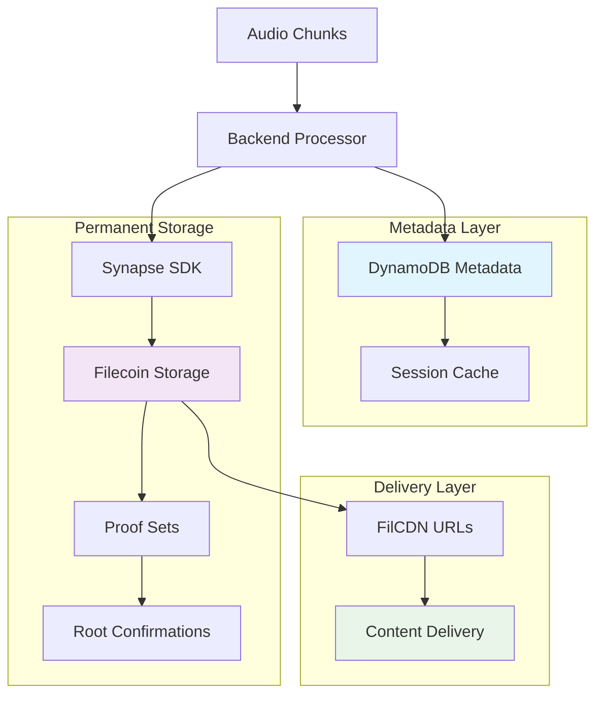

## Storage Architecture



## DynamoDB Persistence

### RTA Metadata Storage

```javascript
// RTA metadata persistence in backend/rawchunks/persistence.js
const saveRTAMetadata = async (metadata) => {
  const params = {
    TableName: 'VibestreamsMetadata',
    Item: {
      rta_id: metadata.rta_id,
      upload_timestamp: metadata.upload_timestamp,
      creator: metadata.creator,
      is_complete: metadata.is_complete,
      proof_set_id: metadata.proof_set_id,
      storage_provider: metadata.storage_provider,
      chunks: metadata.chunks || [],
      chunks_detail: metadata.chunks_detail || [],
      total_duration: metadata.total_duration || 0,
      total_size_mb: metadata.total_size_mb || 0
    }
  };
  
  await dynamoDb.put(params).promise();
  console.log(`✅ RTA metadata saved: ${metadata.rta_id}`);
};
```

### Chunk Addition System

```javascript
// Progressive chunk addition to RTA metadata
const addChunkToRTA = async (rtaId, chunkInfo) => {
  try {
    // Get current RTA data
    const currentRTA = await getRTAMetadata(rtaId);
    
    if (!currentRTA) {
      throw new Error(`RTA ${rtaId} not found`);
    }
    
    // Add chunk to chunks_detail array
    const updatedChunksDetail = [...(currentRTA.chunks_detail || []), chunkInfo];
    
    // Update RTA with new chunk
    const params = {
      TableName: 'VibestreamsMetadata',
      Key: { rta_id: rtaId },
      UpdateExpression: 'SET chunks_detail = :chunks_detail, chunks = :chunk_count',
      ExpressionAttributeValues: {
        ':chunks_detail': updatedChunksDetail,
        ':chunk_count': updatedChunksDetail.length
      }
    };
    
    await dynamoDb.update(params).promise();
    console.log(`✅ Chunk added to RTA ${rtaId}: ${chunkInfo.chunk_id}`);
    
  } catch (error) {
    console.error(`❌ Failed to add chunk to RTA ${rtaId}:`, error);
    throw error;
  }
};
```

### Completion Tracking

```javascript
// RTA completion with metadata compilation
const completeRTA = async (rtaId, finalMetadata) => {
  try {
    const params = {
      TableName: 'VibestreamsMetadata',
      Key: { rta_id: rtaId },
      UpdateExpression: `
        SET is_complete = :complete,
            rta_duration = :duration,
            total_size_mb = :size,
            filcdn_base = :filcdn_base,
            first_chunk_url = :first_url,
            last_chunk_url = :last_url,
            metadata_cid = :metadata_cid,
            compilation_timestamp = :compilation_time
      `,
      ExpressionAttributeValues: {
        ':complete': true,
        ':duration': finalMetadata.rta_duration,
        ':size': finalMetadata.total_size_mb,
        ':filcdn_base': finalMetadata.filcdn_base,
        ':first_url': finalMetadata.first_chunk_url,
        ':last_url': finalMetadata.last_chunk_url,
        ':metadata_cid': finalMetadata.metadata_cid,
        ':compilation_time': Date.now()
      }
    };
    
    await dynamoDb.update(params).promise();
    console.log(`✅ RTA completed: ${rtaId}`);
    
  } catch (error) {
    console.error(`❌ Failed to complete RTA ${rtaId}:`, error);
    throw error;
  }
};
```

## Session Storage Management

### Storage Service Caching

```javascript
// Session-level storage service caching in synapseSDK.js
const sessionStorageServices = new Map(); // rtaId -> StorageService

async function getStorageServiceForRTA(rtaId, synapse, creator = null) {
  try {
    // Check session cache first
    if (sessionStorageServices.has(rtaId)) {
      console.log(`♻️ Reusing cached storage service for RTA: ${rtaId}`);
      return sessionStorageServices.get(rtaId);
    }
    
    // Check if we have existing RTA metadata in DynamoDB
    const existingRTA = await persistenceService.getRTAMetadata(rtaId);
    
    // Create new storage service
    const storageService = await synapse.createStorage({
      withCDN: true,
      callbacks: {
        onProviderSelected: (provider) => {
          console.log(`✅ Provider selected for ${rtaId}:`, {
            address: provider.owner,
            pdpUrl: provider.pdpUrl
          });
        },
        onProofSetResolved: (info) => {
          const status = info.isExisting ? 'existing' : 'new';
          console.log(`📋 Proof set ${status} for ${rtaId}: ID ${info.proofSetId}`);
        }
      }
    });
    
    // Cache the service for this session
    sessionStorageServices.set(rtaId, storageService);
    
    // Initialize RTA metadata if new
    if (!existingRTA) {
      const initialMetadata = {
        rta_id: rtaId,
        upload_timestamp: Date.now(),
        creator: creator || 'unknown',
        is_complete: false,
        proof_set_id: storageService.proofSetId,
        storage_provider: storageService.storageProvider,
        chunks: [],
        chunks_detail: [],
        total_duration: 0,
        total_size_mb: 0
      };
      
      await persistenceService.saveRTAMetadata(initialMetadata);
    }
    
    return storageService;
    
  } catch (error) {
    console.error(`❌ Failed to create storage service for RTA ${rtaId}:`, error);
    throw error;
  }
}
```

## Filecoin Integration

### Upload Process with Callbacks

```javascript
// Comprehensive upload with callback handling
const uploadResult = await storageService.upload(chunkData, {
  onUploadComplete: (commp) => {
    console.log(`✅ Upload complete for ${chunkId}: ${commp.toString()}`);
    uploadComplete = true;
  },
  onRootAdded: (transaction) => {
    if (transaction) {
      console.log(`📝 Root added transaction for ${chunkId}: ${transaction.hash}`);
    } else {
      console.log(`📝 Root added for ${chunkId} (legacy server)`);
    }
    rootAdded = true;
  },
  onRootConfirmed: (rootIds) => {
    console.log(`🎯 Root confirmed for ${chunkId}: IDs ${rootIds.join(', ')}`);
    if (rootIds && rootIds.length > 0) {
      finalRootId = rootIds[0]; // Store the confirmed root ID
      rootConfirmed = true;
    }
  }
});
```

### Chunk Information Assembly

```javascript
// Complete chunk information for storage
const chunkInfo = {
  chunk_id: chunkId,
  cid: uploadResult.commp.toString(),
  size: uploadResult.size,
  root_id: effectiveRootId,
  uploadedAt: Date.now(),
  duration: metadata.duration || 60,
  participants: metadata.participantCount || 1,
  creator: metadata.creator,
  owner: metadata.creator + '.testnet',
  filcdn_url: `https://${FILECOIN_ADDRESS}.calibration.filcdn.io/${uploadResult.commp.toString()}`,
  synapse_confirmed: rootConfirmed, // Track confirmation status
  upload_complete: uploadComplete,
  root_added: rootAdded
};

// Add chunk to RTA in DynamoDB
await persistenceService.addChunkToRTA(rtaId, chunkInfo);
```

## Backend API Endpoints

### Vibestreams Endpoint

```javascript
// Main vibestreams endpoint in backend/rawchunks/app.js
app.get('/api/vibestreams', async (req, res) => {
  try {
    console.log('📡 Fetching all vibestreams from DynamoDB...');
    
    // Get all completed vibestreams
    const vibestreams = await synapseSDK.getVibestreams();
    
    // Filter for completed vibestreams only
    const completedVibestreams = vibestreams.filter(stream => 
      stream.is_complete && 
      stream.chunks_detail && 
      stream.chunks_detail.length > 0
    );
    
    console.log(`✅ Returning ${completedVibestreams.length} completed vibestreams`);
    
    res.json(completedVibestreams);
    
  } catch (error) {
    console.error('❌ Failed to fetch vibestreams:', error);
    res.status(500).json({
      error: 'Failed to fetch vibestreams',
      message: error.message
    });
  }
});
```

### Proxy Endpoint

```javascript
// Content proxy for FilCDN fallbacks
app.get('/api/proxy/:cid', async (req, res) => {
  try {
    const { cid } = req.params;
    console.log(`📥 Proxying content for CID: ${cid}`);
    
    // Attempt FilCDN first
    const filcdnUrl = `https://${process.env.FILECOIN_ADDRESS}.calibration.filcdn.io/${cid}`;
    let response = await fetch(filcdnUrl);
    
    if (!response.ok) {
      console.log(`⚠️ FilCDN failed (${response.status}), trying IPFS gateway...`);
      // Fallback to IPFS gateway
      const ipfsUrl = `https://gateway.pinata.cloud/ipfs/${cid}`;
      response = await fetch(ipfsUrl);
    }
    
    if (!response.ok) {
      throw new Error(`Failed to fetch content: ${response.statusText}`);
    }
    
    // Set appropriate headers
    res.set({
      'Content-Type': response.headers.get('content-type') || 'audio/webm',
      'Cache-Control': 'public, max-age=31536000', // 1 year cache
      'Access-Control-Allow-Origin': '*'
    });
    
    // Stream the content
    response.body.pipe(res);
    
  } catch (error) {
    console.error(`❌ Proxy failed for ${req.params.cid}:`, error);
    res.status(404).json({ 
      error: 'Content not found',
      cid: req.params.cid 
    });
  }
});
```

### Status Endpoint

```javascript
// Upload status tracking endpoint
app.get('/filecoin/status/:rtaId', async (req, res) => {
  try {
    const { rtaId } = req.params;
    const status = await synapseSDK.getFilecoinUploadStatus(rtaId);
    
    res.json(status);
  } catch (error) {
    console.error(`❌ Failed to get upload status for ${rtaId}:`, error);
    res.status(500).json({ error: error.message });
  }
});
```

## Data Retrieval Functions

### Complete Vibestream Retrieval

```javascript
// Get all vibestreams from DynamoDB
async function getVibestreams() {
  try {
    const params = {
      TableName: 'VibestreamsMetadata',
      FilterExpression: 'is_complete = :complete',
      ExpressionAttributeValues: {
        ':complete': true
      }
    };
    
    const result = await dynamoDb.scan(params).promise();
    
    // Sort by upload timestamp (newest first)
    const sortedVibestreams = result.Items.sort((a, b) => 
      (b.upload_timestamp || 0) - (a.upload_timestamp || 0)
    );
    
    console.log(`✅ Retrieved ${sortedVibestreams.length} completed vibestreams from DynamoDB`);
    
    return sortedVibestreams;
    
  } catch (error) {
    console.error('❌ Failed to get vibestreams from DynamoDB:', error);
    return [];
  }
}
```

### Upload Status Tracking

```javascript
// Detailed upload status from DynamoDB
async function getFilecoinUploadStatus(rtaId) {
  try {
    const rtaData = await persistenceService.getRTAMetadata(rtaId);
    if (!rtaData) {
      return { error: 'RTA not found' };
    }
    
    const chunks = rtaData.chunks_detail || [];
    const uploadedChunks = chunks.filter(chunk => chunk.cid);
    const failedChunks = chunks.filter(chunk => !chunk.cid);
  
    return {
      rtaId: rtaId,
      status: rtaData.is_complete ? 'completed' : 'processing',
      totalChunks: chunks.length,
      uploadedChunks: uploadedChunks.length,
      failedChunks: failedChunks.length,
      proofSetId: rtaData.proof_set_id,
      storageProvider: rtaData.storage_provider,
      chunks: chunks.reduce((acc, chunk) => {
        acc[chunk.chunk_id] = {
          status: chunk.cid ? 'uploaded' : 'failed',
          filecoinCid: chunk.cid || null,
          rootId: chunk.root_id || null,
          filcdnUrl: chunk.filcdn_url || null,
          usedFallback: chunk.pinata_fallback || false
        };
        return acc;
      }, {})
    };
  } catch (error) {
    console.error(`❌ Failed to get upload status for ${rtaId}:`, error);
    return { error: error.message };
  }
}
```

## Auto-Completion System

### Fallback Completion Logic

```javascript
// Auto-completion helper for incomplete RTAs
const forceCompleteRTA = async (rtaId) => {
  try {
    console.log(`🔄 Force completing RTA: ${rtaId}`);
    
    const rtaData = await getRTAMetadata(rtaId);
    if (!rtaData) {
      throw new Error(`RTA ${rtaId} not found`);
    }
    
    const validChunks = (rtaData.chunks_detail || []).filter(chunk => 
      chunk.cid && chunk.cid.length > 0
    );
    
    if (validChunks.length === 0) {
      throw new Error(`No valid chunks found for RTA ${rtaId}`);
    }
    
    // Sort chunks by sequence
    const sortedChunks = validChunks.sort((a, b) => {
      const seqA = parseInt(a.chunk_id.split('_chunk_')[1]?.split('_')[0]) || 0;
      const seqB = parseInt(b.chunk_id.split('_chunk_')[1]?.split('_')[0]) || 0;
      return seqA - seqB;
    });
    
    // Calculate metadata
    const totalDuration = sortedChunks.reduce((sum, chunk) => sum + (chunk.duration || 60), 0);
    const totalSizeMB = sortedChunks.reduce((sum, chunk) => sum + (chunk.size || 0), 0) / (1024 * 1024);
    
    // Create final metadata
    const finalMetadata = {
      rta_duration: formatDuration(totalDuration),
      total_size_mb: totalSizeMB,
      filcdn_base: `https://${process.env.FILECOIN_ADDRESS}.calibration.filcdn.io/`,
      first_chunk_url: `https://${process.env.FILECOIN_ADDRESS}.calibration.filcdn.io/${sortedChunks[0].cid}`,
      last_chunk_url: `https://${process.env.FILECOIN_ADDRESS}.calibration.filcdn.io/${sortedChunks[sortedChunks.length - 1].cid}`,
      metadata_cid: null // Will be set after metadata upload
    };
    
    // Complete the RTA
    await completeRTA(rtaId, finalMetadata);
    
    console.log(`✅ Force completion successful for RTA: ${rtaId} (${validChunks.length} chunks)`);
    
  } catch (error) {
    console.error(`❌ Force completion failed for RTA ${rtaId}:`, error);
    throw error;
  }
};
```

### Scheduled Auto-Completion

```javascript
// Scheduled auto-completion for incomplete RTAs
setTimeout(async () => {
  try {
    const rtaData = await persistenceService.getRTAMetadata(rtaId);
    if (rtaData && !rtaData.is_complete) {
      const chunks = rtaData.chunks_detail || [];
      const validChunks = chunks.filter(chunk => chunk.cid && chunk.cid.length > 0);
      
      // If RTA has chunks but isn't complete, auto-complete it
      if (validChunks.length > 0) {
        console.log(`🔄 Auto-completion fallback triggered for RTA: ${rtaId} (${validChunks.length} chunks)`);
        const { forceCompleteRTA } = require('./helper');
        await forceCompleteRTA(rtaId);
      }
    }
  } catch (error) {
    console.warn(`⚠️ Auto-completion fallback failed for ${rtaId}:`, error.message);
  }
}, 360000); // 6 minutes delay
```

## Storage Optimization

### Proof Set Management

```javascript
// Efficient proof set reuse across chunks
const storageService = await synapse.createStorage({
  withCDN: true,
  callbacks: {
    onProofSetResolved: (info) => {
      if (info.isExisting) {
        console.log(`♻️ Reusing existing proof set ${info.proofSetId} for ${rtaId}`);
      } else {
        console.log(`🆕 Creating new proof set ${info.proofSetId} for ${rtaId}`);
      }
    },
    onProofSetCreationProgress: (status) => {
      const elapsed = Math.round(status.elapsedMs / 1000);
      console.log(`⏳ Proof set creation progress [${elapsed}s]: mined=${status.transactionMined}, live=${status.proofSetLive}`);
    }
  }
});
```

### Storage Provider Selection

```javascript
// Storage provider selection with logging
callbacks: {
  onProviderSelected: (provider) => {
    console.log(`✅ Provider selected for ${rtaId}:`, {
      address: provider.owner,
      pdpUrl: provider.pdpUrl,
      region: provider.region || 'unknown',
      capacity: provider.capacity || 'unknown'
    });
  }
}
```

## Monitoring and Diagnostics

### Upload Progress Tracking

```javascript
// Comprehensive upload progress monitoring
const uploadChunkToFilecoin = async (chunkData, rtaId, chunkId, metadata) => {
  console.log(`🚀 Starting Synapse upload for chunk ${chunkId} (${(chunkData.length / 1024).toFixed(1)}KB)`);
  
  try {
    // Log wallet status for diagnostics
    const walletStatus = {
      FIL: ethers.formatEther(filBalance),
      USDFC_Wallet: ethers.formatEther(usdfcBalance),
      USDFC_Contract: ethers.formatEther(contractBalance),
      sufficientFunds: contractBalance > ethers.parseEther('10')
    };
    
    console.log('📊 Wallet Status:', walletStatus);
    
    // Log Pandora service status
    const pandoraStatus = {
      address: pandoraAddress,
      isApproved: serviceApproval.isApproved,
      rateAllowance: ethers.formatEther(serviceApproval.rateAllowance),
      lockupAllowance: ethers.formatEther(serviceApproval.lockupAllowance)
    };
    
    console.log('🏛️ Pandora Service Status:', pandoraStatus);
    
    // Run preflight check
    const preflight = await storageService.preflightUpload(chunkData.length);
    console.log(`💰 Estimated cost: ${ethers.formatEther(preflight.estimatedCost.perMonth)} USDFC/month`);
    
    return uploadResult;
    
  } catch (error) {
    console.error(`❌ Upload failed for chunk ${chunkId}:`, error);
    throw error;
  }
};
```

### Health Checks

```javascript
// Storage system health check
async function testSynapseConnection() {
  try {
    console.log('🧪 Testing Synapse SDK connection...');
    
    const synapse = await createSynapseInstance();
    const network = synapse.getNetwork();
    
    // Test balances
    const filBalance = await synapse.payments.walletBalance();
    const usdfcBalance = await synapse.payments.walletBalance(TOKENS.USDFC);
    const contractBalance = await synapse.payments.balance(TOKENS.USDFC);
    
    console.log('✅ Synapse SDK connection test successful');
    
    return {
      success: true,
      network: network,
      signerAddress: FILECOIN_ADDRESS,
      balances: {
        FIL: ethers.formatEther(filBalance),
        USDFC_Wallet: ethers.formatEther(usdfcBalance),
        USDFC_Contract: ethers.formatEther(contractBalance)
      }
    };
    
  } catch (error) {
    console.error('❌ Synapse SDK connection test failed:', error);
    return {
      success: false,
      error: error.message
    };
  }
}
```

## Error Recovery

### Automatic Retry Logic

```javascript
// Retry logic for failed uploads
const retryFailedUploads = async (rtaId, maxRetries = 3) => {
  try {
    const rtaData = await getRTAMetadata(rtaId);
    if (!rtaData) return;
    
    const failedChunks = (rtaData.chunks_detail || []).filter(chunk => !chunk.cid);
    
    for (const chunk of failedChunks) {
      let retryCount = 0;
      let success = false;
      
      while (retryCount < maxRetries && !success) {
        try {
          console.log(`🔄 Retrying upload for chunk ${chunk.chunk_id} (attempt ${retryCount + 1})`);
          
          // Attempt re-upload
          const result = await uploadChunkToFilecoin(chunk.data, rtaId, chunk.chunk_id, chunk.metadata);
          
          if (result.success) {
            success = true;
            console.log(`✅ Retry successful for chunk ${chunk.chunk_id}`);
          }
          
        } catch (retryError) {
          retryCount++;
          console.warn(`⚠️ Retry ${retryCount} failed for chunk ${chunk.chunk_id}:`, retryError.message);
          
          if (retryCount < maxRetries) {
            // Exponential backoff
            await new Promise(resolve => setTimeout(resolve, Math.pow(2, retryCount) * 1000));
          }
        }
      }
      
      if (!success) {
        console.error(`❌ All retries failed for chunk ${chunk.chunk_id}`);
      }
    }
    
  } catch (error) {
    console.error(`❌ Retry process failed for RTA ${rtaId}:`, error);
  }
};
```

## Performance Monitoring

### Storage Metrics

```javascript
// Storage performance tracking
const trackStorageMetrics = (rtaId, chunkId, uploadStartTime, uploadResult) => {
  const uploadDuration = Date.now() - uploadStartTime;
  const sizeMB = uploadResult.size / (1024 * 1024);
  const throughputMBps = sizeMB / (uploadDuration / 1000);
  
  console.log(`📊 Storage Metrics for ${chunkId}:`, {
    duration: `${uploadDuration}ms`,
    size: `${sizeMB.toFixed(2)}MB`,
    throughput: `${throughputMBps.toFixed(2)}MB/s`,
    provider: uploadResult.provider,
    confirmed: uploadResult.confirmed
  });
  
  // Store metrics for analytics
  const metrics = {
    rtaId,
    chunkId,
    uploadDuration,
    sizeMB,
    throughputMBps,
    timestamp: Date.now(),
    provider: uploadResult.provider
  };
  
  // Optional: Store in analytics database
  // await analyticsService.recordStorageMetrics(metrics);
};
```

## Next Steps

<CardGroup cols={2}>
  <Card title="Third-party Integrations" icon="plug" href="/core/third-party-integrations">
    View all external service integrations
  </Card>
  <Card title="AI Systems" icon="brain" href="/ai/alith-orchestrator">
    Explore detailed AI documentation
  </Card>
</CardGroup>
