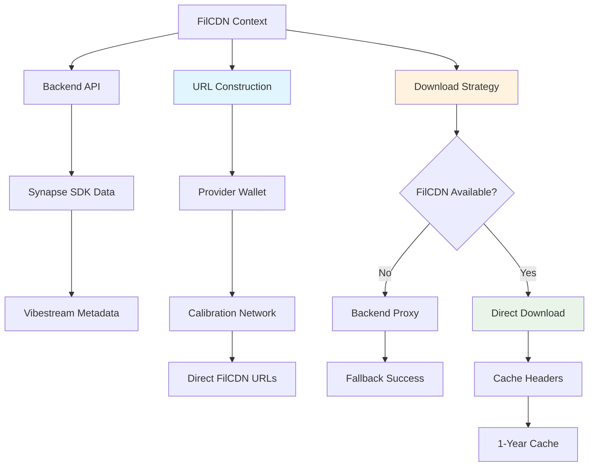

## FilCDN Architecture



## Context Provider

### FilCDN Context Implementation

```javascript
// FilCDN context provider in context/filcdn.tsx
export const FilCDNProvider: React.FC<FilCDNProviderProps> = ({ children }) => {
  const { connected, account, getNetworkInfo } = useWallet();
  const [vibestreams, setVibestreams] = useState<VibestreamData[]>([]);
  const [loading, setLoading] = useState(false);
  const [error, setError] = useState<string | null>(null);

  // Get current address and network info
  const currentAddress = account?.accountId || null;
  const networkInfo = getNetworkInfo();

  // Determine network type based on connected network
  const getNetworkType = (): 'metis' | 'near' | null => {
    if (!networkInfo) return null;
    if (networkInfo.type === 'metis-hyperion') return 'metis';
    if (networkInfo.type === 'near-testnet' || networkInfo.type === 'near-mainnet') return 'near';
    return null;
  };
};
```

### URL Construction

```javascript
// Direct FilCDN URL construction using provider wallet
const constructFilCDNUrl = (cid: string, providerAddress?: string): string => {
  const address = providerAddress || 
    process.env.EXPO_PUBLIC_FILCDN_PROVIDER_ADDRESS;
  
  // Use calibration network
  return `https://${address}.calibration.filcdn.io/${cid}`;
};
```

## Data Loading and Transformation

### Vibestream Data Fetching

```javascript
// Fetch vibestreams with FilCDN URL enhancement
const refreshVibestreams = async () => {
  try {
    setLoading(true);
    setError(null);
    
    console.log('🔄 Fetching vibestreams from Synapse SDK...');
    
    // Call the backend endpoint that uses Synapse SDK
    const backendUrl = process.env.EXPO_PUBLIC_RAWCHUNKS_URL || 'https://api.vibesflow.ai';
    
    // Add cache-busting parameter to force fresh data
    const cacheBuster = Date.now();
    const response = await fetch(`${backendUrl}/api/vibestreams?t=${cacheBuster}`, {
      method: 'GET',
      headers: {
        'Content-Type': 'application/json',
        'Accept': 'application/json',
        'Cache-Control': 'no-cache',
        'Pragma': 'no-cache'
      }
    });

    if (!response.ok) {
      throw new Error(`Failed to fetch vibestreams: ${response.status} ${response.statusText}`);
    }

    const data = await response.json();
    
    if (!Array.isArray(data)) {
      throw new Error('Invalid response format: expected array of vibestreams');
    }

    // Transform the data with proper FilCDN URLs
    const transformedData = data.map((vibestream: any) => ({
      ...vibestream,
      chunks_detail: vibestream.chunks_detail?.map((chunk: any) => {
        if (!chunk.cid) return chunk;
        
        try {
          // Construct direct FilCDN URL using the provider wallet address
          const filcdnUrl = constructFilCDNUrl(chunk.cid);
          
          return {
            ...chunk,
            // Use backend proxy as fallback
            url: `${backendUrl}/api/proxy/${chunk.cid}`,
            // Direct FilCDN URL for optimal performance
            filcdn_url: filcdnUrl,
          };
        } catch (error) {
          console.warn(`⚠️ Failed to construct FilCDN URL for chunk ${chunk.chunk_id}:`, error);
          return {
            ...chunk,
            url: `${backendUrl}/api/proxy/${chunk.cid}`,
          };
        }
      }) || []
    }));

    console.log(`✅ Loaded ${transformedData.length} vibestreams with FilCDN URLs`);
    setVibestreams(transformedData);
    
  } catch (err) {
    const errorMessage = err instanceof Error ? err.message : 'Unknown error occurred';
    console.error('❌ Failed to fetch vibestreams:', errorMessage);
    setError(errorMessage);
    setVibestreams([]); // Clear any existing data on error
  } finally {
    setLoading(false);
  }
};
```

### Chunk URL Enhancement

```javascript
// Enhanced chunk detail processing with FilCDN URLs
chunks_detail: vibestream.chunks_detail?.map((chunk: any) => {
  if (!chunk.cid) return chunk;
  
  try {
    // Construct direct FilCDN URL using the provider wallet address
    const filcdnUrl = constructFilCDNUrl(chunk.cid);
    
    return {
      ...chunk,
      // Backend proxy as fallback
      url: `${backendUrl}/api/proxy/${chunk.cid}`,
      // Direct FilCDN URL for optimal performance
      filcdn_url: filcdnUrl,
    };
  } catch (error) {
    console.warn(`⚠️ Failed to construct FilCDN URL for chunk ${chunk.chunk_id}:`, error);
    return {
      ...chunk,
      url: `${backendUrl}/api/proxy/${chunk.cid}`,
    };
  }
}) || []
```

## Download Strategy

### Prioritized Download Implementation

```javascript
// Download with FilCDN priority and fallbacks
const downloadChunk = async (cid: string, useDirectCDN: boolean = true): Promise<ArrayBuffer> => {
  try {
    console.log(`📥 Downloading chunk ${cid} ${useDirectCDN ? 'from FilCDN (provider wallet)' : 'from backend proxy'}...`);
    
    let response: Response;
    
    if (useDirectCDN) {
      try {
        // Attempt direct FilCDN download using provider wallet
        const filcdnUrl = constructFilCDNUrl(cid);
        response = await fetch(filcdnUrl, {
          method: 'GET',
          headers: {
            'Accept': 'audio/*',
            'Cache-Control': 'public, max-age=31536000' // Cache for 1 year
          }
        });
        
        if (response.ok) {
          console.log(`✅ FilCDN download successful for ${cid} using provider wallet`);
        } else if (response.status === 402) {
          console.warn('📋 FilCDN requires payment - using backend proxy fallback');
          throw new Error('FilCDN payment required');
        } else {
          throw new Error(`FilCDN failed with status: ${response.status}`);
        }
      } catch (filcdnError) {
        console.warn(`⚠️ FilCDN download failed for ${cid}:`, filcdnError);
        // Fall back to backend proxy
        const backendUrl = process.env.EXPO_PUBLIC_RAWCHUNKS_URL || 'https://api.vibesflow.ai';
        response = await fetch(`${backendUrl}/api/proxy/${cid}`, {
          method: 'GET'
        });
      }
    } else {
      // Use backend proxy directly
      const backendUrl = process.env.EXPO_PUBLIC_RAWCHUNKS_URL || 'https://api.vibesflow.ai';
      response = await fetch(`${backendUrl}/api/proxy/${cid}`, {
        method: 'GET'
      });
    }

    if (!response.ok) {
      throw new Error(`Failed to download chunk: ${response.status} ${response.statusText}`);
    }

    const arrayBuffer = await response.arrayBuffer();
    console.log(`✅ Downloaded chunk ${cid}: ${arrayBuffer.byteLength} bytes`);
    
    return arrayBuffer;
  } catch (err) {
    const errorMessage = err instanceof Error ? err.message : 'Download failed';
    console.error(`❌ Failed to download chunk ${cid}:`, errorMessage);
    throw new Error(errorMessage);
  }
};
```

### Error Handling Strategy

```javascript
// Comprehensive error handling with fallback logic
if (useDirectCDN) {
  try {
    // Attempt direct FilCDN download
    const filcdnUrl = constructFilCDNUrl(cid);
    response = await fetch(filcdnUrl, {
      headers: {
        'Accept': 'audio/*',
        'Cache-Control': 'public, max-age=31536000'
      }
    });
    
    if (response.ok) {
      console.log(`✅ FilCDN download successful for ${cid}`);
    } else if (response.status === 402) {
      console.warn('📋 FilCDN requires payment - using backend proxy fallback');
      throw new Error('FilCDN payment required');
    } else {
      throw new Error(`FilCDN failed with status: ${response.status}`);
    }
  } catch (filcdnError) {
    console.warn(`⚠️ FilCDN download failed for ${cid}:`, filcdnError);
    // Automatic fallback to backend proxy
    const backendUrl = process.env.EXPO_PUBLIC_RAWCHUNKS_URL;
    response = await fetch(`${backendUrl}/api/proxy/${cid}`);
  }
}
```

## Utility Functions

### Data Query Functions

```javascript
// Utility functions for vibestream data access
const getVibestreamsByCreator = (creator: string): VibestreamData[] => {
  return vibestreams.filter(stream => stream.creator === creator);
};

const getVibestreamByRTA = (rtaId: string): VibestreamData | null => {
  return vibestreams.find(stream => stream.rta_id === rtaId) || null;
};
```

### Context Value Assembly

```javascript
// Complete context value with all functionality
const contextValue: FilCDNContextType = {
  vibestreams,
  loading,
  error,
  isConnected: connected,
  networkType: getNetworkType(),
  currentAddress,
  refreshVibestreams,
  downloadChunk,
  getVibestreamsByCreator,
  getVibestreamByRTA,
  constructFilCDNUrl,
};
```

## Integration with Components

### Vibe Market Integration

```javascript
// FilCDN context usage in VibeMarket.tsx
const { 
  vibestreams, 
  loading, 
  error, 
  isConnected,
  networkType,
  currentAddress,
  refreshVibestreams 
} = useFilCDN();

// Load vibestreams when connected or on mount
useEffect(() => {
  if (isConnected || vibestreams.length === 0) {
    refreshVibestreams();
  }
}, [isConnected]);
```

### Playback Integration

```javascript
// FilCDN integration in Playback.tsx
const { getVibestreamByRTA, constructFilCDNUrl } = useFilCDN();

// Load vibestream data with FilCDN URLs
const loadVibestream = async () => {
  try {
    const streamData = getVibestreamByRTA(rtaId);
    if (!streamData) {
      Alert.alert('Error', 'Vibestream not found');
      return;
    }

    // Process chunk data with FilCDN URLs
    const rawChunkData = streamData.chunks_detail?.map((chunk: any) => ({
      chunk_id: chunk.chunk_id,
      cid: chunk.cid,
      url: chunk.url,
      filcdn_url: chunk.filcdn_url, // Direct FilCDN URL
      sequence: chunk.sequence || 0,
      is_final: chunk.is_final || false
    })) || [];

    // Load chunks into audio streamer
    audioStreamer.current?.loadVibestream(chunkData);
  } catch (error) {
    console.error('Failed to load vibestream:', error);
  }
};
```

## Preview System Integration

### Audio Streaming with FilCDN

```javascript
// Preview playback using FilCDN URLs in VibeMarket.tsx
const togglePreview = useCallback(async (stream) => {
  try {
    // Get first chunk for preview
    const firstChunk = stream.chunks_detail?.[0];
    if (!firstChunk) {
      Alert.alert('No Audio', 'No chunks available for preview');
      return;
    }

    console.log('🎵 Starting preview for:', stream.rta_id);

    if (Platform.OS === 'web' && audioStreamer.current) {
      // Use FilCDN URL if available, fallback to proxy
      const audioUrl = firstChunk.filcdn_url || firstChunk.url;
      
      // Start preview using AudioStreamer service
      const stopPreview = await audioStreamer.current.playPreview(audioUrl, 0.6);

      setPlayer({
        isPlaying: true,
        currentRTA: stream.rta_id,
        stopPreview
      });
    }
  } catch (error) {
    console.error('❌ Preview toggle failed:', error);
  }
}, []);
```

## Performance Optimizations

### Caching Strategy

```javascript
// Aggressive caching for FilCDN requests
const filcdnUrl = constructFilCDNUrl(cid);
response = await fetch(filcdnUrl, {
  method: 'GET',
  headers: {
    'Accept': 'audio/*',
    'Cache-Control': 'public, max-age=31536000' // Cache for 1 year
  }
});
```

### Cache Busting

```javascript
// Cache busting for metadata updates
const cacheBuster = Date.now();
const response = await fetch(`${backendUrl}/api/vibestreams?t=${cacheBuster}`, {
  headers: {
    'Cache-Control': 'no-cache',
    'Pragma': 'no-cache'
  }
});
```

## Error States and Handling

### Connection Status Display

```javascript
// Connection status in VibeMarket header
{isConnected && currentAddress && (
  <View style={styles.connectionStatus}>
    <View style={[styles.connectionDot, { 
      backgroundColor: networkType === 'metis' ? COLORS.accent : COLORS.secondary 
    }]} />
    <Text style={styles.connectionText}>
      {networkType?.toUpperCase() || 'CONNECTED'}
    </Text>
  </View>
)}
```

### Error State Management

```javascript
// Comprehensive error handling
try {
  const transformedData = data.map((vibestream) => ({
    ...vibestream,
    chunks_detail: vibestream.chunks_detail?.map((chunk) => {
      // ... FilCDN URL construction with error handling
    }) || []
  }));
  
  setVibestreams(transformedData);
} catch (err) {
  const errorMessage = err instanceof Error ? err.message : 'Unknown error occurred';
  console.error('❌ Failed to fetch vibestreams:', errorMessage);
  setError(errorMessage);
  setVibestreams([]); // Clear data on error
}
```

## Backend Proxy Support

### Proxy Endpoint

The backend provides a proxy endpoint for FilCDN fallbacks:

```javascript
// Backend proxy endpoint in backend/rawchunks/app.js
app.get('/api/proxy/:cid', async (req, res) => {
  try {
    const { cid } = req.params;
    
    // Attempt to fetch from FilCDN first
    const filcdnUrl = `https://${FILECOIN_ADDRESS}.calibration.filcdn.io/${cid}`;
    let response = await fetch(filcdnUrl);
    
    if (!response.ok) {
      // Fallback to IPFS gateway
      const ipfsUrl = `https://gateway.pinata.cloud/ipfs/${cid}`;
      response = await fetch(ipfsUrl);
    }
    
    if (!response.ok) {
      throw new Error(`Failed to fetch content: ${response.statusText}`);
    }
    
    // Stream the content
    response.body.pipe(res);
  } catch (error) {
    console.error(`❌ Proxy failed for ${cid}:`, error);
    res.status(404).json({ error: 'Content not found' });
  }
});
```

## Data Structure

### Vibestream Data Interface

```javascript
// Complete vibestream data structure with FilCDN integration
interface VibestreamData {
  rta_id: string;
  creator: string;
  rta_duration: string;
  chunks: number;
  user_profile_image?: string;
  is_complete: boolean;
  filcdn_base: string;
  first_chunk_url?: string;
  last_chunk_url?: string;
  upload_timestamp: number;
  synapse_proof_set_id: number;
  chunks_detail: ChunkDetail[];
}

interface ChunkDetail {
  chunk_id: string;
  cid: string;
  size: number;
  root_id?: number;
  url: string;           // Backend proxy URL
  filcdn_url?: string;   // Direct FilCDN URL
  duration?: number;
  participants?: number;
  owner?: string;
  sequence?: number;
}
```

## Next Steps

<CardGroup cols={2}>
  <Card title="Infrastructure Overview" icon="server" href="/essentials/ai-systems">
    Explore backend infrastructure
  </Card>
  <Card title="Third-party Integrations" icon="plug" href="/essentials/third-party-integrations">
    View all external services
  </Card>
</CardGroup>
