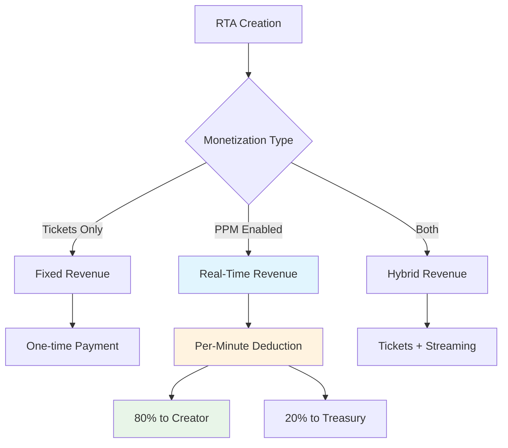

# RTA Protocol (User Perspective)

Real-Time Assets (RTAs) are NFTs that represent your vibestreams and can generate value in real-time through streaming activities. Unlike traditional static NFTs, RTAs accumulate value as people listen to your music.

## What Are RTAs?

RTAs are ERC-721 tokens that:
- Represent ownership of your vibestreams
- Generate revenue through time-based participation
- Exist permanently on blockchain networks
- Enable monetization of creative content

### RTA Creation Process

When you create a vibestream, an RTA NFT is automatically minted:

```javascript
// RTA creation in components/VibestreamModal.tsx
const createRTANFT = await createRTANFT(rawRtaId, rtaConfig);

// Configuration includes:
const rtaConfig = {
  mode,                    // 'solo' or 'group'
  store_to_filecoin: true, // Permanent storage
  distance,                // Group proximity (meters)
  ticket_amount,           // Available tickets
  ticket_price,            // Price per ticket
  pay_per_stream,          // Enable real-time payments
  stream_price,            // Per-minute rate
  creator: accountIdToUse,
  created_at: Date.now()
};
```

## Network-Specific Implementation

### NEAR Network
RTAs on NEAR are created through the `rtav2` contract:

```javascript
// NEAR RTA creation
const fullTokenId = await createRTANFT(rawRtaId, rtaConfig);
// Returns: "rta_1234567890_abcdef"
```

### Metis Hyperion
RTAs on Metis integrate with monetization contracts:

```javascript
// Metis RTA with PPM integration
if (payPerStream && streamPrice > 0) {
  // Automatically registers with PPM contract for revenue generation
  const vibeId = await createVibestreamWithDelegate(config);
}
```

## Revenue Generation Models

<Mermaid>

</Mermaid>

## User Experience

### For Creators

1. **Create Vibestream**: Motion-based music generation
2. **Automatic RTA Minting**: NFT created during vibestream
3. **Revenue Collection**: Automatic payment distribution
4. **Ownership Proof**: Permanent blockchain record

### For Participants

1. **Discover RTAs**: Browse in Vibe Market
2. **Authorize Spending**: Set payment allowances
3. **Join Streams**: Real-time participation
4. **Automatic Payments**: Per-minute deductions

## RTA Data Structure

Each RTA contains immutable and mutable properties:

```typescript
interface RTAConfig {
  mode: 'solo' | 'group';           // Stream type (immutable)
  store_to_filecoin: boolean;       // Storage preference (immutable)
  distance?: number;                // Group proximity in meters (immutable)
  ticket_amount?: number;           // Available tickets (immutable)
  ticket_price?: string;            // Price per ticket (immutable)
  pay_per_stream: boolean;          // PPM enablement (immutable)
  stream_price?: string;            // Per-minute rate (immutable)
  creator: string;                  // Creator address (immutable)
  created_at: number;               // Creation timestamp (immutable)
}
```

## Value Accumulation

RTAs accumulate value through the following mechanisms:

### Time-Based Payments (PPM)
```
RTA Value = Σ(participant_allowances × time_active × pay_per_minute_rate)
```

### Ticket Sales
```
Ticket Revenue = ticket_count × ticket_price
```

### Combined Model
```
Total RTA Value = Ticket Revenue + PPM Revenue
```

## Security Features

### Per-RTA Isolation
Each RTA maintains isolated payment tracking:

```javascript
// PPM contract ensures per-RTA allowance isolation
const allowanceData = await getPPMAllowance(vibeId);
const authorized = allowanceData[2]; // authorizedAmount for this specific RTA
const spent = allowanceData[3];      // spentAmount for this specific RTA
```

### Emergency Controls
- Immediate stream exit capability
- Maximum allowance limits (1000 tMETIS)
- Pausable functionality for system-wide halts

## Integration with VibesFlow Services

### Vibe Market Integration
RTAs are automatically discoverable in the Vibe Market:

```javascript
// Market displays RTA metadata
const getVibestreamTitle = (stream) => {
  const rtaId = stream.rta_id;
  // Extract readable title from RTA ID
  if (rtaId.toUpperCase().startsWith('METIS_VIBE_')) {
    return rtaId.substring(11);
  }
  return rtaId.toUpperCase();
};
```

### Playback Integration
RTAs enable continuous playback through FilCDN:

```javascript
// Playback retrieves RTA chunks
const streamData = getVibestreamByRTA(rtaId);
const chunkData = streamData.chunks_detail?.map(chunk => ({
  chunk_id: chunk.chunk_id,
  cid: chunk.cid,
  url: chunk.url,
  filcdn_url: chunk.filcdn_url
}));
```

## User Interface Elements

### RTA Display in Market
```javascript
// Market card showing RTA information
const renderVibestreamCard = (stream) => (
  <View style={styles.card}>
    <Text style={styles.rtaId}>{getVibestreamTitle(stream)}</Text>
    <Text style={styles.creator}>{getDisplayName(stream.creator)}</Text>
    <Text style={styles.meta}>
      {stream.chunks} CHUNKS • {stream.rta_duration} • {getNetworkFromRtaId(stream.rta_id).toUpperCase()}
    </Text>
  </View>
);
```

### PPM Status Display
```javascript
// Real-time allowance display for participants
<Text style={styles.allowanceValue}>
  {ppmAllowance.remaining.toFixed(4)} tMETIS
</Text>
<Text style={styles.allowanceRate}>
  -{ppmAllowance.streamPrice} tMETIS/MIN
</Text>
```

## Next Steps

<CardGroup cols={2}>
  <Card title="Vibestreams" icon="waveform" href="/essentials/vibestreams">
    Learn about vibestream creation modes
  </Card>
  <Card title="Sensor Processing" icon="satellite-dish" href="/essentials/sensor-processing">
    Understand motion-to-music conversion
  </Card>
</CardGroup>
