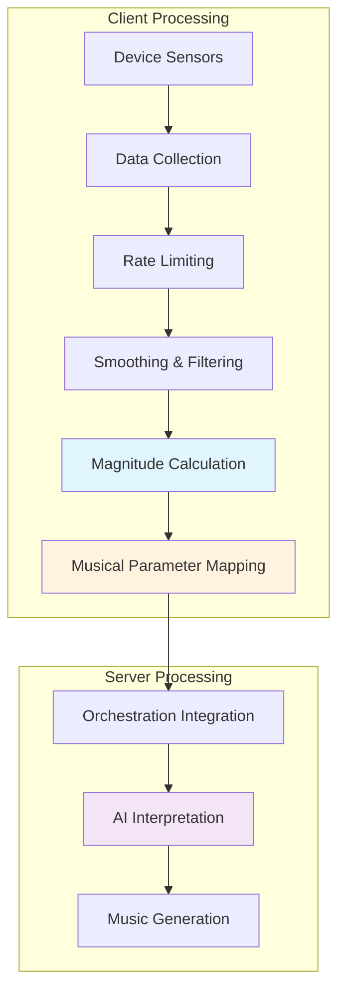

## Sensor Data Collection

### Raw Input Sources

VibesFlow collects data from device accelerometer, keyboard keys, cursor movements, camera vision, and gyroscope sensors

### Data Collection Rates

Different processing rates are used based on user role:

```javascript
// Creator mode: Higher frequency for full orchestration
const sensorInterval = setInterval(() => {
  const sensorData = {
    x: Math.sin(time * 0.5) * 0.8 + Math.random() * 0.4 - 0.2,
    y: Math.cos(time * 0.7) * 0.6 + Math.random() * 0.3 - 0.15,
    z: Math.sin(time * 0.3) * 0.5 + 0.5 + Math.random() * 0.2 - 0.1,
    timestamp: Date.now(),
    source: 'simulation'
  };
  processRealTimeSensorData(sensorData);
}, 50); // 20fps for creators

// Participant mode: Lower frequency for lighter processing
const participantInterval = setInterval(() => {
  const simulatedSensorData = {
    x: Math.sin(time * 0.3) * 0.5,
    y: Math.cos(time * 0.4) * 0.4,
    z: 0.5 + Math.sin(time * 0.2) * 0.3,
    timestamp: Date.now(),
    source: 'participant_simulation'
  };
  setSensorData(simulatedSensorData);
}, 100); // 10fps for participants
```

## Real-Time Processing Pipeline



## Musical Parameter Mapping

### Amplitude Response

Motion magnitude is converted to musical amplitude:

```javascript
// Enhanced amplitude calculation in VibePlayer.tsx
const processRealTimeSensorData = useCallback(async (sensorData) => {
  try {
    // Calculate motion magnitude
    const magnitude = Math.sqrt(sensorData.x ** 2 + sensorData.y ** 2 + sensorData.z ** 2);
    
    // Convert to amplitude with increased sensitivity
    const amplitudeResponse = Math.min(magnitude * 2.5 + 0.1, 1);
    setCurrentAmplitude(amplitudeResponse);
    
  } catch (error) {
    console.warn('Real-time processing error:', error);
  }
}, []);
```

### Frequency Mapping

Multi-axis sensor data maps to frequency parameters:

```javascript
// Multi-axis frequency response
const frequencyBase = 1.0;
const xContribution = Math.abs(sensorData.x) * 4;  // Primary axis
const yContribution = Math.abs(sensorData.y) * 2;  // Secondary axis
const zContribution = Math.abs(sensorData.z) * 1.5; // Tertiary axis

const finalFrequency = frequencyBase + xContribution + yContribution + zContribution;
setCurrentFrequency(finalFrequency);
```

### Waveform Generation

Sensor data drives visual waveform representation:

```javascript
// Advanced waveform generation in VibePlayer.tsx
const generateWaveformData = () => {
  const points = [];
  const segments = 150;
  const time = Date.now() / 1000;
  
  for (let i = 0; i < segments; i++) {
    const baseWave = Math.sin((i / segments) * Math.PI * currentFrequency);
    const harmonic1 = Math.sin((i / segments) * Math.PI * currentFrequency * 2) * 0.5;
    const harmonic2 = Math.sin((i / segments) * Math.PI * currentFrequency * 3) * 0.25;
    const motionInfluence = Math.sin(time + i * 0.1) * currentAmplitude * 0.3;
    
    const combinedWave = baseWave + harmonic1 + harmonic2 + motionInfluence;
    const height = 20 + combinedWave * currentAmplitude * 20;
    points.push(Math.max(5, Math.min(40, height)));
  }
  return points;
};
```

## Alith Orchestrator Integration

### Server Connection

The orchestration coordinator manages connections to the Alith-powered backend:

```javascript
// Server connection in orchestration/coordinator.js
async connectToInterpretationServer() {
  try {
    const wsUrl = this.getWebSocketUrl('interpretation');
    this.interpretationWs = new WebSocket(wsUrl);
    
    this.interpretationWs.onopen = () => {
      console.log('🔗 Connected to interpretation server');
      this.isConnectedToServer = true;
      this.reconnectAttempts = 0;
    };
    
    this.interpretationWs.onmessage = (event) => {
      this.handleServerInterpretation(JSON.parse(event.data));
    };
    
    this.interpretationWs.onclose = () => {
      console.log('🔌 Interpretation server connection closed');
      this.isConnectedToServer = false;
      this.reconnectToServer();
    };
    
  } catch (error) {
    console.error('Failed to connect to interpretation server:', error);
    throw error;
  }
}
```

### Data Transmission

Sensor data is sent to the server with rate limiting:

```javascript
// Rate-limited sensor transmission
sendSensorDataToServer(sensorData) {
  const now = Date.now();
  
  // Apply rate limiting
  if (now - this.lastServerSend < this.minSendInterval) {
    return;
  }
  
  if (this.interpretationWs?.readyState === WebSocket.OPEN) {
    this.interpretationWs.send(JSON.stringify({
      type: 'sensorUpdate',
      sensorData: sensorData,
      timestamp: now,
      sessionId: this.sessionId
    }));
    
    this.lastServerSend = now;
  }
}
```

## AI Interpretation Layer

### Alith Agent Processing

The backend uses Alith Agent with Gemini 2.5 Flash Lite for sensor interpretation:

```javascript
// Agent initialization in backend/orchestrator/index.js
musicAgent = new Agent({
  model: "gemini-2.5-flash-lite",
  apiKey: process.env.GOOGLE_GENERATIVE_AI_API_KEY,
  baseUrl: "generativelanguage.googleapis.com/v1beta/openai",
  preamble: enhancedPreamble,
  memory: new WindowBufferMemory(8)
});

// Sensor data processing
const interpretation = await musicAgent.run(JSON.stringify({
  sensorData: enrichedSensorData,
  sessionHistory: sessionData?.history || [],
  userProfile: sessionData?.profile || {},
  currentBaseline: this.currentBaseline
}));
```

### Enhanced Context

Sensor data is enriched with contextual information:

```javascript
// Context enrichment in backend orchestrator
const enrichedSensorData = {
  ...sensorData,
  sessionDuration: Date.now() - this.sessionStartTime,
  totalSensorUpdates: this.sensorUpdateCount,
  averageMotionLevel: this.calculateAverageMotion(),
  motionTrend: this.calculateMotionTrend(),
  energyLevel: this.calculateEnergyLevel(sensorData)
};
```

## Activity Detection

### Motion Pattern Recognition

The system detects music activity patterns for processing optimization:

```javascript
// Enhanced activity detection in chunks.tsx
private updateMusicActivityDetection(now, timeSinceLastActivity) {
  // Adaptive threshold based on recent patterns
  let adaptiveThreshold = this.activityDetectionWindow;
  
  if (this.musicActivityHistory.length > 5) {
    const recentIntervals = [];
    for (let i = 1; i < this.musicActivityHistory.length; i++) {
      recentIntervals.push(this.musicActivityHistory[i] - this.musicActivityHistory[i - 1]);
    }
    
    if (recentIntervals.length > 0) {
      const avgInterval = recentIntervals.reduce((a, b) => a + b, 0) / recentIntervals.length;
      // Adapt threshold based on music rhythm patterns
      adaptiveThreshold = Math.min(Math.max(avgInterval * 0.6, this.activityDetectionWindow), this.activityDetectionWindow * 2);
    }
  }
  
  this.isLiveMusicActive = timeSinceLastActivity < adaptiveThreshold;
}
```

### Peak Detection

Musical peaks are detected for rhythm-based optimization:

```javascript
// Peak detection for rhythm optimization
if (typeof audioData === 'string') {
  const estimatedEnergy = audioData.length;
  if (estimatedEnergy > this.musicPeakDetection.averagePeakInterval * 1.5) {
    this.musicPeakDetection.recentPeaks.push(now);
    this.musicPeakDetection.lastPeakTime = now;
    
    // Keep only recent peaks (last 30 seconds)
    this.musicPeakDetection.recentPeaks = this.musicPeakDetection.recentPeaks.filter(
      peak => now - peak < 30000
    );
    
    // Update average peak interval
    if (this.musicPeakDetection.recentPeaks.length > 1) {
      const intervals = [];
      for (let i = 1; i < this.musicPeakDetection.recentPeaks.length; i++) {
        intervals.push(this.musicPeakDetection.recentPeaks[i] - this.musicPeakDetection.recentPeaks[i - 1]);
      }
      this.musicPeakDetection.averagePeakInterval = 
        intervals.reduce((a, b) => a + b, 0) / intervals.length;
    }
  }
}
```

## Processing Optimization

### Adaptive Load Balancing

Processing intensity adapts to music activity:

```javascript
// Adaptive compression levels based on activity
private adjustCompressionLevel(timeSinceLastActivity) {
  let newLevel;
  
  if (this.isLiveMusicActive) {
    newLevel = 'light'; // Minimal processing during live music
  } else if (timeSinceLastActivity < this.quietPeriodThreshold) {
    // Smart medium processing
    const queuePressure = this.backgroundQueue.length > 3;
    const lowSystemLoad = this.processingLoadMonitor.avgProcessingTime < 100;
    newLevel = (queuePressure && lowSystemLoad) ? 'medium' : 'light';
  } else {
    // Heavy processing during confirmed idle periods
    const confirmedIdle = this.backgroundQueue.length > 2 && 
                         !this.processingLoadMonitor.isHeavyProcessing;
    newLevel = confirmedIdle ? 'heavy' : 'medium';
  }
  
  this.compressionLevel = newLevel;
}
```

### Rate Limiting Configuration

```javascript
// Optimized rate limiting for API quotas
this.geminiCallCooldown = 4500; // 4.5 seconds for 15 requests/minute quota
this.serverLatency = 250;       // Stability-focused latency
this.minSendInterval = 200;     // Smooth server processing
```

## Error Handling and Fallbacks

### Fallback Processing

When AI interpretation fails, the system uses energy-based fallbacks:

```javascript
// Intelligent fallback in backend orchestrator
createIntelligentRaveFallback(enrichedSensorData, sessionData) {
  // Energy-based fallback when AI agent is unavailable
  const energy = Math.sqrt(
    Math.pow(enrichedSensorData.x, 2) + 
    Math.pow(enrichedSensorData.y, 2) + 
    Math.pow(enrichedSensorData.z, 2)
  ) / 3;
  
  return {
    singleCoherentPrompt: this.generateEnergyBasedPrompt(energy),
    lyriaConfig: this.generateEnergyBasedConfig(energy),
    requiresCrossfade: energy > 0.6
  };
}
```

### Connection Recovery

Automatic reconnection with exponential backoff:

```javascript
// Exponential backoff reconnection
async reconnectToServer() {
  const delay = Math.min(1000 * Math.pow(2, this.reconnectAttempts), 30000);
  
  setTimeout(async () => {
    try {
      await this.connectToInterpretationServer();
    } catch (error) {
      this.reconnectAttempts++;
      if (this.reconnectAttempts < this.maxReconnectAttempts) {
        this.reconnectToServer();
      }
    }
  }, delay);
}
```

## Performance Monitoring

### Processing Metrics

The system tracks performance metrics for optimization:

```javascript
// Processing performance tracking
private updateEnhancedProcessingMetrics() {
  // Rolling window of processing times
  if (this.processingLoadMonitor.processingTimes.length > 15) {
    this.processingLoadMonitor.processingTimes = this.processingLoadMonitor.processingTimes.slice(-15);
  }
  
  if (this.processingLoadMonitor.processingTimes.length > 0) {
    // Calculate average processing time
    this.processingLoadMonitor.avgProcessingTime = 
      this.processingLoadMonitor.processingTimes.reduce((a, b) => a + b, 0) / 
      this.processingLoadMonitor.processingTimes.length;
    
    // Detect heavy processing periods
    this.processingLoadMonitor.isHeavyProcessing = 
      this.processingLoadMonitor.avgProcessingTime > 200 || 
      this.processingLoadMonitor.peakProcessingTime > 500;
  }
}
```

## Next Steps

<CardGroup cols={2}>
  <Card title="Decentralization" icon="network-wired" href="/essentials/decentralization">
    Learn about blockchain integration
  </Card>
  <Card title="Vibe Player" icon="play" href="/essentials/vibe-player">
    Understand the playback interface
  </Card>
</CardGroup>
