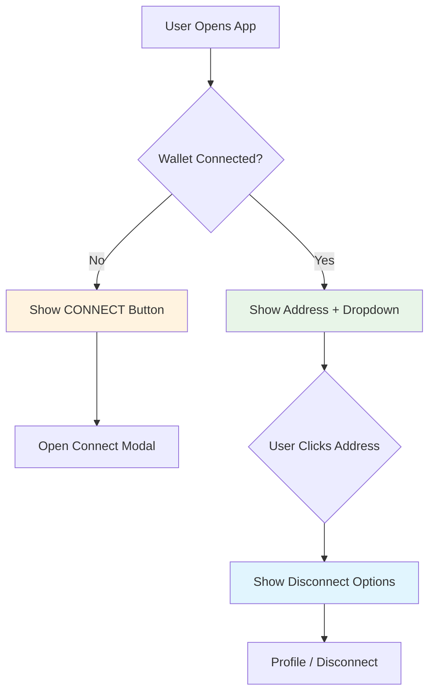

# Splash Screen

The Splash Screen serves as VibesFlow's main entry point, providing wallet connection, live vibestream tracking, and navigation to core features. It implements the primary user interface for accessing the platform's functionality.

## Core Functionality

### Wallet Integration

The Splash Screen manages multi-network wallet connections:

```javascript
// Wallet context integration in SplashScreen.tsx
const { account, connected, disconnect, openModal } = useWallet();

// Connection status display
const formatAddress = (accountId) => {
  if (!accountId || typeof accountId !== 'string') return 'CONNECT';
  if (accountId.length <= 10) return accountId.toUpperCase();
  return `${accountId.substring(0, 6)}...${accountId.substring(accountId.length - 4)}`.toUpperCase();
};
```

### Live Vibestream Tracking

Real-time tracking of active vibestreams across networks:

```javascript
// Live tracking integration in SplashScreen.tsx
const [liveVibestreamsData, setLiveVibestreamsData] = useState({
  liveVibestreams: [],
  totalLive: 0,
  nearLive: 0,
  metisLive: 0,
  lastUpdated: 0
});

// Initialize tracking service
useEffect(() => {
  const startTracking = async () => {
    try {
      await liveVibestreamsTracker.startTracking((data) => {
        setLiveVibestreamsData(data);
      });
    } catch (error) {
      console.warn('Failed to start live vibestreams tracking:', error);
    }
  };

  startTracking();

  return () => {
    liveVibestreamsTracker.stopTracking((data) => {
      setLiveVibestreamsData(data);
    });
  };
}, []);
```

## User Interface Components

### Connection Status

<Mermaid>

</Mermaid>

### Wallet Display Logic

```javascript
// Connection button rendering in SplashScreen.tsx
<TouchableOpacity 
  style={[
    styles.connectButton,
    connected && styles.connectedButton
  ]} 
  onPress={handleWalletClick}
>
  <Text style={[
    styles.connectText,
    connected && styles.connectedText
  ]}>
    {formatAddress(account?.accountId || null)}
  </Text>
</TouchableOpacity>

// Dropdown menu for connected users
{showDisconnectDropdown && connected && (
  <View style={styles.disconnectDropdown}>
    <TouchableOpacity onPress={handleOpenProfile}>
      <Text style={styles.dropdownText}>PROFILE</Text>
    </TouchableOpacity>
    <TouchableOpacity onPress={handleDisconnect}>
      <Text style={styles.dropdownText}>DISCONNECT</Text>
    </TouchableOpacity>
  </View>
)}
```

### Live Counter Display

```javascript
// Live vibestreams counter component
<TouchableOpacity 
  style={styles.liveVibesContainer}
  onPress={handleLiveVibes}
>
  <View style={styles.liveDot} />
  <Text style={styles.liveVibesText}>
    {liveVibestreamsData.totalLive} Vibestream{liveVibestreamsData.totalLive !== 1 ? 's' : ''} Live
  </Text>
</TouchableOpacity>
```

## Action Handlers

### Vibestream Creation

Connection-aware vibestream creation:

```javascript
// Start vibing handler with connection check
const handleStartVibing = () => {
  if (connected && account) {
    setVibestreamModalVisible(true);
  } else {
    openModal(); // Open wallet connection modal
  }
};
```

### Market Access

```javascript
// Vibe Market access with connection requirement
const handleVibeMarket = () => {
  if (connected && account) {
    onOpenVibeMarket();
  } else {
    openModal();
  }
};
```

### Live Vibes Navigation

```javascript
// Live vibestreams navigation
const handleLiveVibes = () => {
  if (connected && account) {
    onOpenLiveVibes?.();
  } else {
    openModal();
  }
};
```

## Visual Effects

### Glitch Animation System

The Splash Screen implements a cyberpunk-style glitch effect:

```javascript
// Glitch line generation in SplashScreen.tsx
type GlitchLine = {
  y: number;
  width: number;
  opacity: number;
};

const generateGlitchLines = (count) => {
  const lines = [];
  for (let i = 0; i < count; i++) {
    const y = Math.random() * height;
    const lineWidth = Math.random() * 100 + 50;
    const opacity = Math.random() * 0.5 + 0.1;
    lines.push({ y, width: lineWidth, opacity });
  }
  return lines;
};

const glitchLines = generateGlitchLines(15);
```

### Background Layers

```javascript
// Layered background rendering
{/* Dark background */}
<View style={styles.background} />

{/* Acid color gradient overlay */}
<LinearGradient
  colors={['rgba(0,0,0,0.8)', 'rgba(10,10,10,0.9)']}
  style={styles.gradientBackground}
/>

{/* Glitch lines with brand colors */}
{glitchLines.map((line, index) => (
  <View 
    key={index}
    style={[
      styles.glitchLine,
      {
        top: line.y,
        width: line.width,
        opacity: line.opacity,
        backgroundColor: index % 3 === 0 ? COLORS.primary : 
                        index % 3 === 1 ? COLORS.secondary : COLORS.accent
      }
    ]}
  />
))}

{/* Noise texture overlay */}
<View style={styles.noiseOverlay} />
```

## Brand Integration

### Logo and Branding

```javascript
// Logo and brand display in SplashScreen.tsx
<View style={styles.logoContainer}>
  <View style={styles.logoBox}>
    <Text style={styles.logoText}>V</Text>
  </View>
  <Text style={styles.title}>VIBES<Text style={styles.titleAccent}>FLOW</Text></Text>
  <Text style={styles.slogan}>{BRANDING.slogan}</Text>
</View>
```

### Action Buttons

```javascript
// Primary action buttons
<View style={styles.buttonsContainer}>
  <TouchableOpacity 
    style={styles.startButton}
    onPress={handleStartVibing}
  >
    <Text style={styles.startButtonText}>START_VIBING</Text>
    <View style={styles.buttonGlow} />
  </TouchableOpacity>
  
  <TouchableOpacity 
    style={styles.marketButton}
    onPress={handleVibeMarket}
  >
    <Text style={styles.marketButtonText}>VIBE_MARKET</Text>
    <View style={styles.marketButtonGlow} />
  </TouchableOpacity>
</View>
```

## Navigation Flow

### Modal Integration

The Splash Screen integrates with various modals:

```javascript
// Modal components integration
<ConnectModal /> {/* Wallet connection handled by context */}

<VibestreamModal
  visible={vibestreamModalVisible}
  onClose={() => setVibestreamModalVisible(false)}
  onLaunchVibePlayer={onLaunchVibePlayer}
/>
```

### State Management

```javascript
// Component state management
const [vibestreamModalVisible, setVibestreamModalVisible] = useState(false);
const [showDisconnectDropdown, setShowDisconnectDropdown] = useState(false);

// Cleanup handlers
const handleDisconnect = () => {
  disconnect();
  setShowDisconnectDropdown(false);
};

const handleOpenProfile = () => {
  onOpenProfile();
  setShowDisconnectDropdown(false);
};
```

## Responsive Design

### Platform Adaptations

```javascript
// Platform-specific styling
const styles = StyleSheet.create({
  connectText: {
    color: COLORS.primary,
    fontWeight: '700',
    fontSize: 14,
    letterSpacing: 2,
  },
  startButtonText: {
    color: COLORS.primary,
    fontSize: width < 400 ? 16 : 18, // Responsive font sizing
    fontWeight: 'bold',
    letterSpacing: 1.5,
    textAlign: 'center',
  },
  // ... additional responsive styles
});
```

### Accessibility Features

```javascript
// Accessibility properties
<TouchableOpacity 
  style={styles.connectButton}
  onPress={handleWalletClick}
  activeOpacity={0.6}
  accessibilityLabel={connected ? "Wallet connected" : "Connect wallet"}
  accessibilityHint={connected ? "Tap to view account options" : "Tap to connect your wallet"}
>
```

## Error Handling

### Connection Failures

```javascript
// Graceful handling of tracking failures
useEffect(() => {
  const startTracking = async () => {
    try {
      await liveVibestreamsTracker.startTracking((data) => {
        setLiveVibestreamsData(data);
      });
    } catch (error) {
      console.warn('Failed to start live vibestreams tracking:', error);
      // Continue without live tracking
    }
  };

  startTracking();
}, []);
```

### Fallback States

```javascript
// Default state for live counter when tracking fails
const [liveVibestreamsData, setLiveVibestreamsData] = useState({
  liveVibestreams: [],
  totalLive: 0,      // Safe default
  nearLive: 0,
  metisLive: 0,
  lastUpdated: 0
});
```

## Performance Optimizations

### Efficient Rendering

```javascript
// Memoized glitch lines generation
const glitchLines = useMemo(() => generateGlitchLines(15), []);

// Optimized update intervals
useEffect(() => {
  // Only track when component is mounted
  const cleanup = liveVibestreamsTracker.startTracking(setLiveVibestreamsData);
  
  return () => {
    cleanup?.();
  };
}, []);
```

## Next Steps

<CardGroup cols={2}>
  <Card title="Vibestream Modal" icon="modal" href="/essentials/vibestream-modal">
    Learn about vibestream creation interface
  </Card>
  <Card title="Vibe Market" icon="store" href="/essentials/vibe-market">
    Explore the vibestream marketplace
  </Card>
</CardGroup>
