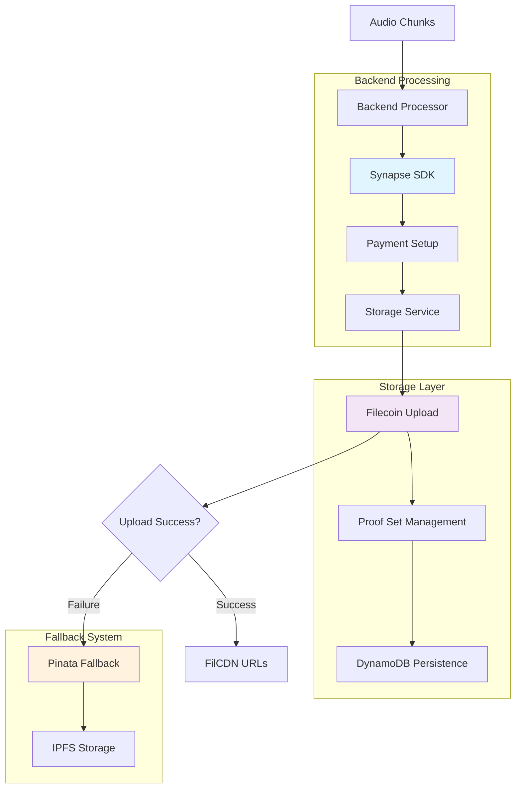

## Upload Architecture



## Synapse SDK Integration

### SDK Initialization

```javascript
// Synapse SDK initialization in backend/rawchunks/synapseSDK.js
async function createSynapseInstance() {
  if (globalSynapseInstance && paymentsInitialized) {
    return globalSynapseInstance;
  }
  
  const { Synapse, TOKENS } = await initializeSynapseSDK();
  
  try {
    console.log('🚀 Initializing Synapse SDK for Calibration network...');
    
    // Create Synapse instance
    globalSynapseInstance = await Synapse.create({
      privateKey: FILECOIN_PRIVATE_KEY,
      rpcURL: FILECOIN_RPC_URL,
      withCDN: true // Enable CDN for VibesFlow
    });
  
    console.log(`✅ Synapse instance created for wallet: ${FILECOIN_ADDRESS}`);
    
    // Setup payments if not already done
    if (!paymentsInitialized) {
      await setupPayments(globalSynapseInstance);
      paymentsInitialized = true;
    }
    
    return globalSynapseInstance;
    
  } catch (error) {
    console.error('❌ Failed to create Synapse instance:', error);
    throw error;
  }
}
```

### Payment Configuration

```javascript
// Automated USDFC payment setup
async function setupPayments(synapse) {
  try {
    console.log('💳 Setting up payments and service approvals...');
    
    const { TOKENS, CONTRACT_ADDRESSES } = await initializeSynapseSDK();
    
    // Check current balances
    const filBalance = await synapse.payments.walletBalance(); // FIL balance
    const usdfcBalance = await synapse.payments.walletBalance(TOKENS.USDFC); // USDFC balance
    const contractBalance = await synapse.payments.balance(TOKENS.USDFC); // Contract balance
    
    console.log('📊 Current Balances:', {
      FIL: ethers.formatEther(filBalance),
      USDFC_Wallet: ethers.formatEther(usdfcBalance),
      USDFC_Contract: ethers.formatEther(contractBalance)
    });
    
    // Minimum required amounts (from fs-upload-dapp patterns)
    const minDeposit = ethers.parseEther('50'); // 50 USDFC minimum
    const rateAllowance = ethers.parseEther('10'); // 10 USDFC per epoch
    const lockupAllowance = ethers.parseEther('1000'); // 1000 USDFC lockup
    
    // Deposit USDFC if contract balance is low
    if (contractBalance < minDeposit) {
      const depositAmount = minDeposit - contractBalance;
      console.log(`💰 Depositing ${ethers.formatEther(depositAmount)} USDFC...`);
      
      const depositTx = await synapse.payments.deposit(depositAmount, TOKENS.USDFC);
      console.log(`📝 Deposit transaction: ${depositTx.hash}`);
      await depositTx.wait();
      console.log('✅ Deposit confirmed');
    }
    
    // Approve Pandora service
    const network = synapse.getNetwork();
    const pandoraAddress = CONTRACT_ADDRESSES.PANDORA_SERVICE[network];
    
    const approveTx = await synapse.payments.approveService(
      pandoraAddress,
      rateAllowance,
      lockupAllowance,
      TOKENS.USDFC
    );
    
    console.log(`📝 Service approval transaction: ${approveTx.hash}`);
    await approveTx.wait();
    console.log('✅ Pandora service approved');
    
  } catch (error) {
    console.error('❌ Payment setup failed:', error);
    throw error;
  }
}
```

## Storage Service Management

### Per-RTA Storage Services

```javascript
// Create or get storage service for specific RTA
async function getStorageServiceForRTA(rtaId, synapse, creator = null) {
  try {
    // Check session cache first
    if (sessionStorageServices.has(rtaId)) {
      console.log(`♻️ Reusing cached storage service for RTA: ${rtaId}`);
      return sessionStorageServices.get(rtaId);
    }
    
    // Check if we have existing RTA metadata in DynamoDB
    const existingRTA = await persistenceService.getRTAMetadata(rtaId);
    
    console.log(`🔧 Creating new storage service for RTA: ${rtaId}...`);
    
    // Create storage service with CDN enabled
    const storageService = await synapse.createStorage({
      withCDN: true,
      callbacks: {
        onProviderSelected: (provider) => {
          console.log(`✅ Provider selected for ${rtaId}:`, {
            address: provider.owner,
            pdpUrl: provider.pdpUrl
          });
        },
        onProofSetResolved: (info) => {
          const status = info.isExisting ? 'existing' : 'new';
          console.log(`📋 Proof set ${status} for ${rtaId}: ID ${info.proofSetId}`);
        },
        onProofSetCreationStarted: (transaction, statusUrl) => {
          console.log(`🚀 Proof set creation started for ${rtaId}: ${transaction.hash}`);
        },
        onProofSetCreationProgress: (status) => {
          const elapsed = Math.round(status.elapsedMs / 1000);
          console.log(`⏳ Proof set creation progress [${elapsed}s]: mined=${status.transactionMined}, live=${status.proofSetLive}`);
        }
      }
    });
    
    console.log(`✅ Storage service created for RTA: ${rtaId}`, {
      proofSetId: storageService.proofSetId,
      provider: storageService.storageProvider
    });
    
    // Cache the service for this session
    sessionStorageServices.set(rtaId, storageService);
    
    return storageService;
    
  } catch (error) {
    console.error(`❌ Failed to create storage service for RTA ${rtaId}:`, error);
    throw error;
  }
}
```

### Proof Set Callbacks

```javascript
// Comprehensive callback handling for storage operations
const storageService = await synapse.createStorage({
  withCDN: true,
  callbacks: {
    onProviderSelected: (provider) => {
      console.log(`✅ Provider selected for ${rtaId}:`, {
        address: provider.owner,
        pdpUrl: provider.pdpUrl
      });
    },
    onProofSetResolved: (info) => {
      const status = info.isExisting ? 'existing' : 'new';
      console.log(`📋 Proof set ${status} for ${rtaId}: ID ${info.proofSetId}`);
    },
    onProofSetCreationStarted: (transaction, statusUrl) => {
      console.log(`🚀 Proof set creation started for ${rtaId}: ${transaction.hash}`);
    },
    onProofSetCreationProgress: (status) => {
      const elapsed = Math.round(status.elapsedMs / 1000);
      console.log(`⏳ Progress [${elapsed}s]: mined=${status.transactionMined}, live=${status.proofSetLive}`);
    }
  }
});
```

## Chunk Upload Process

### Upload Implementation

```javascript
// Complete chunk upload with status tracking
async function uploadChunkToFilecoin(chunkData, rtaId, chunkId, metadata) {
  console.log(`🚀 Starting Synapse upload for chunk ${chunkId} (${(chunkData.length / 1024).toFixed(1)}KB)`);
  
  try {
    // Initialize Synapse instance
    const synapse = await createSynapseInstance();
    
    // Get wallet and service status for frontend logging
    const { TOKENS } = await initializeSynapseSDK();
    const filBalance = await synapse.payments.walletBalance();
    const usdfcBalance = await synapse.payments.walletBalance(TOKENS.USDFC);
    const contractBalance = await synapse.payments.balance(TOKENS.USDFC);
    
    const walletStatus = {
      FIL: ethers.formatEther(filBalance),
      USDFC_Wallet: ethers.formatEther(usdfcBalance),
      USDFC_Contract: ethers.formatEther(contractBalance),
      sufficientFunds: contractBalance > ethers.parseEther('10')
    };
    
    // Check Pandora service approval
    const network = synapse.getNetwork();
    const { CONTRACT_ADDRESSES } = await initializeSynapseSDK();
    const pandoraAddress = CONTRACT_ADDRESSES.PANDORA_SERVICE[network];
    const serviceApproval = await synapse.payments.serviceApproval(pandoraAddress, TOKENS.USDFC);
    
    const pandoraStatus = {
      address: pandoraAddress,
      isApproved: serviceApproval.isApproved,
      rateAllowance: ethers.formatEther(serviceApproval.rateAllowance),
      lockupAllowance: ethers.formatEther(serviceApproval.lockupAllowance)
    };
    
    // Get or create storage service for this RTA
    const storageService = await getStorageServiceForRTA(rtaId, synapse, metadata.creator);
    
    // Run preflight check
    console.log(`🔍 Running preflight check for chunk ${chunkId}...`);
    const preflight = await storageService.preflightUpload(chunkData.length);
    
    if (!preflight.allowanceCheck.sufficient) {
      throw new Error(`Insufficient allowance for upload: ${preflight.allowanceCheck.message}`);
    }
    
    console.log(`💰 Estimated cost: ${ethers.formatEther(preflight.estimatedCost.perMonth)} USDFC/month`);
    
    // Upload chunk with callback handling
    let finalRootId = null;
    let uploadComplete = false;
    let rootConfirmed = false;
    
    const uploadResult = await storageService.upload(chunkData, {
      onUploadComplete: (commp) => {
        console.log(`✅ Upload complete for ${chunkId}: ${commp.toString()}`);
        uploadComplete = true;
      },
      onRootAdded: (transaction) => {
        if (transaction) {
          console.log(`📝 Root added transaction for ${chunkId}: ${transaction.hash}`);
        }
      },
      onRootConfirmed: (rootIds) => {
        console.log(`🎯 Root confirmed for ${chunkId}: IDs ${rootIds.join(', ')}`);
        if (rootIds && rootIds.length > 0) {
          finalRootId = rootIds[0];
          rootConfirmed = true;
        }
      }
    });
    
    // Wait for callbacks to complete
    await new Promise(resolve => setTimeout(resolve, 1000));
    
    const effectiveRootId = finalRootId || uploadResult.rootId;
    
    return {
      success: true,
      cid: uploadResult.commp.toString(),
      size: uploadResult.size,
      rootId: effectiveRootId,
      chunkId: chunkId,
      rtaId: rtaId,
      provider: 'synapse-filecoin',
      confirmed: rootConfirmed,
      // Status for frontend
      uploadId: `${rtaId}_${chunkId}`,
      walletStatus: walletStatus,
      pandoraStatus: pandoraStatus,
      proofSetId: storageService.proofSetId
    };
    
  } catch (error) {
    console.error(`❌ Synapse upload failed for chunk ${chunkId}:`, error.message);
    
    // Fallback to Pinata
    console.log(`🔄 Falling back to Pinata for chunk ${chunkId}...`);
    return await uploadToPinataFallback(chunkData, chunkId, metadata);
  }
}
```

### Upload Status Tracking

```javascript
// Track upload progress and root confirmations
const uploadResult = await storageService.upload(chunkData, {
  onUploadComplete: (commp) => {
    console.log(`✅ Upload complete for ${chunkId}: ${commp.toString()}`);
    uploadComplete = true;
  },
  onRootAdded: (transaction) => {
    if (transaction) {
      console.log(`📝 Root added transaction for ${chunkId}: ${transaction.hash}`);
    } else {
      console.log(`📝 Root added for ${chunkId} (legacy server)`);
    }
    rootAdded = true;
  },
  onRootConfirmed: (rootIds) => {
    console.log(`🎯 Root confirmed for ${chunkId}: IDs ${rootIds.join(', ')}`);
    if (rootIds && rootIds.length > 0) {
      finalRootId = rootIds[0]; // Store the confirmed root ID
      rootConfirmed = true;
    }
  }
});
```

## Fallback System

### Pinata IPFS Fallback

```javascript
// Pinata fallback when Synapse fails
async function uploadToPinataFallback(chunkData, chunkId, metadata) {
  try {
    console.log(`📌 FALLBACK: Uploading chunk ${chunkId} to Pinata...`);
    
    if (!PINATA_JWT) {
      throw new Error('Pinata JWT not configured for fallback');
    }
    
    const formData = new FormData();
    formData.append('file', Buffer.from(chunkData), {
      filename: `${chunkId}.webm`,
      contentType: 'audio/webm'
    });
    
    const pinataMetadata = {
      name: `VibesFlow-Chunk-${chunkId}`,
      keyvalues: {
        rtaId: metadata.rtaId || 'unknown',
        chunkId: chunkId,
        type: 'audio-chunk',
        creator: metadata.creator || 'unknown',
        isFinal: metadata.isFinal ? 'true' : 'false'
      }
    };
    
    formData.append('pinataMetadata', JSON.stringify(pinataMetadata));
    formData.append('pinataOptions', JSON.stringify({ cidVersion: 1 }));
    
    const response = await fetch('https://api.pinata.cloud/pinning/pinFileToIPFS', {
      method: 'POST',
      headers: {
        'Authorization': `Bearer ${PINATA_JWT}`,
        ...formData.getHeaders()
      },
      body: formData
    });
    
    if (!response.ok) {
      throw new Error(`Pinata fallback failed: ${response.statusText}`);
    }
    
    const result = await response.json();
    
    console.log(`✅ FALLBACK: Chunk ${chunkId} uploaded to Pinata: ${result.IpfsHash}`);
    
    return {
      success: true,
      cid: result.IpfsHash,
      size: chunkData.length,
      chunkId: chunkId,
      provider: 'pinata-fallback'
    };
    
  } catch (error) {
    console.error(`❌ Pinata fallback failed for chunk ${chunkId}:`, error);
    throw error;
  }
}
```

## Metadata Compilation

### RTA Metadata Assembly

```javascript
// Compile final RTA metadata for FilCDN retrieval
async function compileRTAMetadata(rtaId, storageService = null) {
  try {
    console.log(`📋 Compiling metadata for RTA: ${rtaId}...`);
    
    // Get RTA data from DynamoDB
    const rtaData = await persistenceService.getRTAMetadata(rtaId);
    if (!rtaData) {
      console.error(`❌ No RTA data found for: ${rtaId}`);
      return null;
    }
  
    // Sort chunks by sequence
    const sortedChunks = (rtaData.chunks_detail || []).sort((a, b) => {
      const seqA = parseInt(a.chunk_id.split('_chunk_')[1]?.split('_')[0]) || 0;
      const seqB = parseInt(b.chunk_id.split('_chunk_')[1]?.split('_')[0]) || 0;
      return seqA - seqB;
    });
  
    // Calculate total duration
    const totalDuration = sortedChunks.reduce((sum, chunk) => sum + (chunk.duration || 60), 0);
    const formattedDuration = formatDuration(totalDuration);
  
    // Create FilCDN-compatible metadata structure
    const metadata = {
      rta_id: rtaId,
      creator: rtaData.creator,
      rta_duration: formattedDuration,
      chunks: sortedChunks.length,
      is_complete: true,
      
      // FilCDN integration
      filcdn_base: `https://${FILECOIN_ADDRESS}.calibration.filcdn.io/`,
      filcdn_wallet: FILECOIN_ADDRESS,
      network: 'calibration',
      
      // Synapse integration details
      proof_set_id: rtaData.proof_set_id,
      storage_provider: rtaData.storage_provider,
      
      // URLs for first and last chunks
      first_chunk_url: sortedChunks.length > 0 ? 
        `https://${FILECOIN_ADDRESS}.calibration.filcdn.io/${sortedChunks[0].cid}` : null,
      last_chunk_url: sortedChunks.length > 0 ? 
        `https://${FILECOIN_ADDRESS}.calibration.filcdn.io/${sortedChunks[sortedChunks.length - 1].cid}` : null,
      
      // Metadata
      upload_timestamp: rtaData.upload_timestamp,
      compilation_timestamp: Date.now(),
      total_size_mb: sortedChunks.reduce((sum, chunk) => sum + (chunk.size || 0), 0) / (1024 * 1024),
      
      // Detailed chunk information for playback
      chunks_detail: sortedChunks.map(chunk => ({
        chunk_id: chunk.chunk_id,
        cid: chunk.cid,
        size: chunk.size,
        root_id: chunk.root_id,
        duration: chunk.duration || 60,
        participants: chunk.participants || 1,
        owner: chunk.owner,
        filcdn_url: chunk.filcdn_url,
        sequence: parseInt(chunk.chunk_id.split('_chunk_')[1]?.split('_')[0]) || 0
      }))
    };
  
    console.log(`📊 Metadata compiled:`, {
      chunks: metadata.chunks,
      duration: metadata.rta_duration,
      totalSizeMB: metadata.total_size_mb.toFixed(2),
      proofSetId: metadata.proof_set_id
    });
    
    return metadata;
    
  } catch (error) {
    console.error(`❌ Failed to compile RTA metadata for ${rtaId}:`, error);
    throw error;
  }
}
```

## Backend Processing Flow

### Chunk Upload Handler

```javascript
// Backend endpoint for chunk uploads in backend/rawchunks/app.js
app.post('/upload', async (req, res) => {
  try {
    const { chunkId, rtaId, audioData, metadata, isFinalChunk } = req.body;
    
    // Validate chunk size for Synapse SDK
    const chunkBuffer = Buffer.from(audioData, 'base64');
    if (chunkBuffer.length < 65) {
      return res.status(400).json({
        success: false,
        error: 'Chunk too small for Synapse SDK (minimum 65 bytes)'
      });
    }

    console.log(`📤 Processing chunk upload: ${chunkId} (${(chunkBuffer.length / 1024).toFixed(1)}KB)`);

    // Upload to Filecoin via Synapse SDK
    const uploadResult = await synapseSDK.queueChunkForFilecoin(rtaId, chunkId, chunkBuffer, {
      ...metadata,
      isFinal: isFinalChunk
    });

    // Return detailed status for frontend logging
    res.json({
      success: true,
      chunkId: chunkId,
      cid: uploadResult.cid,
      size: uploadResult.size,
      provider: uploadResult.provider,
      synapseStatus: {
        success: uploadResult.success,
        uploadId: uploadResult.uploadId,
        queuePosition: uploadResult.queuePosition,
        estimatedProcessTime: uploadResult.estimatedProcessTime,
        walletStatus: uploadResult.walletStatus,
        pandoraStatus: uploadResult.pandoraStatus,
        proofSetId: uploadResult.proofSetId,
        proofSetStatus: uploadResult.proofSetStatus,
        storageProvider: uploadResult.storageProvider
      }
    });

  } catch (error) {
    console.error('❌ Chunk upload failed:', error);
    res.status(500).json({
      success: false,
      error: error.message,
      synapseStatus: {
        success: false,
        message: error.message,
        error: error.message
      }
    });
  }
});
```

### Status Polling

```javascript
// Polling endpoint for upload status
app.get('/filecoin/status/:rtaId', async (req, res) => {
  try {
    const { rtaId } = req.params;
    const status = await synapseSDK.getFilecoinUploadStatus(rtaId);
    
    res.json(status);
  } catch (error) {
    console.error(`❌ Failed to get upload status for ${rtaId}:`, error);
    res.status(500).json({ error: error.message });
  }
});
```

## Auto-Completion System

### Fallback Completion

```javascript
// Auto-completion for incomplete RTAs
setTimeout(async () => {
  try {
    const rtaData = await persistenceService.getRTAMetadata(rtaId);
    if (rtaData && !rtaData.is_complete) {
      const chunks = rtaData.chunks_detail || [];
      const validChunks = chunks.filter(chunk => chunk.cid && chunk.cid.length > 0);
      
      // If RTA has chunks but isn't complete, auto-complete it
      if (validChunks.length > 0) {
        console.log(`🔄 Auto-completion fallback triggered for RTA: ${rtaId} (${validChunks.length} chunks)`);
        const { forceCompleteRTA } = require('./helper');
        await forceCompleteRTA(rtaId);
      }
    }
  } catch (error) {
    console.warn(`⚠️ Auto-completion fallback failed for ${rtaId}:`, error.message);
  }
}, 360000); // 6 minutes delay
```

## Next Steps

<CardGroup cols={2}>
  <Card title="FilCDN Integration" icon="network-wired" href="/essentials/filcdn-integration">
    Learn about content delivery system
  </Card>
  <Card title="Infrastructure" icon="server" href="/essentials/ai-systems">
    Explore backend infrastructure
  </Card>
</CardGroup>
