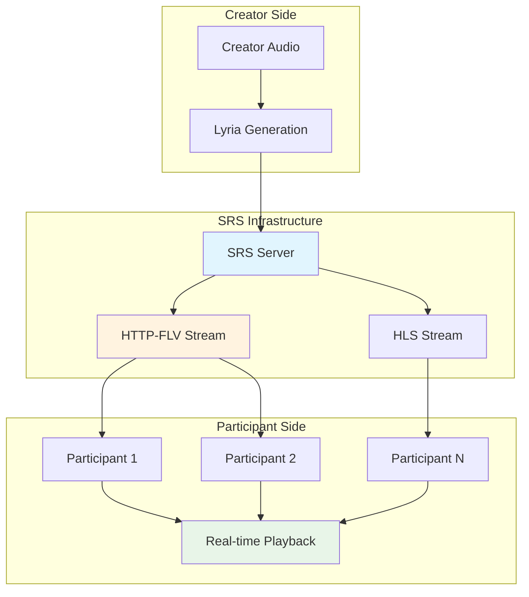

## SRS Architecture



## SRS Server Configuration

### Server Setup

```javascript
// SRS configuration in backend/streaming/lyria.js
const SRS_CONFIG = {
  listen: 1935,                    // RTMP input port
  max_connections: 1000,           // Maximum concurrent connections
  daemon: false,                   // Run in foreground for logging
  http_api: {
    enabled: true,
    listen: 1985,                  // API port
    crossdomain: true
  },
  http_server: {
    enabled: true,
    listen: 8080,                  // HTTP streaming port
    dir: './objs/nginx/html'
  },
  rtc_server: {
    enabled: true,
    listen: 8000,                  // WebRTC port
    candidate: process.env.SRS_CANDIDATE || '$CANDIDATE'
  }
};
```

### Stream Publishing

```javascript
// RTMP stream publishing configuration
const RTMP_CONFIG = {
  rtmp: {
    enabled: true,
    listen: 1935,
    chunk_size: 60000,             // 60KB chunks for low latency
    gop_cache: true,               // Enable GOP cache for immediate playback
    queue_length: 10,              // Stream buffer queue
    refer_play: '*',               // Allow all referrers
    refer_publish: '*'             // Allow all publishers
  }
};
```

## Stream Distribution

### HTTP-FLV Implementation

Primary streaming protocol for low-latency delivery:

```javascript
// HTTP-FLV stream configuration in backend/streaming/lyria.js
const HTTP_FLV_CONFIG = {
  http_remux: {
    enabled: true,
    mount: '[vhost]/[app]/[stream].flv',
    hstrs: true,                   // HTTP streaming
    fast_cache: 30                 // 30-second fast cache
  }
};

// Stream URL generation
const generateStreamUrls = (streamKey) => {
  const baseUrl = process.env.SRS_SERVER_URL || 'http://localhost:8080';
  
  return {
    rtmp: `rtmp://localhost:1935/live/${streamKey}`,
    httpFlv: `${baseUrl}/live/${streamKey}.flv`,
    hls: `${baseUrl}/live/${streamKey}.m3u8`,
    webrtc: `webrtc://localhost:8000/live/${streamKey}`
  };
};
```

### HLS Fallback

```javascript
// HLS configuration for broader compatibility
const HLS_CONFIG = {
  hls: {
    enabled: true,
    hls_fragment: 2,               // 2-second segments
    hls_window: 60,                // 60-second window
    hls_on_error: 'continue',      // Continue on errors
    hls_storage: 'memory',         // Memory-based storage
    hls_path: './objs/nginx/html', // HLS file path
    hls_m3u8_file: '[app]/[stream].m3u8',
    hls_ts_file: '[app]/[stream]-[seq].ts'
  }
};
```

## Participant Integration

### Audio Stream Connection

```javascript
// Participant audio connection in VibePlayer.tsx
const startParticipantMode = async () => {
  try {
    console.log('👥 Starting participant mode - receiving from SRS');
    
    // Create audio element for LIVE HTTP-FLV stream
    if (participantOptions?.streamingUrl) {
      console.log(`🎵 Connecting to LIVE SRS stream: ${participantOptions.streamingUrl}`);
      
      const liveAudio = new Audio();
      liveAudio.crossOrigin = 'anonymous';
      liveAudio.src = participantOptions.streamingUrl;
      liveAudio.volume = 0.8;
      liveAudio.autoplay = true;
      liveAudio.controls = false;
      
      // Handle audio events
      liveAudio.oncanplay = () => console.log('✅ Live stream ready to play');
      liveAudio.onplay = () => console.log('▶️ Live stream playing');
      liveAudio.onerror = (e) => {
        console.error('❌ Live stream error:', e);
        // Try HLS fallback
        if (participantOptions?.hlsUrl) {
          liveAudio.src = participantOptions.hlsUrl;
        }
      };
      liveAudio.onstalled = () => {
        console.warn('⚠️ Live stream stalled');
        setTimeout(() => {
          console.log('🔄 Retrying stalled stream...');
          liveAudio.load();
        }, 3000);
      };
      
      // Start live playback
      await liveAudio.play();
      console.log('✅ Vibestream started for participant');
      
      return liveAudio;
    }
  } catch (error) {
    console.error('❌ Failed to start participant mode:', error);
    throw error;
  }
};
```

### Error Handling and Fallbacks

```javascript
// Comprehensive error handling for streaming
liveAudio.onerror = (e) => {
  console.error('❌ Live stream error:', e);
  console.log('🔄 Retrying with HLS fallback...');
  // Try HLS as fallback
  if (participantOptions?.hlsUrl) {
    liveAudio.src = participantOptions.hlsUrl;
  }
};

liveAudio.onstalled = () => {
  console.warn('⚠️ Live stream stalled - stream may not be active yet');
  // Try to reload after a delay
  setTimeout(() => {
    console.log('🔄 Retrying stalled stream...');
    liveAudio.load();
  }, 3000);
};
```

## Stream Management

### Dynamic Stream Creation

```javascript
// Dynamic stream creation based on vibestream configuration
const createStreamForVibestream = (rtaId, config) => {
  const streamKey = `vibe_${rtaId}`;
  const streamUrls = generateStreamUrls(streamKey);
  
  console.log(`🎬 Creating stream for vibestream ${rtaId}:`, {
    streamKey: streamKey,
    rtmpUrl: streamUrls.rtmp,
    httpFlvUrl: streamUrls.httpFlv,
    hlsUrl: streamUrls.hls
  });
  
  return {
    streamKey,
    urls: streamUrls,
    config: {
      maxParticipants: config.ticket_amount || 100,
      requiresPayment: config.pay_per_stream || false,
      streamPrice: config.stream_price || '0'
    }
  };
};
```

### Stream Lifecycle Management

```javascript
// Stream lifecycle management
class StreamManager {
  private activeStreams: Map<string, StreamInfo> = new Map();
  
  async startStream(rtaId: string, config: any): Promise<StreamInfo> {
    try {
      const streamInfo = createStreamForVibestream(rtaId, config);
      
      // Register stream with SRS
      await this.registerStreamWithSRS(streamInfo);
      
      // Store active stream info
      this.activeStreams.set(rtaId, streamInfo);
      
      console.log(`✅ Stream started for RTA: ${rtaId}`);
      return streamInfo;
      
    } catch (error) {
      console.error(`❌ Failed to start stream for ${rtaId}:`, error);
      throw error;
    }
  }
  
  async stopStream(rtaId: string): Promise<void> {
    try {
      const streamInfo = this.activeStreams.get(rtaId);
      if (!streamInfo) return;
      
      // Unregister from SRS
      await this.unregisterStreamFromSRS(streamInfo);
      
      // Remove from active streams
      this.activeStreams.delete(rtaId);
      
      console.log(`✅ Stream stopped for RTA: ${rtaId}`);
      
    } catch (error) {
      console.error(`❌ Failed to stop stream for ${rtaId}:`, error);
    }
  }
}
```

## Quality Management

### Adaptive Bitrate

```javascript
// Adaptive bitrate based on participant count and network conditions
const calculateOptimalBitrate = (participantCount, networkQuality) => {
  let baseBitrate = 128000; // 128kbps baseline
  
  // Adjust for participant count
  if (participantCount > 10) {
    baseBitrate = 96000;  // Lower bitrate for many participants
  } else if (participantCount > 50) {
    baseBitrate = 64000;  // Even lower for very high participant count
  }
  
  // Adjust for network quality
  switch (networkQuality) {
    case 'poor':
      return Math.floor(baseBitrate * 0.6);
    case 'good':
      return baseBitrate;
    case 'excellent':
      return Math.floor(baseBitrate * 1.5);
    default:
      return baseBitrate;
  }
};
```

### Buffer Management

```javascript
// Stream buffer management for smooth playback
const BUFFER_CONFIG = {
  minBufferTime: 2000,     // 2 seconds minimum buffer
  maxBufferTime: 10000,    // 10 seconds maximum buffer
  targetBufferTime: 5000,  // 5 seconds target buffer
  rebufferThreshold: 1000  // Rebuffer when below 1 second
};
```

## Integration Points

### VibePlayer Integration

```javascript
// SRS integration in VibePlayer participant mode
if (participantOptions?.isParticipant) {
  console.log(`👥 PARTICIPANT MODE: Joining existing vibestream`);
  console.log(`🎵 Stream URL: ${participantOptions.streamingUrl}`);
  console.log(`📺 HLS URL: ${participantOptions.hlsUrl}`);
  
  // Start audio streaming mode - receive from SRS
  await startParticipantMode();
  return;
}
```

### Backend Coordination

```javascript
// Backend coordination for stream lifecycle
app.post('/api/streams/start', async (req, res) => {
  try {
    const { rtaId, config } = req.body;
    
    const streamInfo = await streamManager.startStream(rtaId, config);
    
    res.json({
      success: true,
      streamKey: streamInfo.streamKey,
      urls: streamInfo.urls,
      config: streamInfo.config
    });
    
  } catch (error) {
    console.error('❌ Failed to start stream:', error);
    res.status(500).json({
      success: false,
      error: error.message
    });
  }
});

app.post('/api/streams/stop', async (req, res) => {
  try {
    const { rtaId } = req.body;
    
    await streamManager.stopStream(rtaId);
    
    res.json({
      success: true,
      message: `Stream stopped for RTA: ${rtaId}`
    });
    
  } catch (error) {
    console.error('❌ Failed to stop stream:', error);
    res.status(500).json({
      success: false,
      error: error.message
    });
  }
});
```

## Deployment Configuration

### PM2 Configuration

```javascript
// PM2 ecosystem configuration for SRS deployment
module.exports = {
  apps: [{
    name: 'vibesflow-srs',
    script: 'lyria.js',
    instances: 1,
    exec_mode: 'fork',
    env: {
      NODE_ENV: 'production',
      SRS_SERVER_URL: 'http://localhost:8080',
      SRS_CANDIDATE: '$CANDIDATE'
    },
    log_file: './logs/srs.log',
    error_file: './logs/srs-error.log',
    out_file: './logs/srs-out.log'
  }]
};
```

### Docker Configuration

```bash
# SRS Docker configuration
docker run -d \
  --name srs-server \
  -p 1935:1935 \
  -p 8080:8080 \
  -p 1985:1985 \
  -p 8000:8000/udp \
  -v ./srs.conf:/usr/local/srs/conf/srs.conf \
  ossrs/srs:5
```

## Next Steps

<CardGroup cols={2}>
  <Card title="Decentralized Storage" icon="database" href="/essentials/decentralized-storage">
    Learn about storage backend
  </Card>
  <Card title="Third-party Integrations" icon="plug" href="/essentials/third-party-integrations">
    View all external services
  </Card>
</CardGroup>
