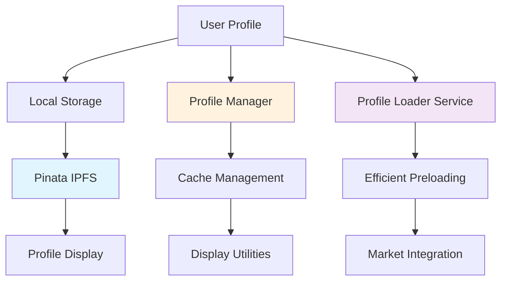

## Profile System Architecture



## Integration with Components

### Vibe Market Integration

```javascript
// Profile integration in VibeMarket.tsx
const profileLoader = useRef<ProfileLoader>(new ProfileLoader());

// Preload creator profiles when vibestreams change
useEffect(() => {
  const loadCreatorProfiles = async () => {
    if (vibestreams.length === 0) return;
    
    const uniqueCreators = [...new Set(vibestreams.map(stream => stream.creator))];
    
    // Use ProfileLoader's efficient preloading
    await profileLoader.current.preloadProfiles(uniqueCreators);
  };
  
  loadCreatorProfiles();
}, [vibestreams]);

// Display name resolution with caching
const getDisplayName = useCallback((creator: string): string => {
  // ProfileLoader handles caching internally
  const cached = profileLoader.current.getDisplayName(creator);
  if (cached) return cached;
  
  // Fallback formatting
  if (creator.startsWith('0x')) {
    return `${creator.slice(0, 5)}...${creator.slice(-6)}`;
  }
  return creator;
}, []);
```

### Playback Integration

```javascript
// Profile loading in Playback.tsx
const profileLoader = useRef<ProfileLoader>(new ProfileLoader());

// Creator profile state
const [creatorProfile, setCreatorProfile] = useState<{
  displayName: string;
  profileImageUri: string | null;
  bio: string;
}>({
  displayName: '',
  profileImageUri: null,
  bio: ''
});

// Load creator profile during initialization
useEffect(() => {
  const loadVibestream = async () => {
    try {
      const streamData = getVibestreamByRTA(rtaId);
      if (!streamData) {
        Alert.alert('Error', 'Vibestream not found');
        return;
      }

      setVibestream(streamData);
      
      // Load creator profile
      const profile = await profileLoader.current.loadCreatorProfile(streamData.creator);
      setCreatorProfile(profile);
      
      setLoading(false);
    } catch (error) {
      console.error('Failed to load vibestream:', error);
    }
  };

  loadVibestream();
}, [rtaId, getVibestreamByRTA]);
```

## Profile Display Components

### Profile Image Component

```javascript
// Profile image with fallback in Playback.tsx
<View style={styles.profileImageContainer}>
  {creatorProfile.profileImageUri ? (
    <Image 
      source={{ uri: creatorProfile.profileImageUri }}
      style={styles.profileImage}
    />
  ) : (
    <View style={styles.profileImagePlaceholder}>
      <FontAwesome5 name="user-astronaut" size={20} color={COLORS.primary} />
    </View>
  )}
</View>
```

### Authenticated Image Component

```javascript
// AuthenticatedImage component for profile pictures
import AuthenticatedImage from './ui/ProfilePic';

// Usage in components
<AuthenticatedImage 
  source={{ uri: profileImageUrl }}
  style={styles.profileImage}
  fallback={
    <View style={styles.profileImagePlaceholder}>
      <FontAwesome5 name="user-astronaut" size={20} color={COLORS.primary} />
    </View>
  }
/>
```

## Utility Functions

### Shared Formatting Utilities

```javascript
// Shared utility functions in utils/profile.ts

/**
 * Format time helper (shared utility)
 */
export const formatTime = (seconds: number): string => {
  const mins = Math.floor(seconds / 60);
  const secs = Math.floor(seconds % 60);
  return `${mins}:${secs.toString().padStart(2, '0')}`;
};

/**
 * Format date helper (shared utility)
 */
export const formatDate = (timestamp: number): string => {
  let date: Date;
  
  if (timestamp > 1e12) {
    date = new Date(timestamp);
  } else if (timestamp > 1e9) {
    date = new Date(timestamp * 1000);
  } else {
    date = new Date();
  }
  
  const options: Intl.DateTimeFormatOptions = {
    month: 'short',
    day: 'numeric',
    hour: '2-digit',
    minute: '2-digit',
    hour12: false
  };
  
  return date.toLocaleDateString('en-US', options).toUpperCase();
};

/**
 * Network detection helper (shared utility)
 */
export const getNetworkFromRtaId = (rtaId: string): 'metis' | 'near' => {
  const upperRtaId = rtaId.toUpperCase();
  
  if (upperRtaId.startsWith('METIS_') || upperRtaId.includes('METIS')) {
    return 'metis';
  }
  if (upperRtaId.startsWith('RTA_') || upperRtaId.startsWith('NEAR_')) {
    return 'near';
  }
  
  return 'near'; // Default to NEAR
};

/**
 * Title extraction helper (shared utility)
 */
export const getVibestreamTitle = (stream: any): string => {
  const rtaId = stream.rta_id;
  const upperRtaId = rtaId.toUpperCase();
  
  // Remove network prefixes for cleaner titles
  if (upperRtaId.startsWith('METIS_VIBE_')) {
    return rtaId.substring(11);
  } else if (upperRtaId.startsWith('METIS_')) {
    return rtaId.substring(6);
  } else if (upperRtaId.startsWith('RTA_ID_')) {
    return rtaId.substring(7);
  } else if (upperRtaId.startsWith('RTA_')) {
    return rtaId.substring(4);
  } else if (upperRtaId.startsWith('NEAR_')) {
    return rtaId.substring(5);
  }
  
  return rtaId.toUpperCase();
};
```

## Storage Integration

### Local Storage Management

```javascript
// Web-based local storage for profiles
if (Platform.OS === 'web' && typeof localStorage !== 'undefined') {
  // Save profile data
  localStorage.setItem(`vibesflow_profile_${creatorAccountId}`, imageHash);
  localStorage.setItem(`vibesflow_name_${creatorAccountId}`, displayName);
  localStorage.setItem(`vibesflow_bio_${creatorAccountId}`, bio);
  
  // Load profile data
  const savedImageHash = localStorage.getItem(`vibesflow_profile_${creatorAccountId}`);
  const savedName = localStorage.getItem(`vibesflow_name_${creatorAccountId}`);
  const savedBio = localStorage.getItem(`vibesflow_bio_${creatorAccountId}`);
}
```

### Pinata IPFS Integration

```javascript
// IPFS URL construction for profile images
const PINATA_URL = process.env.PINATA_URL || 
  process.env.EXPO_PUBLIC_PINATA_URL || 'vibesflow.mypinata.cloud';

const getProfileImageUrl = (imageHash: string): string => {
  return `https://${PINATA_URL}/ipfs/${imageHash}`;
};
```

## Performance Optimizations

### Cache Management

```javascript
// Cache management utilities
export class ProfileManager {
  /**
   * Clear profile cache (for memory management)
   */
  static clearCache(): void {
    this.profileCache.clear();
  }

  /**
   * Get cache size for debugging
   */
  static getCacheSize(): number {
    return this.profileCache.size;
  }
}
```

### Efficient Loading

```javascript
// Prevent duplicate loading with promises map
private loadingPromises: Map<string, Promise<any>> = new Map();

async preloadProfiles(creatorIds: string[]): Promise<void> {
  const loadPromises = creatorIds.map(async (creatorId) => {
    // Check if already cached or loading
    if (!this.profileCache.has(creatorId) && !this.loadingPromises.has(creatorId)) {
      const loadPromise = this.loadCreatorProfile(creatorId);
      this.loadingPromises.set(creatorId, loadPromise);
      
      try {
        const profile = await loadPromise;
        this.profileCache.set(creatorId, profile);
      } finally {
        this.loadingPromises.delete(creatorId);
      }
    }
  });

  await Promise.allSettled(loadPromises);
}
```

## Error Handling

### Graceful Fallbacks

```javascript
// Profile loading with error handling
static async loadCreatorProfile(creatorAccountId: string): Promise<CreatorProfile> {
  try {
    // ... profile loading logic
  } catch (error) {
    console.warn(`⚠️ Failed to load profile for creator ${creatorAccountId}:`, error);
    return {}; // Return empty profile instead of throwing
  }
}
```

### Display Fallbacks

```javascript
// Display name with multiple fallback strategies
static getCreatorDisplayName(creator: string, profile?: CreatorProfile): string {
  // 1. Use profile name if available
  if (profile?.name) {
    return profile.name;
  }
  
  // 2. Format Ethereum addresses
  if (creator.startsWith('0x')) {
    return `${creator.slice(0, 4)}...${creator.slice(-4)}`;
  }
  
  // 3. Format NEAR addresses
  if (creator.includes('.testnet') || creator.includes('.near')) {
    const baseName = creator.split('.')[0];
    return baseName.length > 12 ? `${baseName.slice(0, 8)}...` : baseName;
  }
  
  // 4. Generic truncation
  return creator.length > 12 ? `${creator.slice(0, 8)}...` : creator;
}
```

## Next Steps

<CardGroup cols={2}>
  <Card title="Chunking Process" icon="cube" href="/essentials/chunking-process">
    Learn about audio processing pipeline
  </Card>
  <Card title="FilCDN Integration" icon="network-wired" href="/essentials/filcdn-integration">
    Understand content delivery system
  </Card>
</CardGroup>
