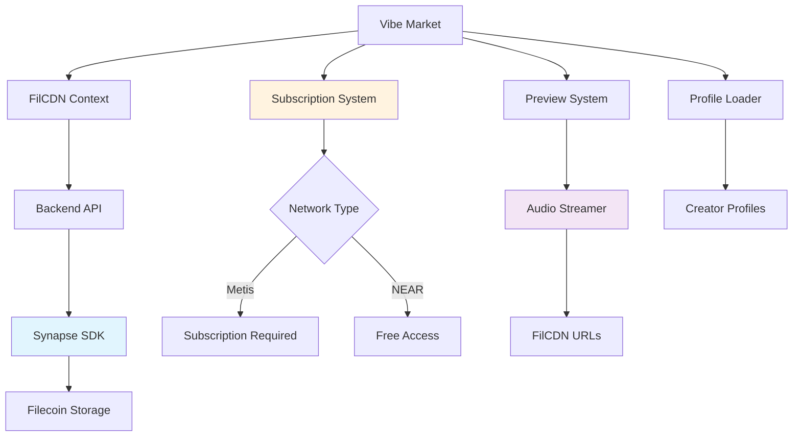

# Vibe Market

The Vibe Market is the discovery and playback interface for all stored vibestreams. It integrates with FilCDN for content delivery and implements subscription-based access control for Metis users.

## Architecture Overview



## FilCDN Integration

### Context Provider

The Vibe Market relies on the FilCDN context for vibestream data:

```javascript
// FilCDN context usage in VibeMarket.tsx
const { 
  vibestreams, 
  loading, 
  error, 
  isConnected,
  networkType,
  currentAddress,
  refreshVibestreams 
} = useFilCDN();
```

### Data Loading

```javascript
// Load vibestreams when connected
useEffect(() => {
  if (isConnected || vibestreams.length === 0) {
    refreshVibestreams();
  }
}, [isConnected]);
```

### URL Construction

FilCDN URLs are constructed with provider wallet addresses:

```javascript
// FilCDN URL construction in context/filcdn.tsx
const constructFilCDNUrl = (cid, providerAddress) => {
  const address = providerAddress || 
    process.env.EXPO_PUBLIC_FILCDN_PROVIDER_ADDRESS;
  
  // Use calibration network
  return `https://${address}.calibration.filcdn.io/${cid}`;
};

// Chunk transformation with FilCDN support
const transformedData = data.map((vibestream) => ({
  ...vibestream,
  chunks_detail: vibestream.chunks_detail?.map((chunk) => {
    if (!chunk.cid) return chunk;
    
    const filcdnUrl = constructFilCDNUrl(chunk.cid);
    
    return {
      ...chunk,
      url: `${backendUrl}/api/proxy/${chunk.cid}`, // Backend fallback
      filcdn_url: filcdnUrl, // Direct FilCDN URL
    };
  }) || []
}));
```

## Subscription System

### Network-Based Access Control

```javascript
// Subscription status checking in VibeMarket.tsx
useEffect(() => {
  const checkSubscriptionStatus = async () => {
    if (!connected || !account) {
      setSubscriptionStatus({
        isSubscribed: false,
        isLoading: false,
        requiresSubscription: false
      });
      return;
    }

    const networkInfo = getNetworkInfo();
    
    // Only check subscription for Metis Hyperion network
    if (networkInfo?.type === 'metis-hyperion') {
      setSubscriptionStatus(prev => ({ 
        ...prev, 
        isLoading: true, 
        requiresSubscription: true 
      }));
      
      try {
        const isSubscribed = await isUserSubscribed();
        setSubscriptionStatus({
          isSubscribed,
          isLoading: false,
          requiresSubscription: true
        });
      } catch (error) {
        console.error('❌ Failed to check subscription status:', error);
        setSubscriptionStatus({
          isSubscribed: false,
          isLoading: false,
          requiresSubscription: true
        });
      }
    } else {
      // For non-Metis networks, no subscription required
      setSubscriptionStatus({
        isSubscribed: true, // Allow access
        isLoading: false,
        requiresSubscription: false
      });
    }
  };

  checkSubscriptionStatus();
}, [connected, account, isUserSubscribed, getNetworkInfo]);
```

### Subscription Gate UI

```javascript
// Subscription gate for Metis users
{subscriptionStatus.requiresSubscription && !subscriptionStatus.isSubscribed && (
  <GlitchContainer intensity="medium" style={styles.subscriptionGate}>
    <FontAwesome5 name="lock" size={32} color={COLORS.accent} />
    <Text style={styles.gateTitle}>PREMIUM ACCESS REQUIRED</Text>
    <Text style={styles.gateSubtext}>
      Access all DJ sets ever created on Metis Hyperion for just 10 tMETIS per month!
    </Text>
    <TouchableOpacity 
      style={styles.subscribeButton}
      onPress={() => setSubscribeModalVisible(true)}
    >
      <Text style={styles.subscribeButtonText}>SUBSCRIBE NOW</Text>
    </TouchableOpacity>
  </GlitchContainer>
)}
```

## Preview System

### Audio Streaming Service

```javascript
// Preview playback using AudioStreamer service
const togglePreview = useCallback(async (stream) => {
  try {
    if (player.currentRTA === stream.rta_id && player.isPlaying) {
      // Stop current preview
      if (player.stopPreview) {
        player.stopPreview();
      }
      setPlayer({
        isPlaying: false,
        currentRTA: null,
        stopPreview: null
      });
      return;
    }

    // Stop any existing preview
    if (player.stopPreview) {
      player.stopPreview();
    }

    // Get first chunk for preview
    const firstChunk = stream.chunks_detail?.[0];
    if (!firstChunk) {
      Alert.alert('No Audio', 'No chunks available for preview');
      return;
    }

    console.log('🎵 Starting preview for:', stream.rta_id);

    if (Platform.OS === 'web' && audioStreamer.current) {
      // Use FilCDN URL if available, fallback to proxy
      const audioUrl = firstChunk.filcdn_url || firstChunk.url;
      
      // Start preview using AudioStreamer service
      const stopPreview = await audioStreamer.current.playPreview(audioUrl, 0.6);

      setPlayer({
        isPlaying: true,
        currentRTA: stream.rta_id,
        stopPreview
      });

      // Auto-stop after 30 seconds
      setTimeout(() => {
        if (playerRef.current.currentRTA === stream.rta_id && playerRef.current.isPlaying) {
          stopPreview();
          setPlayer(prev => ({
            ...prev,
            isPlaying: false,
            currentRTA: null,
            stopPreview: null
          }));
        }
      }, 30000);
    }
  } catch (error) {
    console.error('❌ Preview toggle failed:', error);
    Alert.alert('Error', 'Failed to toggle preview');
  }
}, [player]);
```

### Preview Controls

```javascript
// Preview button in vibestream cards
<TouchableOpacity 
  style={styles.previewButton}
  onPress={(e) => {
    e.stopPropagation();
    togglePreview(stream);
  }}
>
  <FontAwesome5 
    name={isPlaying ? "stop" : "play"} 
    size={12} 
    color={COLORS.background} 
    style={!isPlaying ? { marginLeft: 1 } : {}}
  />
</TouchableOpacity>
```

## Profile Integration

### Creator Profile Loading

```javascript
// Profile preloading in VibeMarket.tsx
useEffect(() => {
  const loadCreatorProfiles = async () => {
    if (vibestreams.length === 0) return;
    
    const uniqueCreators = [...new Set(vibestreams.map(stream => stream.creator))];
    
    // Use ProfileLoader's efficient preloading
    await profileLoader.current.preloadProfiles(uniqueCreators);
  };
  
  loadCreatorProfiles();
}, [vibestreams]);
```

### Display Name Resolution

```javascript
// Creator display name helper using ProfileLoader cache
const getDisplayName = useCallback((creator) => {
  // ProfileLoader handles caching internally
  const cached = profileLoader.current.getDisplayName(creator);
  if (cached) return cached;
  
  // Fallback formatting
  if (creator.startsWith('0x')) {
    return `${creator.slice(0, 5)}...${creator.slice(-6)}`;
  }
  return creator;
}, []);
```

## Data Processing Utilities

### Network Detection

```javascript
// Network detection from RTA ID
const getNetworkFromRtaId = (rtaId) => {
  const upperRtaId = rtaId.toUpperCase();
  
  if (upperRtaId.startsWith('METIS_') || upperRtaId.includes('METIS')) {
    return 'metis';
  }
  return 'near';
};
```

### Title Extraction

```javascript
// Clean title extraction from RTA ID
const getVibestreamTitle = (stream) => {
  const rtaId = stream.rta_id;
  
  if (rtaId.toUpperCase().startsWith('METIS_VIBE_')) {
    return rtaId.substring(11);
  } else if (rtaId.toUpperCase().startsWith('METIS_')) {
    return rtaId.substring(6);
  } else if (rtaId.toUpperCase().startsWith('RTA_ID_')) {
    return rtaId.substring(7);
  } else if (rtaId.toUpperCase().startsWith('RTA_')) {
    return rtaId.substring(4);
  }
  
  return rtaId.toUpperCase();
};
```

### Date Formatting

```javascript
// Timestamp formatting with fallbacks
const formatDate = (timestamp) => {
  let date;
  
  if (timestamp > 1e12) {
    date = new Date(timestamp);
  } else if (timestamp > 1e9) {
    date = new Date(timestamp * 1000);
  } else {
    date = new Date();
  }
  
  const options = {
    month: 'short',
    day: 'numeric',
    hour: '2-digit',
    minute: '2-digit',
    hour12: false
  };
  
  return date.toLocaleDateString('en-US', options).toUpperCase();
};
```

## Filtering System

### Filter State

```javascript
// Filter state management
const [filters, setFilters] = useState({
  network: 'all',
  creator: '',
  date: 'all'
});
```

### Filter Implementation

```javascript
// Comprehensive filtering logic
const filteredVibestreams = vibestreams.filter(stream => {
  // Network filter
  if (filters.network !== 'all') {
    const streamNetwork = getNetworkFromRtaId(stream.rta_id);
    if (streamNetwork !== filters.network) return false;
  }

  // Creator filter
  if (filters.creator && !stream.creator.toLowerCase().includes(filters.creator.toLowerCase())) {
    return false;
  }

  // Date filter
  if (filters.date !== 'all') {
    const timestamp = stream.upload_timestamp;
    let streamDate;
    
    if (timestamp > 1e12) {
      streamDate = new Date(timestamp);
    } else if (timestamp > 1e9) {
      streamDate = new Date(timestamp * 1000);
    } else {
      return true;
    }
    
    const now = new Date();
    const diffMs = now.getTime() - streamDate.getTime();
    const diffDays = Math.floor(diffMs / (1000 * 60 * 60 * 24));

    switch (filters.date) {
      case 'today':
        if (diffDays > 0) return false;
        break;
      case 'week':
        if (diffDays > 7) return false;
        break;
      case 'month':
        if (diffDays > 30) return false;
        break;
    }
  }

  return true;
});
```

### Filter UI

```javascript
// Filter chips interface
<View style={styles.filtersContainer}>
  <ScrollView horizontal showsHorizontalScrollIndicator={false}>
    {/* Network filter */}
    <TouchableOpacity 
      style={[styles.filterChip, filters.network !== 'all' && styles.activeFilterChip]}
      onPress={() => setFilters(prev => ({
        ...prev, 
        network: prev.network === 'all' ? 'metis' : prev.network === 'metis' ? 'near' : 'all'
      }))}
    >
      <Text style={[styles.filterText, filters.network !== 'all' && styles.activeFilterText]}>
        {filters.network === 'all' ? 'ALL NETWORKS' : filters.network.toUpperCase()}
      </Text>
    </TouchableOpacity>

    {/* Date filter */}
    <TouchableOpacity 
      style={[styles.filterChip, filters.date !== 'all' && styles.activeFilterChip]}
      onPress={() => setFilters(prev => ({
        ...prev,
        date: prev.date === 'all' ? 'today' : prev.date === 'today' ? 'week' : prev.date === 'week' ? 'month' : 'all'
      }))}
    >
      <Text style={[styles.filterText, filters.date !== 'all' && styles.activeFilterText]}>
        {filters.date === 'all' ? 'ALL TIME' : filters.date.toUpperCase()}
      </Text>
    </TouchableOpacity>
  </ScrollView>
</View>
```

## Card Rendering

### Vibestream Card

```javascript
// Minimal vibestream card renderer
const renderVibestreamCard = (stream, index) => {
  const isPlaying = player.currentRTA === stream.rta_id && player.isPlaying;
  const network = getNetworkFromRtaId(stream.rta_id);
  const title = getVibestreamTitle(stream);
  const displayName = getDisplayName(stream.creator);
  
  return (
    <GlitchContainer key={stream.rta_id} intensity="low" style={styles.cardContainer}>
      <TouchableOpacity 
        style={styles.card}
        onPress={() => onOpenPlayback?.(stream.rta_id)}
      >
        {/* Network indicator */}
        <View style={[styles.networkIndicator, { 
          backgroundColor: network === 'metis' ? COLORS.accent : COLORS.secondary 
        }]} />
        
        {/* Main content */}
        <View style={styles.cardContent}>
          <View style={styles.cardHeader}>
            <GlitchText text={title} style={styles.cardTitle} />
            <TouchableOpacity 
              style={styles.previewButton}
              onPress={(e) => {
                e.stopPropagation();
                togglePreview(stream);
              }}
            >
              <FontAwesome5 
                name={isPlaying ? "stop" : "play"} 
                size={12} 
                color={COLORS.background} 
              />
            </TouchableOpacity>
          </View>
          
          <Text style={styles.creatorName}>{displayName}</Text>
          
          <View style={styles.cardMeta}>
            <Text style={styles.metaText}>{stream.chunks} CHUNKS</Text>
            <Text style={styles.metaText}>{stream.rta_duration}</Text>
            <Text style={styles.metaText}>{formatDate(stream.upload_timestamp)}</Text>
          </View>
        </View>
      </TouchableOpacity>
    </GlitchContainer>
  );
};
```

## Error States

### Connection Warning

```javascript
// Connection warning display
{!isConnected && (
  <GlitchContainer intensity="medium" style={styles.warningContainer}>
    <FontAwesome5 name="exclamation-triangle" size={24} color={COLORS.accent} />
    <Text style={styles.warningText}>WALLET NOT CONNECTED</Text>
    <Text style={styles.warningSubtext}>
      Connect your wallet to access all features
    </Text>
  </GlitchContainer>
)}
```

### Empty States

```javascript
// Empty state when no vibestreams found
{filteredVibestreams.length === 0 ? (
  <View style={styles.emptyState}>
    <FontAwesome5 name="satellite-dish" size={32} color={COLORS.textTertiary} />
    <Text style={styles.emptyText}>NO SIGNALS DETECTED</Text>
    <Text style={styles.emptySubtext}>Adjust filters or check back later</Text>
  </View>
) : (
  <View style={styles.cardsList}>
    {filteredVibestreams.map((stream, index) => renderVibestreamCard(stream, index))}
  </View>
)}
```

## Performance Optimizations

### Cleanup Management

```javascript
// Cleanup audio when component unmounts
useEffect(() => {
  return () => {
    if (player.stopPreview) {
      player.stopPreview();
    }
    audioStreamer.current?.dispose();
  };
}, [player.stopPreview]);
```

### Subscription Success Handling

```javascript
// Handle subscription success callback
const handleSubscriptionSuccess = useCallback(() => {
  setSubscriptionStatus({
    isSubscribed: true,
    isLoading: false,
    requiresSubscription: true
  });
  setSubscribeModalVisible(false);
}, []);
```

## Next Steps

<CardGroup cols={2}>
  <Card title="User Profiles" icon="user" href="/essentials/user-profiles">
    Learn about profile management
  </Card>
  <Card title="Playback System" icon="play" href="/essentials/playback-system">
    Understand continuous playback
  </Card>
</CardGroup>
