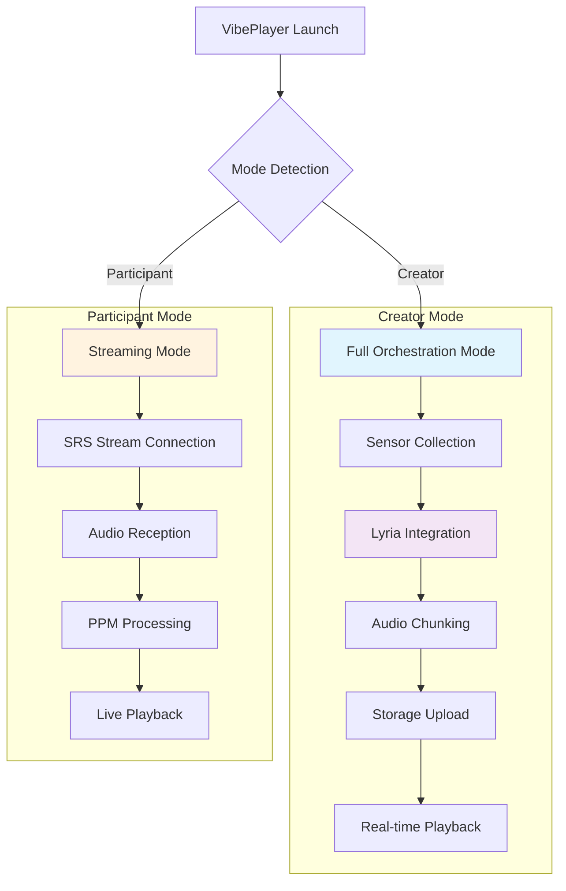

# Vibe Player

The Vibe Player is the core interface for real-time music generation, providing creator and participant modes with integrated sensor processing, audio chunking, and Lyria AI orchestration.

## Dual Mode Architecture

<Mermaid>

</Mermaid>

## Initialization System

### Mode Detection

```javascript
// Initialization logic in VibePlayer.tsx
useEffect(() => {
  const initializeVibePlayer = async () => {
    try {
      if (participantOptions?.isParticipant) {
        // PARTICIPANT MODE: Audio streaming only
        console.log('👥 PARTICIPANT MODE: Initializing audio streaming only...');
        
        // Start simple waveform animation
        const participantWaveformInterval = setInterval(() => {
          const time = Date.now() / 1000;
          const simulatedSensorData = {
            x: Math.sin(time * 0.3) * 0.5,
            y: Math.cos(time * 0.4) * 0.4,
            z: 0.5 + Math.sin(time * 0.2) * 0.3,
            timestamp: Date.now(),
            source: 'participant_simulation'
          };
          setSensorData(simulatedSensorData);
          processRealTimeSensorData(simulatedSensorData);
        }, 100); // 10fps for participants
        
        updateIntervalRef.current = participantWaveformInterval;
        setIsInitialized(true);
        return;
      }
      
      // CREATOR MODE: Full orchestration system
      console.log('🎛️ CREATOR MODE: Initializing full orchestration system...');
      // ... creator initialization
    } catch (error) {
      console.error('❌ VibePlayer initialization failed:', error);
      setIsInitialized(true); // Still allow UI to function
    }
  };

  initializeVibePlayer();
}, [participantOptions?.isParticipant]);
```

### Creator Mode Initialization

```javascript
// Full orchestration initialization for creators
const sensorInterval = setInterval(() => {
  // Generate realistic sensor data
  const time = Date.now() / 1000;
  const sensorData = {
    x: Math.sin(time * 0.5) * 0.8 + Math.random() * 0.4 - 0.2,
    y: Math.cos(time * 0.7) * 0.6 + Math.random() * 0.3 - 0.15,
    z: Math.sin(time * 0.3) * 0.5 + 0.5 + Math.random() * 0.2 - 0.1,
    timestamp: Date.now(),
    source: 'simulation'
  };
  
  setSensorData(sensorData);
  processRealTimeSensorData(sensorData);
}, 50); // 20fps sensor updates for creators

// Initialize orchestration integration
const status = orchestrationIntegration.getStatus();
if (status.initialized) {
  console.log('✅ Orchestration integration ready:', status);
  
  // Get real sensor data
  orchestrationIntegration.onSensorData((data) => {
    if (!data.isDecay) {
      setSensorData(data);
      processRealTimeSensorData(data);
      
      // Feed audio data to chunks service
      if (typeof data.audioData === 'string' || data.audioData instanceof ArrayBuffer) {
        audioChunkService.addAudioData(data.audioData);
      }
    }
  });
}
```

## Real-Time Processing

### Sensor Data Processing

```javascript
// Enhanced sensor processing in VibePlayer.tsx
const processRealTimeSensorData = useCallback(async (sensorData) => {
  try {
    // Accurate waveform representation
    const magnitude = Math.sqrt(sensorData.x ** 2 + sensorData.y ** 2 + sensorData.z ** 2);
    
    // Sensitive amplitude calculation (increased from 0.8 to 2.5)
    const amplitudeResponse = Math.min(magnitude * 2.5 + 0.1, 1);
    setCurrentAmplitude(amplitudeResponse);
    
    // Multi-axis frequency mapping
    const frequencyBase = 1.0;
    const xContribution = Math.abs(sensorData.x) * 4; // Increased from 3 to 4
    const yContribution = Math.abs(sensorData.y) * 2; // Added Y axis
    const zContribution = Math.abs(sensorData.z) * 1.5; // Added Z axis
    setCurrentFrequency(frequencyBase + xContribution + yContribution + zContribution);
    
  } catch (error) {
    console.warn('Real-time processing error:', error);
  }
}, []);
```

### Waveform Generation

```javascript
// Advanced waveform generation with harmonics
const generateWaveformData = () => {
  const points = [];
  const segments = 150;
  const time = Date.now() / 1000;
  
  for (let i = 0; i < segments; i++) {
    const baseWave = Math.sin((i / segments) * Math.PI * currentFrequency);
    const harmonic1 = Math.sin((i / segments) * Math.PI * currentFrequency * 2) * 0.5;
    const harmonic2 = Math.sin((i / segments) * Math.PI * currentFrequency * 3) * 0.25;
    const motionInfluence = Math.sin(time + i * 0.1) * currentAmplitude * 0.3;
    
    const combinedWave = baseWave + harmonic1 + harmonic2 + motionInfluence;
    const height = 20 + combinedWave * currentAmplitude * 20;
    points.push(Math.max(5, Math.min(40, height)));
  }
  return points;
};
```

## Creator Mode Operations

### Vibestream Creation

```javascript
// Creator mode vibestream creation
const startVibestream = async () => {
  try {
    console.log('🎵 Starting vibestream with RTA:', rtaID);
    
    // CREATOR MODE: Full vibestream creation
    console.log('🎛️ CREATOR MODE: Creating new vibestream with full orchestration');
    
    setIsStreaming(true);
    startTimeRef.current = Date.now();
    
    // Start audio chunk service for backend upload
    if (rtaID && config?.creator) {
      console.log('🎵 CREATOR: Starting audio chunk service...');
      audioChunkService.reloadBackendUrl();
      audioChunkService.startCollecting(rtaID, config.creator);
      audioChunkService.updateParticipantCount(participants.count);
    }

    // Start Lyria orchestration
    console.log('🎛️ CREATOR: Starting Lyria orchestration...');
    
    // Initialize with wallet
    if (config?.creator) {
      await orchestrationIntegration.initializeWithWallet({ 
        account: { accountId: config.creator } 
      });
    }
    
    // Start orchestration (Lyria music generation)
    const success = await orchestrationIntegration.startOrchestration();
    
    if (!success) {
      console.error('❌ CREATOR: Failed to start Lyria orchestration');
      setIsStreaming(false);
      return;
    }
    
    console.log('🎉 CREATOR: Lyria started with baseline');
    
    // Start vibestream session (sensors + chunks)
    if (rtaID) {
      orchestrationIntegration.startVibestreamSession(rtaID, audioChunkService);
    }
    
  } catch (error) {
    setIsStreaming(false);
    console.error('❌ Failed to start vibestream:', error);
  }
};
```

### Audio Chunking Integration

```javascript
// Audio data feeding to chunk service
orchestrationIntegration.onSensorData((data) => {
  if (!data.isDecay) {
    setSensorData(data);
    processRealTimeSensorData(data);
    
    // Feed audio data to chunks service (CREATOR ONLY)
    if (typeof data.audioData === 'string' || data.audioData instanceof ArrayBuffer) {
      audioChunkService.addAudioData(data.audioData);
      console.log('🎵 Audio data fed to chunks service:', typeof data.audioData);
    }
  }
});
```

## Participant Mode Operations

### SRS Stream Connection

```javascript
// Participant mode streaming
const startParticipantMode = async () => {
  try {
    console.log('👥 Starting participant mode - receiving from SRS');
    
    setIsStreaming(true);
    startTimeRef.current = Date.now();
    
    // Create audio element for LIVE HTTP-FLV stream
    if (participantOptions?.streamingUrl) {
      console.log(`🎵 Connecting to LIVE SRS stream: ${participantOptions.streamingUrl}`);
      
      const liveAudio = new Audio();
      liveAudio.crossOrigin = 'anonymous';
      liveAudio.src = participantOptions.streamingUrl;
      liveAudio.volume = 0.8;
      liveAudio.autoplay = true;
      liveAudio.controls = false;
      
      // Handle audio events
      liveAudio.oncanplay = () => console.log('✅ Live stream ready to play');
      liveAudio.onplay = () => console.log('▶️ Live stream playing');
      liveAudio.onerror = (e) => {
        console.error('❌ Live stream error:', e);
        // Try HLS fallback
        if (participantOptions?.hlsUrl) {
          liveAudio.src = participantOptions.hlsUrl;
        }
      };
      liveAudio.onstalled = () => {
        console.warn('⚠️ Live stream stalled');
        setTimeout(() => {
          console.log('🔄 Retrying stalled stream...');
          liveAudio.load();
        }, 3000);
      };
      
      // Start live playback
      await liveAudio.play();
      console.log('✅ Vibestream started for participant');
      
      return liveAudio;
    }
  } catch (error) {
    console.error('❌ Failed to start participant mode:', error);
    setIsStreaming(false);
    throw error;
  }
};
```

### PPM Integration

```javascript
// PPM allowance tracking for participants
useEffect(() => {
  if (participantOptions?.isParticipant && participantOptions?.isPPMEnabled && isStreaming && rtaID) {
    console.log('💰 Starting real PPM allowance tracking for participant');
    
    const fetchPPMAllowance = async () => {
      try {
        const vibeId = rtaID.replace('metis_vibe_', ''); // Extract numeric vibeId
        const allowanceData = await getPPMAllowance(vibeId);
        
        const authorizedWei = allowanceData[2]; // authorizedAmount
        const spentWei = allowanceData[3]; // spentAmount
        const payPerMinuteWei = allowanceData[4]; // payPerMinute
        const isActive = allowanceData[7]; // isActive
        
        const authorized = parseFloat((authorizedWei / BigInt(10**18)).toString());
        const spent = parseFloat((spentWei / BigInt(10**18)).toString());
        const streamPrice = parseFloat((payPerMinuteWei / BigInt(10**18)).toString());
        const remaining = authorized - spent;
        
        setPpmAllowance({
          authorized,
          spent,
          remaining,
          lastDeduction: Date.now(),
          streamPrice,
        });
        
        // Check if allowance is exhausted
        if (remaining <= 0 || !isActive) {
          Alert.alert(
            'Allowance Exhausted',
            'Your spending allowance has been used up.',
            [{ text: 'OK', onPress: () => onBack() }]
          );
        }
        
      } catch (error) {
        console.warn('⚠️ Failed to fetch PPM allowance:', error);
      }
    };
    
    // Fetch immediately, then every 10 seconds
    fetchPPMAllowance();
    const ppmInterval = setInterval(fetchPPMAllowance, 10000);
    
    return () => clearInterval(ppmInterval);
  }
}, [isStreaming, participantOptions?.isParticipant, participantOptions?.isPPMEnabled, rtaID]);
```

## User Interface

### Status Display

```javascript
// Live indicator with glitch animation
<Animated.View style={[
  styles.liveIndicator,
  {
    opacity: isStreaming ? glitchAnimation.interpolate({
      inputRange: [0, 1],
      outputRange: [0.7, 1]
    }) : 1
  }
]}>
  <View style={[styles.liveDot, { 
    backgroundColor: isStreaming ? COLORS.primary : COLORS.muted 
  }]} />
  <GlitchText 
    text={isStreaming ? 'LIVE' : 'IDLE'} 
    style={styles.liveText}
    intensity={isStreaming ? 'medium' : 'low'}
  />
</Animated.View>
```

### Mode-Specific Status

```javascript
// Mode-specific status display
<View style={styles.workerStatus}>
  <Text style={styles.workerStatusText}>
    {participantOptions?.isParticipant ? 
      'PARTICIPANT MODE - RECEIVING STREAM' : 
      'CREATOR MODE - GENERATING MUSIC'}
  </Text>
</View>
```

### PPM Allowance Display

```javascript
// PPM allowance display for participants
{participantOptions?.isParticipant && participantOptions?.isPPMEnabled && (
  <View style={styles.ppmAllowanceContainer}>
    <Text style={styles.ppmAllowanceLabel}>ALLOWANCE:</Text>
    <Text style={[
      styles.ppmAllowanceValue,
      { color: ppmAllowance.remaining <= ppmAllowance.streamPrice * 2 ? 
        COLORS.error : COLORS.accent }
    ]}>
      {ppmAllowance.remaining.toFixed(4)} tMETIS
    </Text>
    <Text style={styles.ppmAllowanceRate}>
      -{ppmAllowance.streamPrice} tMETIS/MIN
    </Text>
  </View>
)}
```

### Interactive Waveform

```javascript
// Clickable waveform for comments
<TouchableOpacity onPress={handleWaveformClick} style={styles.waveformTouch}>
  <Animated.View style={[styles.waveform, {
    transform: [{
      scaleY: waveformAnimation.interpolate({
        inputRange: [0, 1],
        outputRange: [0.95, 1.05]
      })
    }]
  }]}>
    {waveformData.map((amp, i) => (
      <Animated.View
        key={i}
        style={[
          styles.waveformBar,
          {
            height: `${Math.max(5, amp * 80)}%`,
            backgroundColor: isStreaming ? COLORS.primary : COLORS.muted,
            opacity: isStreaming ? 1 : 0.6,
          },
        ]}
      />
    ))}
  </Animated.View>
  
  {/* Sensor data overlay */}
  <View style={styles.sensorOverlay}>
    <Text style={styles.sensorText}>
      X: {sensorData.x.toFixed(2)} | Y: {sensorData.y.toFixed(2)} | Z: {sensorData.z.toFixed(2)}
    </Text>
    <Text style={styles.sensorText}>
      SOURCE: {sensorData.source?.toUpperCase() || 'UNKNOWN'}
    </Text>
  </View>
</TouchableOpacity>
```

## Cleanup and Termination

### Creator Mode Cleanup

```javascript
// Creator mode cleanup sequence
const closeVibestream = async () => {
  console.log('🛑 Closing vibestream...');
  setIsStreaming(false);
  
  if (!participantOptions?.isParticipant) {
    // CREATOR MODE: Full orchestration cleanup
    console.log('🛑 CREATOR: Full orchestration cleanup...');
    
    try {
      // Stop audio chunk service (processes remaining chunks)
      await audioChunkService.stopCollecting();
      console.log('🛑 CREATOR: Audio chunk service stopped');
      
      // Stop vibestream session (cleanup sensors)
      orchestrationIntegration.stopVibestream();
      
      // Stop orchestration (Lyria + server connection)
      await orchestrationIntegration.stopOrchestration();
      
      console.log('✅ CREATOR: Vibestream closed successfully');
    } catch (error) {
      console.error('❌ CREATOR: Error during cleanup:', error);
    }
  }
  
  onBack(); // Navigate back
};
```

### Participant Mode Cleanup

```javascript
// Participant cleanup
if (participantOptions?.isParticipant) {
  console.log('🛑 PARTICIPANT: Cleaning up audio stream and PPM...');
  
  // Leave PPM vibestream if enabled
  if (participantOptions?.isPPMEnabled && rtaID) {
    try {
      const vibeId = rtaID.replace('metis_vibe_', '');
      await leavePPMVibestream(vibeId);
      console.log('✅ PARTICIPANT: Left PPM vibestream');
    } catch (error) {
      console.warn('⚠️ Failed to leave PPM vibestream:', error);
    }
  }
  
  // Cleanup audio stream
  if (updateIntervalRef.current?.cleanup) {
    updateIntervalRef.current.cleanup();
  }
}
```

## Performance Optimizations

### Auto-Start Optimization

```javascript
// Auto-start for immediate experience
useEffect(() => {
  if (isInitialized && !isStreaming) {
    // Auto-start streaming for immediate rave experience
    startVibestream();
  }
}, [isInitialized]);
```

### Animation Throttling

```javascript
// Throttled UI updates
useEffect(() => {
  let animationFrame;
  
  const throttledUpdate = () => {
    const magnitude = Math.sqrt(sensorData.x ** 2 + sensorData.y ** 2 + sensorData.z ** 2);
    const amplitude = Math.min(magnitude * 0.5 + 0.2, 1);
    
    setCurrentAmplitude(amplitude);
    
    // Update animations
    Animated.timing(waveformAnimation, {
      toValue: amplitude,
      duration: 100,
      useNativeDriver: false,
    }).start();
  };

  animationFrame = requestAnimationFrame(throttledUpdate);
  
  return () => {
    if (animationFrame) {
      cancelAnimationFrame(animationFrame);
    }
  };
}, [sensorData.timestamp, isStreaming]);
```

## Next Steps

<CardGroup cols={2}>
  <Card title="Vibe Market" icon="store" href="/essentials/vibe-market">
    Explore the vibestream marketplace
  </Card>
  <Card title="Chunking Process" icon="cube" href="/essentials/chunking-process">
    Learn about audio processing pipeline
  </Card>
</CardGroup>
