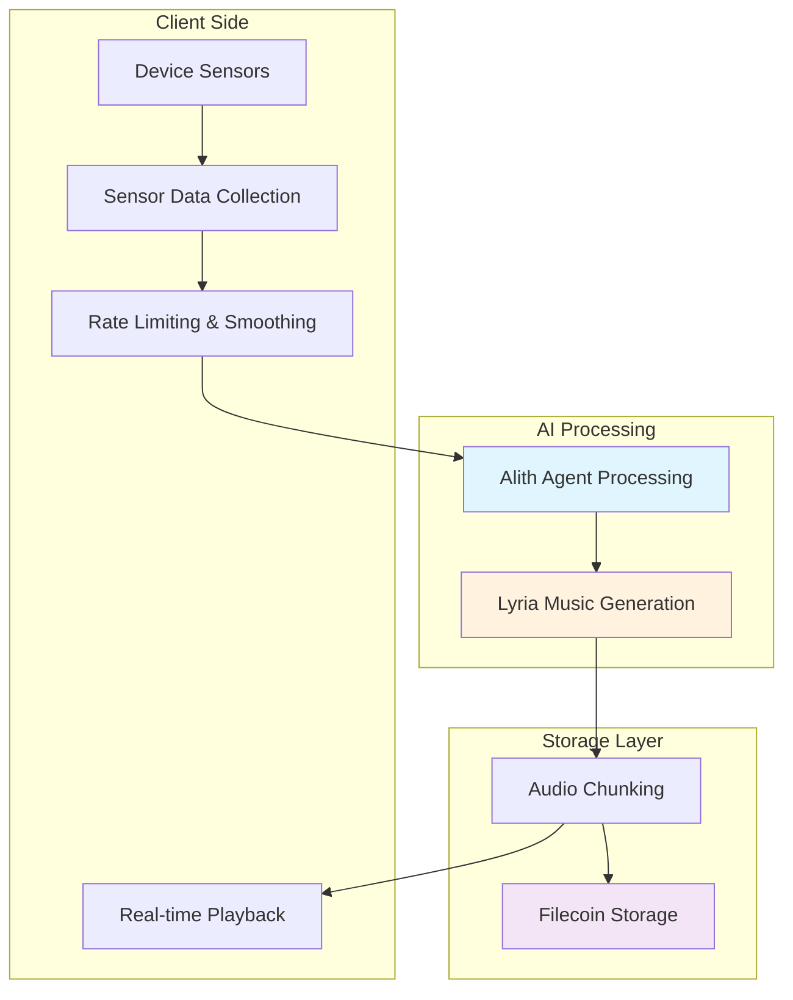
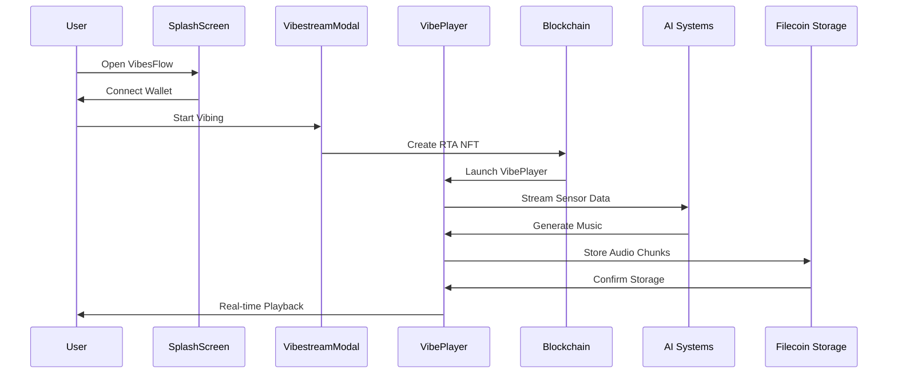

# VibesFlow Overview

VibesFlow is the first application that enables users to create and monetize DJ sets in real-time through motion-based input. The platform continuously adapts music generation to user movement, creating unique vibestreams that respond to physical gestures and body motion.

## Core Functionality

### Real-Time Music Generation

VibesFlow transforms device sensor data (accelerometer and gyroscope) into musical parameters through AI interpretation:

```javascript
// Sensor data processing in orchestration/coordinator.js
const processRealTimeSensorData = useCallback(async (sensorData: SensorData) => {
  try {
    const magnitude = Math.sqrt(sensorData.x ** 2 + sensorData.y ** 2 + sensorData.z ** 2);
    
    // Convert motion to musical parameters
    const amplitudeResponse = Math.min(magnitude * 2.5 + 0.1, 1);
    const frequencyBase = 1.0;
    const xContribution = Math.abs(sensorData.x) * 4;
    const yContribution = Math.abs(sensorData.y) * 2;
    const zContribution = Math.abs(sensorData.z) * 1.5;
    
    setCurrentFrequency(frequencyBase + xContribution + yContribution + zContribution);
  } catch (error) {
    console.warn('Real-time processing error:', error);
  }
}, []);
```

### Motion-to-Music Pipeline



## Platform Architecture

### Multi-Network Support

VibesFlow operates across two blockchain networks with distinct roles:

```javascript
// Network detection in context/connector.tsx
const getNetworkInfo = () => {
  if (!networkInfo) return null;
  if (networkInfo.type === 'metis-hyperion') return 'metis';
  if (networkInfo.type === 'near-testnet' || networkInfo.type === 'near-mainnet') return 'near';
  return null;
};
```

| Network | Purpose | Contracts |
|---------|---------|-----------|
| NEAR | RTA NFT creation | `rtav2` contract |
| Metis Hyperion | Monetization & PPM | `VibeFactory`, `PPM`, `Subscriptions` |

### Decentralized Storage

All vibestreams are permanently stored on Filecoin through the Synapse SDK:

```javascript
// Storage implementation in backend/rawchunks/synapseSDK.js
const storageService = await synapse.createStorage({
  withCDN: true,
  callbacks: {
    onProviderSelected: (provider) => {
      console.log(`✅ Provider selected:`, provider.owner);
    },
    onProofSetResolved: (info) => {
      console.log(`📋 Proof set ${info.isExisting ? 'existing' : 'new'}: ID ${info.proofSetId}`);
    }
  }
});
```

## User Experience Flow



## Key Features

### Creator Mode
- Real-time music generation from motion input
- Automatic audio chunking and storage
- NFT minting for vibestream ownership
- Revenue generation through PPM (Pay-Per-Minute)

### Participant Mode
- Join existing vibestreams
- Real-time audio streaming via SRS
- Automated payment processing
- Geographic proximity constraints (for group modes)

### Market Integration
- Browse all stored vibestreams
- Preview and playback functionality
- Subscription-based access (Metis users)
- FilCDN-powered content delivery

## Technical Stack

### Frontend Technologies
- **React Native**: Cross-platform mobile and web support
- **Expo**: Development and deployment framework
- **TypeScript**: Type-safe development

### Blockchain Integration
- **NEAR SDK**: RTA NFT management
- **Ethers.js**: Metis Hyperion contract interaction
- **Multi-wallet support**: NEAR Wallet, MetaMask

### AI and Audio Processing
- **Google Lyria**: Real-time music generation
- **Alith Framework**: Intelligent sensor interpretation
- **Web Audio API**: Client-side audio processing

### Storage and CDN
- **Synapse SDK**: Filecoin storage integration
- **FilCDN**: Decentralized content delivery
- **Pinata**: IPFS fallback storage

## Development Environment

The platform supports both development and production environments with proper configuration management:

```javascript
// Environment-aware configuration in configs/
const backendUrl = process.env.EXPO_PUBLIC_RAWCHUNKS_URL || 'https://api.vibesflow.ai';
const filcdnProvider = process.env.EXPO_PUBLIC_FILCDN_PROVIDER_ADDRESS;
```

## Next Steps

<CardGroup cols={2}>
  <Card title="RTA Protocol" icon="certificate" href="/essentials/rta-protocol">
    Understand Real-Time Assets mechanics
  </Card>
  <Card title="Vibestreams" icon="waveform" href="/essentials/vibestreams">
    Learn about vibestream creation and modes
  </Card>
</CardGroup>
