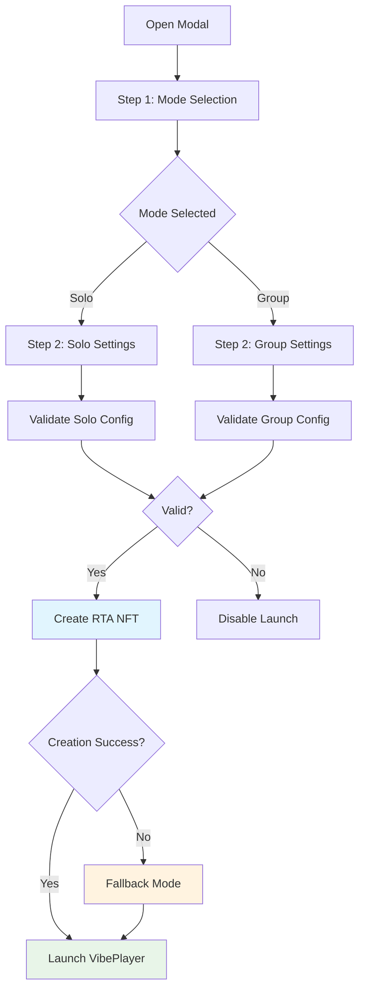

# Vibestream Modal

The Vibestream Modal provides the interface for creating new vibestreams, with support for both Solo and Group modes. It handles parameter validation, network-aware creation, and RTA NFT minting.

## Modal Flow

<Mermaid>

</Mermaid>

## Mode Selection (Step 1)

### Interface Components

```javascript
// Mode selection UI in VibestreamModal.tsx
const renderStep1 = () => (
  <View style={styles.stepContainer}>
    <Text style={styles.stepTitle}>SELECT MODE</Text>
    
    <View style={styles.modeContainer}>
      <TouchableOpacity
        style={[styles.modeButton, mode === 'solo' && styles.selectedMode]}
        onPress={() => handleModeSelect('solo')}
      >
        <Text style={styles.modeText}>SOLO</Text>
      </TouchableOpacity>
      
      <TouchableOpacity
        style={[styles.modeButton, mode === 'group' && styles.selectedMode]}
        onPress={() => handleModeSelect('group')}
      >
        <Text style={styles.modeText}>GROUP</Text>
      </TouchableOpacity>
    </View>
  </View>
);
```

### Mode Handler

```javascript
// Mode selection logic
const handleModeSelect = (selectedMode) => {
  setMode(selectedMode);
  if (selectedMode === 'solo') {
    setStep(2);
  } else {
    setStep(2); // Both modes proceed to settings
  }
};
```

## Configuration (Step 2)

### Universal Settings

Settings available for both Solo and Group modes:

```javascript
// Universal settings component
<TouchableOpacity
  style={styles.checkboxContainer}
  onPress={() => setStoreToFilecoin(!storeToFilecoin)}
>
  <View style={[styles.checkbox, storeToFilecoin && styles.checkedBox]}>
    {storeToFilecoin && (
      <FontAwesome name="check" size={8} color={COLORS.background} />
    )}
  </View>
  <Text style={styles.checkboxText}>STORE TO FILECOIN</Text>
</TouchableOpacity>
```

### Group Mode Parameters

Group mode exposes additional configuration options:

```javascript
// Group-specific settings
{mode === 'group' && (
  <>
    {/* Distance Configuration */}
    <View style={styles.inputGroup}>
      <Text style={styles.inputLabel}>DISTANCE (1-10 METERS)</Text>
      <View style={styles.inputContainer}>
        <TextInput
          style={styles.textInput}
          value={distance}
          onChangeText={(text) => {
            // Contract validation: 1-10 meters only
            const num = parseInt(text);
            if (text === '' || (num >= 1 && num <= 10)) {
              setDistance(text);
            }
          }}
          keyboardType="numeric"
          maxLength={2}
        />
        <Text style={styles.inputUnit}>MT</Text>
      </View>
    </View>

    {/* Ticket Amount */}
    <View style={styles.inputGroup}>
      <Text style={styles.inputLabel}>TICKETS</Text>
      <View style={styles.inputContainer}>
        <TextInput
          style={styles.textInput}
          value={ticketAmount}
          onChangeText={setTicketAmount}
          keyboardType="numeric"
        />
        <Text style={styles.inputUnit}>AMT</Text>
      </View>
    </View>
  </>
)}
```

### PPM Configuration

Pay-Per-Minute settings with network-aware currency display:

```javascript
// Network-aware currency display
const getCurrency = () => {
  const networkInfo = getNetworkInfo();
  return networkInfo?.type === 'metis-hyperion' ? 'tMETIS' : 'NEAR';
};

// Ticket pricing configuration
<View style={styles.inputGroup}>
  <Text style={styles.inputLabel}>TICKET PRICE?</Text>
  <View style={styles.payPerStreamContainer}>
    <TouchableOpacity
      style={styles.ynCheckboxContainer}
      onPress={() => setFreeTickets(true)}
    >
      <View style={[styles.checkbox, freeTickets && styles.checkedBox]}>
        {freeTickets && (
          <FontAwesome name="check" size={8} color={COLORS.background} />
        )}
      </View>
      <Text style={styles.ynCheckboxText}>N</Text>
    </TouchableOpacity>
    
    <TouchableOpacity
      style={styles.ynCheckboxContainer}
      onPress={() => setFreeTickets(false)}
    >
      <View style={[styles.checkbox, !freeTickets && styles.checkedBox]}>
        {!freeTickets && (
          <FontAwesome name="check" size={8} color={COLORS.background} />
        )}
      </View>
      <Text style={styles.ynCheckboxText}>Y</Text>
    </TouchableOpacity>
  </View>
  
  <View style={[styles.inputContainer, freeTickets && styles.disabledInput]}>
    <TextInput
      style={[styles.textInput, freeTickets && styles.disabledTextInput]}
      value={ticketPrice}
      onChangeText={setTicketPrice}
      keyboardType="decimal-pad"
      editable={!freeTickets}
    />
    <Text style={styles.inputUnit}>{getCurrency()}</Text>
  </View>
</View>
```

## Validation Logic

### Parameter Validation

Comprehensive validation prevents invalid configurations:

```javascript
// Launch validation in VibestreamModal.tsx
const isLaunchDisabled = () => {
  if (isCreatingRTA) return true;
  
  if (mode === 'group') {
    // Distance validation (1-10 meters per contract)
    const distanceNum = parseInt(distance);
    if (!distance || distance === '0' || distanceNum < 1 || distanceNum > 10) return true;
    
    // Ticket amount validation (must be at least 1)
    const ticketAmountNum = parseInt(ticketAmount);
    if (!ticketAmount || ticketAmount === '0' || ticketAmountNum < 1) return true;
    
    // PPM validation
    if (payPerStream && (!streamPrice || streamPrice === '0')) return true;
    
    // Ticket price validation  
    if (!freeTickets && (!ticketPrice || ticketPrice === '0')) return true;
  }
  return false;
};
```

### Connection Validation

```javascript
// Wallet connection check
{!connected && (
  <View style={styles.walletWarning}>
    <FontAwesome name="exclamation-triangle" size={12} color={COLORS.secondary} />
    <Text style={styles.walletWarningText}>WALLET NOT CONNECTED</Text>
  </View>
)}
```

## RTA Creation Process

### Configuration Assembly

```javascript
// RTA configuration assembly
const rtaConfig = {
  mode,
  store_to_filecoin: storeToFilecoin,
  // Group mode specific fields
  distance: mode === 'group' ? parseInt(distance) : undefined,
  ticket_amount: mode === 'group' ? parseInt(ticketAmount) : undefined,
  ticket_price: mode === 'group' && !freeTickets ? ticketPrice : undefined,
  pay_per_stream: mode === 'group' ? payPerStream : false,
  stream_price: mode === 'group' && payPerStream ? streamPrice : '0',
  creator: accountIdToUse,
  created_at: Date.now(),
};
```

### Network-Aware Creation

```javascript
// Network-specific RTA creation
const handleLaunchVibestream = async () => {
  // Connection validation
  if (!connected) {
    Alert.alert('Wallet Required', 'Please connect your wallet to create a vibestream.');
    return;
  }

  const networkInfo = getNetworkInfo();
  if (!networkInfo) {
    Alert.alert('Error', 'Network information not available.');
    return;
  }

  setIsCreatingRTA(true);

  try {
    // Enable audio first
    await enableAudio();
    
    // Generate unique RTA ID
    const rawRtaId = generateRtaID();
    
    console.log(`🔥 Creating ${networkInfo.type} vibestream with config:`, rtaConfig);

    // Network-aware creation with timeout
    const creationPromise = createRTANFT(rawRtaId, rtaConfig);
    const timeoutPromise = new Promise((_, reject) => {
      setTimeout(() => reject(new Error(`${networkInfo.type} creation timeout`)), 30000);
    });

    const fullTokenId = await Promise.race([creationPromise, timeoutPromise]);
    
    console.log(`✅ ${networkInfo.type} vibestream created successfully:`, fullTokenId);
    
    // Launch vibestream
    onLaunchVibePlayer(fullTokenId, rtaConfig);
    onClose();

  } catch (error) {
    console.error('Failed to create vibestream:', error);
    // Handle errors with user-friendly messages
    handleCreationError(error);
  } finally {
    setIsCreatingRTA(false);
  }
};
```

## Audio Initialization

### Web Audio Context

```javascript
// Audio context initialization for web
const enableAudio = async () => {
  if (Platform.OS === 'web' && typeof window !== 'undefined' && window.AudioContext) {
    try {
      const audioContext = new (window.AudioContext || window.webkitAudioContext)();
      if (audioContext.state === 'suspended') {
        await audioContext.resume();
      }
      
      // Test audio with brief beep
      const osc = audioContext.createOscillator();
      const gain = audioContext.createGain();
      osc.connect(gain);
      gain.connect(audioContext.destination);
      osc.frequency.value = 800;
      gain.gain.setValueAtTime(0.1, audioContext.currentTime);
      gain.gain.exponentialRampToValueAtTime(0.001, audioContext.currentTime + 0.1);
      osc.start();
      osc.stop(audioContext.currentTime + 0.1);
      
      setAudioEnabled(true);
      console.log('Audio enabled successfully');
    } catch (error) {
      console.warn('Failed to enable audio:', error);
    }
  } else {
    setAudioEnabled(true);
  }
};
```

## Error Handling

### Fallback Mode

When RTA creation fails, the system provides fallback functionality:

```javascript
// Fallback handling
} catch (error) {
  console.warn(`⚠️ ${networkInfo.type} vibestream creation failed:`, error);
  console.log('🔄 Using fallback mode - vibestream will continue with mock data');
  
  // Generate fallback data
  const networkPrefix = networkInfo.type === 'metis-hyperion' ? 'metis_vibe' : 'rta';
  fullTokenId = `${networkPrefix}_${rawRtaId}`;
  creationSucceeded = false;

  // Add fallback indicators
  rtaConfig.fallback_mode = true;
  rtaConfig.fallback_reason = error.message.includes('timeout') ? 
    `${networkInfo.type}_timeout` : `${networkInfo.type}_error`;
  rtaConfig.original_error = error.message;
  rtaConfig.network = networkInfo.type;
}
```

### User Notifications

```javascript
// Success/failure notifications
if (creationSucceeded) {
  console.log(`🎉 ${networkInfo.type} vibestream created - full functionality enabled`);
  
  // Group mode success message
  if (mode === 'group' && Platform.OS === 'web') {
    const networkName = networkInfo.type === 'metis-hyperion' ? 'Metis Hyperion' : 'NEAR';
    Alert.alert(
      'Group Vibestream Created!',
      `Your Group vibestream is ready on ${networkName}!\n\n🎫 Tickets: ${freeTickets ? 'FREE' : ticketPrice + ' tokens'}\n📍 Distance: ${distance}m\n👥 Max participants: ${ticketAmount}`,
      [{ text: 'Start Vibing!', style: 'default' }]
    );
  }
} else {
  // Fallback mode notification
  const networkName = networkInfo.type === 'metis-hyperion' ? 'Metis Hyperion' : 'NEAR';
  Alert.alert(
    'Vibestream Starting (Fallback Mode)',
    `${networkName} is slow, but your vibestream will start anyway!\n\n✅ Audio chunking: Working\n✅ Backend processing: Working\n✅ Storage: Working`,
    [{ text: 'Start Vibing!', style: 'default' }]
  );
}
```

## State Management

### Modal State

```javascript
// Modal state management
const [step, setStep] = useState(1);
const [mode, setMode] = useState('solo');
const [storeToFilecoin, setStoreToFilecoin] = useState(true);
const [distance, setDistance] = useState('1');
const [ticketAmount, setTicketAmount] = useState('1');
const [ticketPrice, setTicketPrice] = useState('0');
const [streamPrice, setStreamPrice] = useState('0');
const [freeTickets, setFreeTickets] = useState(true);
const [payPerStream, setPayPerStream] = useState(false);
const [isCreatingRTA, setIsCreatingRTA] = useState(false);
```

### Reset Logic

```javascript
// Modal reset on close
const resetModal = () => {
  setStep(1);
  setMode('solo');
  setStoreToFilecoin(true);
  setDistance('1');
  setTicketAmount('1');
  setTicketPrice('0');
  setStreamPrice('0');
  setFreeTickets(true);
  setPayPerStream(false);
  setIsCreatingRTA(false);
};

useEffect(() => {
  if (!visible) {
    resetModal();
  }
}, [visible]);
```

## UI Components

### Loading State

```javascript
// Creation loading indicator
{isCreatingRTA ? (
  <View style={styles.loadingContainer}>
    <ActivityIndicator size="small" color={COLORS.primary} />
    <Text style={styles.loadingText}>CREATING RTA...</Text>
  </View>
) : (
  <Text style={styles.actionButtonText}>
    LAUNCH
  </Text>
)}
```

### Action Buttons

```javascript
// Action buttons row
<View style={styles.actionButtonsRow}>
  <TouchableOpacity
    style={[styles.actionButton, isLaunchDisabled() && styles.disabledButton]}
    onPress={handleLaunchVibestream}
    disabled={isLaunchDisabled()}
  >
    {/* Launch button content */}
  </TouchableOpacity>
  
  <TouchableOpacity
    style={[styles.actionButton, styles.disabledButton]}
    disabled={true}
  >
    <Text style={[styles.actionButtonText, styles.disabledText]}>
      SCHEDULE
    </Text>
  </TouchableOpacity>
</View>
```

## Next Steps

<CardGroup cols={2}>
  <Card title="Vibe Player" icon="play" href="/essentials/vibe-player">
    Learn about the music generation interface
  </Card>
  <Card title="User Profiles" icon="user" href="/essentials/user-profiles">
    Understand profile management
  </Card>
</CardGroup>
