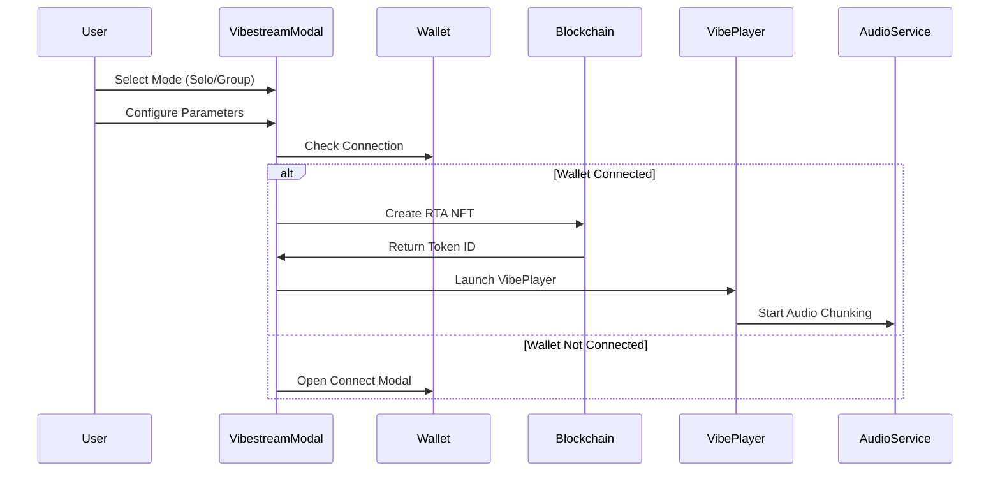

# Vibestreams

Vibestreams are real-time music sessions generated from device sensor data. They combine motion detection, AI interpretation, and music generation to create unique audio experiences that respond to user movement.

## Vibestream Modes

### Solo Mode

Solo mode creates individual vibestreams for single-user experiences:

```javascript
// Solo mode configuration in VibestreamModal.tsx
const rtaConfig = {
  mode: 'solo',
  store_to_filecoin: true,
  creator: accountIdToUse,
  created_at: Date.now(),
  // Group-specific fields are undefined for solo mode
  distance: undefined,
  ticket_amount: undefined,
  ticket_price: undefined,
  pay_per_stream: false,
  stream_price: '0'
};
```

**Solo Mode Characteristics:**
- Single creator experience
- No participant limits
- No geographic constraints
- Optional PPM monetization
- Direct sensor-to-music mapping

### Group Mode

Group mode enables collaborative vibestreams with participant management:

```javascript
// Group mode configuration with validation
const rtaConfig = {
  mode: 'group',
  store_to_filecoin: true,
  // Required group parameters
  distance: parseInt(distance),      // 1-10 meters per contract
  ticket_amount: parseInt(ticketAmount), // Must be >= 1
  ticket_price: freeTickets ? undefined : ticketPrice,
  pay_per_stream: payPerStream,
  stream_price: payPerStream ? streamPrice : '0',
  creator: accountIdToUse,
  created_at: Date.now()
};
```

**Group Mode Parameters:**

| Parameter | Type | Range | Description |
|-----------|------|-------|-------------|
| `distance` | number | 1-10 meters | Geographic proximity constraint |
| `ticket_amount` | number | >= 1 | Maximum participants |
| `ticket_price` | string | >= 0 | Cost per ticket (optional) |
| `pay_per_stream` | boolean | - | Enable per-minute payments |
| `stream_price` | string | >= 0 | Rate per minute (if PPM enabled) |

## Creation Flow

<Mermaid>

</Mermaid>

## Parameter Validation

### Group Mode Validation

The system validates group mode parameters before creation:

```javascript
// Validation logic in VibestreamModal.tsx
const isLaunchDisabled = () => {
  if (mode === 'group') {
    // Distance validation (1-10 meters per contract)
    const distanceNum = parseInt(distance);
    if (!distance || distanceNum < 1 || distanceNum > 10) return true;
    
    // Ticket amount validation (must be at least 1)
    const ticketAmountNum = parseInt(ticketAmount);
    if (!ticketAmount || ticketAmountNum < 1) return true;
    
    // PPM validation
    if (payPerStream && (!streamPrice || streamPrice === '0')) return true;
    
    // Ticket price validation
    if (!freeTickets && (!ticketPrice || ticketPrice === '0')) return true;
  }
  return false;
};
```

## Network-Specific Creation

### NEAR Network
```javascript
// NEAR vibestream creation
console.log(`🔥 Creating NEAR vibestream with config:`, rtaConfig);
const fullTokenId = await createRTANFT(rawRtaId, rtaConfig);
// Returns format: "rta_1234567890_abcdef"
```

### Metis Hyperion
```javascript
// Metis vibestream with integrated PPM
console.log(`🔥 Creating Metis vibestream with config:`, rtaConfig);
const fullTokenId = await createRTANFT(rawRtaId, rtaConfig);
// Returns format: "metis_vibe_1234567890_abcdef"
// Automatically registers with PPM contract if payPerStream enabled
```

## Audio Processing Pipeline

### Creator Mode (Full Processing)
```javascript
// Full orchestration for creators in VibePlayer.tsx
console.log('🎛️ CREATOR MODE: Creating new vibestream with full orchestration');

// Start audio chunk service
audioChunkService.startCollecting(rtaId, config.creator);

// Initialize orchestration with wallet
await orchestrationIntegration.initializeWithWallet({ account: { accountId: config.creator } });

// Start Lyria orchestration
const success = await orchestrationIntegration.startOrchestration();

// Start vibestream session (sensors + chunks)
orchestrationIntegration.startVibestreamSession(rtaId, audioChunkService);
```

### Participant Mode (Streaming Only)
```javascript
// Simplified processing for participants
console.log('👥 PARTICIPANT MODE: Joining existing vibestream');

// Create audio element for LIVE HTTP-FLV stream
const liveAudio = new Audio();
liveAudio.src = participantOptions.streamingUrl;
liveAudio.autoplay = true;

// Handle streaming events
liveAudio.oncanplay = () => console.log('✅ Live stream ready to play');
liveAudio.onerror = () => {
  // Try HLS fallback
  if (participantOptions?.hlsUrl) {
    liveAudio.src = participantOptions.hlsUrl;
  }
};
```

## Sensor Data Integration

### Real-Time Processing
```javascript
// Sensor data processing in VibePlayer.tsx
const processRealTimeSensorData = useCallback(async (sensorData) => {
  try {
    // Accurate waveform representation
    const magnitude = Math.sqrt(sensorData.x ** 2 + sensorData.y ** 2 + sensorData.z ** 2);
    
    // Sensitive amplitude calculation
    const amplitudeResponse = Math.min(magnitude * 2.5 + 0.1, 1);
    setCurrentAmplitude(amplitudeResponse);
    
    // Multi-axis frequency mapping
    const frequencyBase = 1.0;
    const xContribution = Math.abs(sensorData.x) * 4;
    const yContribution = Math.abs(sensorData.y) * 2;
    const zContribution = Math.abs(sensorData.z) * 1.5;
    setCurrentFrequency(frequencyBase + xContribution + yContribution + zContribution);
    
  } catch (error) {
    console.warn('Real-time processing error:', error);
  }
}, []);
```

### Activity Detection
```javascript
// Enhanced activity tracking in chunks.tsx
private updateMusicActivityDetection(now, timeSinceLastActivity) {
  // Adaptive threshold based on recent patterns
  let adaptiveThreshold = this.activityDetectionWindow;
  
  if (this.musicActivityHistory.length > 5) {
    const recentIntervals = [];
    for (let i = 1; i < this.musicActivityHistory.length; i++) {
      recentIntervals.push(this.musicActivityHistory[i] - this.musicActivityHistory[i - 1]);
    }
    
    if (recentIntervals.length > 0) {
      const avgInterval = recentIntervals.reduce((a, b) => a + b, 0) / recentIntervals.length;
      adaptiveThreshold = Math.min(Math.max(avgInterval * 0.6, this.activityDetectionWindow), this.activityDetectionWindow * 2);
    }
  }
  
  this.isLiveMusicActive = timeSinceLastActivity < adaptiveThreshold;
}
```

## Storage and Persistence

### Chunk Generation
```javascript
// 60-second chunk timer in chunks.tsx
private startOptimizedChunkTimer() {
  this.chunkTimer = setInterval(async () => {
    if (this.isCollecting && this.audioBuffer.length > 0) {
      // Create chunk in background
      const chunkData = {
        chunkId: this.generateChunkId(false),
        buffer: this.combineAudioBuffers(),
        metadata: this.createCurrentMetadata(),
        isFinal: false,
        priority: this.isLiveMusicActive ? 'low' : 'normal'
      };
      
      // Add to background queue
      this.backgroundQueue.push(chunkData);
      
      // Clear buffer and reset timing
      this.audioBuffer = [];
      this.bufferStartTime = Date.now();
      this.chunkSequence++;
    }
  }, this.chunkDuration); // 60000ms = 60 seconds
}
```

### Metadata Structure
```javascript
// Chunk metadata in chunks.tsx
private createCurrentMetadata() {
  return {
    rtaId: this.currentRtaId,
    chunkId: this.generateChunkId(false),
    timestamp: Date.now(),
    creator: this.currentCreator,
    startTime: this.startTime.toString(),
    chunkTimestamp: this.bufferStartTime,
    sampleRate: 48000,
    channels: 2,
    bitDepth: 16,
    participantCount: this.currentParticipantCount,
    audioFormat: 'webm-opus'
  };
}
```

## User Interface Components

### Mode Selection
```javascript
// Mode selection UI in VibestreamModal.tsx
<View style={styles.modeContainer}>
  <TouchableOpacity
    style={[styles.modeButton, mode === 'solo' && styles.selectedMode]}
    onPress={() => handleModeSelect('solo')}
  >
    <Text style={styles.modeText}>SOLO</Text>
  </TouchableOpacity>
  
  <TouchableOpacity
    style={[styles.modeButton, mode === 'group' && styles.selectedMode]}
    onPress={() => handleModeSelect('group')}
  >
    <Text style={styles.modeText}>GROUP</Text>
  </TouchableOpacity>
</View>
```

### Group Configuration
```javascript
// Group mode parameter inputs
{mode === 'group' && (
  <>
    <View style={styles.inputGroup}>
      <Text style={styles.inputLabel}>DISTANCE (1-10 METERS)</Text>
      <TextInput
        style={styles.textInput}
        value={distance}
        onChangeText={(text) => {
          const num = parseInt(text);
          if (text === '' || (num >= 1 && num <= 10)) {
            setDistance(text);
          }
        }}
        keyboardType="numeric"
        maxLength={2}
      />
    </View>
    
    <View style={styles.inputGroup}>
      <Text style={styles.inputLabel}>TICKETS</Text>
      <TextInput
        style={styles.textInput}
        value={ticketAmount}
        onChangeText={setTicketAmount}
        keyboardType="numeric"
      />
    </View>
  </>
)}
```

## Error Handling

### Fallback Modes
```javascript
// Fallback handling in VibestreamModal.tsx
try {
  const fullTokenId = await createRTANFT(rawRtaId, rtaConfig);
  creationSucceeded = true;
} catch (error) {
  console.warn(`⚠️ ${networkInfo.type} vibestream creation failed:`, error);
  console.log('🔄 Using fallback mode - vibestream will continue with mock data');
  
  // Generate fallback data
  const networkPrefix = networkInfo.type === 'metis-hyperion' ? 'metis_vibe' : 'rta';
  fullTokenId = `${networkPrefix}_${rawRtaId}`;
  creationSucceeded = false;
  
  // Add fallback indicators
  rtaConfig.fallback_mode = true;
  rtaConfig.fallback_reason = error.message.includes('timeout') ? 
    `${networkInfo.type}_timeout` : `${networkInfo.type}_error`;
}
```

## Next Steps

<CardGroup cols={2}>
  <Card title="Sensor Processing" icon="satellite-dish" href="/essentials/sensor-processing">
    Learn about motion-to-music conversion
  </Card>
  <Card title="Vibe Player" icon="play" href="/essentials/vibe-player">
    Understand the playback interface
  </Card>
</CardGroup>
